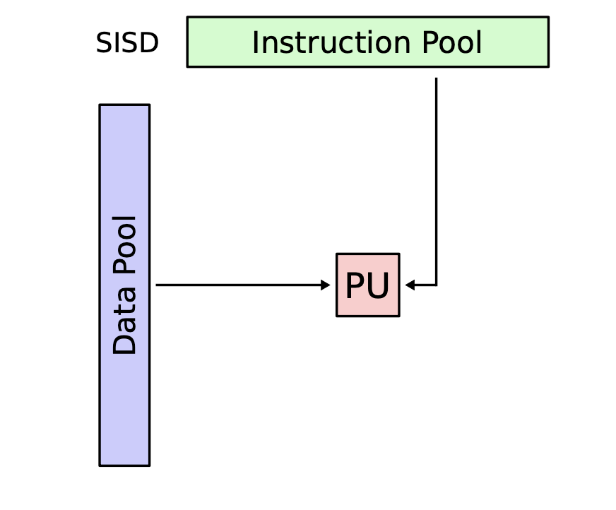
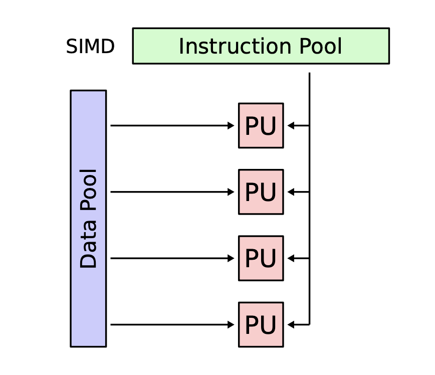
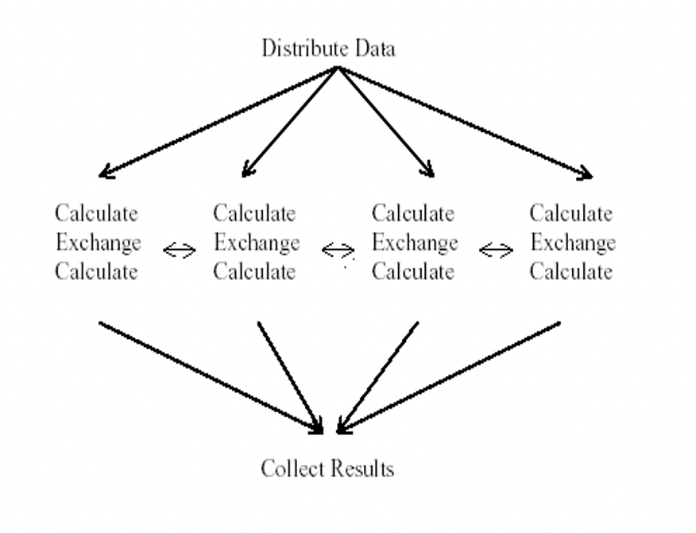
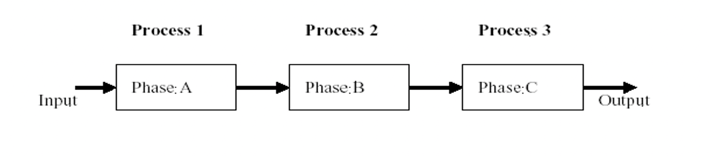

# Lecture 3
## Compute Scaling
* ### <font color='red'>Vertical Computational Scaling</font>: 
    - Have faster processors: Switch n GHz CPU for a 2n GHz = two times faster
    - Limits of fundamental physics
* ### <font color='red'>Horizontal Computational Scaling</font>:
    - Have more processors:
        * Easy to add more; Cost increase.
        * Harder to design, develop, test, debug, deploy and understand.
* ### <font color='red'>Single machine multiple cores</font>:
    - Typical laptop/PC/servers
* ### <font color='red'>Loosely coupled collection/cluster of machines</font>:
    - Pooling/sharing of resources
        * Dedicated vs available only when not in use by others.
        * Web services: <font color='green'>Condor, Seti@home, Boinc</font>
* ### <font color='red'>Tightly coupled cluster of machines</font>:
    - Typical HPC/HTC set-up
        * Many servers in same rack/server room(Often with fast message passing interconnects)
* ### <font color='red'>Widely distributed clusters of machines</font>:
    - <font color='green'>UK NGS, EGEE, etc.</font> Distributed systems more generally.
* ### <font color='red'>Hybrid combinations of above</font>:
    * Leads to many challenges with distributed systems.
        * Shared state
        * Message passing paradigms <font color='pink'>(dangers of delayed/lost messages)</font>
## Limitations
* ### Add more processes
    * If n processors are thrown at a problem. How much faster will it go:
    * Terminologies:
        * *T(1)* = time for serial computation
        * *T(N)* = time for N parallel computations
        * *S(N)* = speed up
        > $$ S(N) = \frac{T(1)}{T(N)}$$
        * Proportion of speed up depend on parts of program that can't be parallelized.
## <font color='blue'>*Amdahl's Law*:</font>
* 
>$$ T(1) = \sigma + \pi$$
>$$ T(N) = \sigma + \frac{\pi}{N}$$
>$$ S = \frac{T(1)}{T(N)} = \frac{\sigma+\pi}{1+(\frac{\pi}{\sigma})*(\frac{1}{N})}$$
>$$ \frac{\pi}{\sigma} = \frac{1-\alpha}{\alpha} $$
>$$ where \ \alpha \ is \ fraction \ of \ running \ time \ that \ sequential \ program \ spends \ on \ $$ 
>$$non-parallel \ parts \ of \ a \ computation \ approximates \ to \ S = \frac{1}{\alpha}$$
>$$ Therefore \ S = \frac{1+\frac{(1-\alpha)}{\alpha}}{1+\frac{(1-\alpha)}{N\alpha}} = \frac{1}{\alpha + \frac{(1-\alpha)}{N}} \thickapprox \frac{1}{\alpha}$$
* E.g. If 95% of the program can be parallelized, the theoretical maximum speedup using parallel computing would be <font color='red'> 20 times</font>, no matter how many processors are used.     
    * <font color='pink'>If the non-parallelizable part takes 1 hour, then no matter how many cores you throw at it, it won't complete in less than 1 hour.</font>
### Over Simplifications of *Amdahl's Law*
* Consider a program that executes a single loop, where all iterations cna be computed independently. <font color='pink'> i.e. code can be parallelized by splitting the loop into several parts. </font>The overhead is replicated as many times as there are are processors. In effect, loop overhead acts as a further overhead in running the code. Also getting data to/from many processors overheads
    * <font color='red'>In a nutshell *Amdahl's Law* greatly simplifies the real world</font>
* It also assumes a fixed problem size - sometimes can't predict length of time required of jobs.
## <font color='blue'> *Gustafson-Barsis's Law*</font>
* Gives the 'scaled speed-up':
> $$ T(1) = \sigma + N \pi \quad T(N) = \sigma + \pi $$
> $$ S(N) = \frac{T(1)}{T(N)} = \frac{\sigma + N\pi}{\sigma + \pi} = \frac{\sigma}{\sigma + \pi} + \frac{N\pi}{\sigma + \pi}$$
> $$ Where \ \pi \ is \ fixed \ parallel \ time \ per \ process$$
> $$ And \ \alpha \ is \ fraction \ of \ running \ time \ sequential \ program \ spends \ on \ parallel \ parts$$
> $$ So: \ \frac{\pi}{\sigma} = \frac{1-\alpha}{\alpha}$$
> $$ Therefore: \ S(N) = \alpha + N(1-\alpha) = N - \alpha(N-1)$$
* E.g. Speed up *S* using *N* processes is given as a linear formula dependent on the number of processes and the fraction of time to urn sequential parts. *Gustafson's Law* processes that programmer tend to set the size of problems to use the available equipment to solve problems within a practical fixed time. Faster (more parallel) equipment available, larger problems can be solved in the same time. 
## Computer Architecture
* A computer comprises:
    * CPU for executing programs
        * ALU, FPU
        * Load/store unit
        * Registers <font color='pink'>(fast memory locations)</font>
        * Program counter <font color='pink'>(address of instruction that is executing)</font>
        * Memory interface
    * Memory that stores/executing programs and related data
    * I/O systems <font color='pink'>(keyboards, networks, etc)</font>
    * Permanent storage for read/writing data into out of memory
    * Of key importance is the balance of all of these:
        * Superfast CPU's starved of data
        * Jobs killing clusters
    * There are many different ways to design/architect computers
* ### <font color='blue'>*Flynn's Taxonomy*</font>
    * #### <font color='red'>Single Instruction, Single Data Stream(SISD)</font>
        * Sequential computer which exploits no parallelism in either the instruction or data streams
        * Single control unit (CU/CPU) fetches single Instruction Stream from memory,. The CU/CPU then generates appropriate control signals to direct to direct single processing element to operate on single Stream. <font color='pink'>i.e. one operation at a time.</font>
        * Obsolete
        >E.g. Example architecture of SISD
        >>
    * #### <font color='red'>Multiple Instruction, Single Data Stream(MISD)</font>
        * Parallel computing architecture where many functional units(PU/CPU) perform different operations on the same data.
        * Examples include fault checking computer architectures. <font color='pink'>E.g. Running multiples error checking processes on same data stream.</font>
        >E.g. Example architecture of MISD
        >>
    * #### <font color='red'>Single Instruction, Multiple Data Stream(SIMD)</font>
        * Multiple processing elements that perform the same operation on multiple data points simultaneously.
        * Focus is on data level parallelism. <font color='pink'>i.e. Many parallel computations, but only a single process at a given moment.</font>
        * Many modern computers use *SIMD* instructions. <font color='pink'>E.g. To improve performance of multimedia use such as for image processing.</font>
        >E.g. Example architecture for SIMD
        >>
    * #### <font color='red'>Multiple Instruction, Multiple Data Stream(MIMD)</font>
        * Number of processors that function asynchronously and independently.
        * At any time, different processors may be executing different instruction on different pieces of data.
        * Machines can be shared memory or distributed memory categories.
            * Depends on how *MIMD* processors access memory.
        * Most systems these days operate on *MIMD*. <font color='pink'>E.g. HPC</font>
        >E.g. Example architecture of MIMD
        >>
## Approaches for Parallelism
### Explicit vs Implicit Parallelism
* <font color=red>Implicit Parallelism</font>
    * Supported by parallel languages and parallelizing compliers that take care of identifying parallelism, the scheduling od calculations and the placement of data.
* <font color=red>Explicit Parallelism</font>
    * The programmer is responsible for most of the parallelization effort such as task decomposition, mapping tasks to processors, inter-process communications.
    * This approach assumes user is the best judge of how parallelism can be exploited for a particular application
        * <font color=pink>E.g. SPARTAN HPC cluster</font>
        ``` 
        #SBATCH --ntasks=2 --cpus-per-task=4
        vs
        #SBATCH --ntasks=1 --cpus-per-task=8
        ```
### Hardware Parallelization
* #### <font color=red>Hardware Threading CPU</font>
    * <font color=red>Cache</font>: Much faster than reading/writing to main memory; <font color=red>Instruction cache, data cache(multiple level) and translation lookaside buffer</font> used for virtual-physical address translatio.
    * Parallelization by adding extra CPU to allow more instructions to be processed per cycle. Usually shares arithmetic units. Heavy use of one type of computation can tie up all the available units of the CPU preventing other thread from using them.
* #### <font color=red>Multi-Core</font>
    * Multiple cores that can process data and perform computational tasks in parallel. Typically share same cache but issue of cache read/write performance and cache coherence. Possibility of cache stalls. <font color=pink> (CPU not doing anything whilst waiting for caching)</font>
    * Many chips have mixture. <font color=pink> (L1 cache on single cores, L2 cache on pair of cores, L3 cache shared by all cores)</font>
    * Typical to have different cache speed and cache sizes.
* #### <font color=red>Symmetric Multiprocessing (SMP)</font>
    * Two or more identical processors connected to a single, shared memory, with full access to all I/O devices, controlled by a single OS instance that treats all processors equally. Each processors executes different programs and works on different data but with same capability of sharing common resources <font color=pink>(memory, I/O device, etc)</font>
    * Processors can be connected in a variety of ways: <font color=red> buses, crossbar switches, meshes.</font>. More complex to program since need to program both for CPU and inter-processor communications.
* #### <font color=red>Non-Uniform Memory Access (NUMA)</font>
    * <font color=red>NUMA</font> provides speed-up by allowing a processor to access its own local memory faster than non-local memory. Improved performance as long as data are localized to specific processes/processors. Key is allocating memory/processors in NUMA friendly ways. <font color=pink> E.g. To avoid scheduling/locking and inter-processor communication.</font> Approaches such as <font color=red>ccNUMA</font> with range of cache coherency protocols/products.
### Operating System Parallelism Approaches
* Most modern multi-core operating systems support different forms of parallelization
    * parallel vs. interleaved semantics
        * A || B vs A ||| B
* Compute parallelism
    * <font color=red>Processes</font>
        * used to realize tasks, structure activities
    * <font color=red>Threads</font>
        * Native threads: <font color=red>Fork, Spawn, Join</font>
        * Green threads: Scheduled by a virtual machine instead of by the OS
* Data parallelism:
    * Caching (cache coherency)
    * OS implies on a computer
### Software Parallelism Approaches
* Many languages now support a range of parallelization/concurrency features:
    * <font color=pink>Threads, thread pools, lock, semaphores, etc.</font>
* Many languages developed specifically for parallel/concurrent systems
* Key issues that need to be tackled
    * <font color=red>Deadlock</font>: processes involved constantly waiting for each other.
    * <font color=red>Livelock</font>: processes involved in livelock constantly change with regard to one another, but none are progressing.
## <font color=red>Message Passing Interface(MPI)</font>
* Widely adopted approach for message in parallel systems
* Mappings to major languages <font color=pink>Fortan, C, C++, Python, Java</font>
* Key MPI functions:
    * `MPI_init`: initiate MPI computation
    * `MPI_Finalize`: terminate computation
    * `MPI_COMM_SIZE`: determine number of processors
    * `MPI_COMM_RANK`: determine my process identifier
    * `MPI_SEND`: send a message
    * `MPI_RECV`: receive a message
* Supports point-point, broadcast communications
### Example: HelloWorld MPI
```c
#include <stdio.h>
#include <mpi.h>

int main (argc, argv)
int argc;
char *argv[];
{	
    int rank, size;	
    MPI_Init (&argc, &argv); /* starts MPI */	
    MPI_Comm_rank (MPI_COMM_WORLD, &rank); /* get current process id */
    MPI_Comm_size (MPI_COMM_WORLD, &size); /* get number of processes */	
    printf( "Hello world from process %d of %d\n", rank, size );	
    MPI_Finalize();	
    return 0;
}
$mpicc -o hello_world hello_world.c
$ mpirun -np 4 hello_world
Hello world from process 1 of 4
Hello world from process 2 of 4
Hello world from process 3 of 4
Hello world from process 0 of 4
```
## Erroneous Assumptions of Distributed Systems
1. The network is reliable
2. Latency is zero
3. Bandwidth is infinite
4. The network is secure
5. Topology doesn't change
6. There is one administrator
7. Transport cost is zero
8. The network is homogeneous
9. Time is ubiquitous
## Design Stages of Parallel Programs
* Partitioning
    * Decomposition of computational activities and data into smaller tasks
    * Numerous paradigms:
        * <font color=pink>Master-worker, SPMD, pipeline, divided and conquer, speculation</font>
* Communication
    * Flow of information and coordination among tasks that are created in the partitioning state.
* Agglomeration
    * Tasks and communication structure created in the above stages are evaluated for performance and implementation cost
    * Tasks may be grouped into larger tasks to improve communication
    * Individual communications can be bundled
* Mapping/Scheduling
    * Assigning tasks to processor such that job completion time is minimized and resource utilization is maximized.
### <font color=red>Master Worker/Slave Model</font>
* Master decomposes the problem into small tasks, distributes to workers and gathers partial results to produce the final result.
* Realized in many ways of different levels of granularity. <font color=pink>E.g. Threads through to web service workflow definition and enactment.</font>
>Example of Master-Worker Model:
>> 
### <font color=red>Single-Program Multiple-Data</font>
* Commonly exploited model
    * <font color=pink>Bioinformatics, MapReduce, etc</font>
* Each process executes the same piece of code, but on different parts of the data.
* Data is typically split among the available processors.
* Data splitting and analysis can be done in many ways.
>Example of Single-Program Multiple-Data:
>>
### <font color=red>Data Pipelining</font>
* Suitable for applications involving multiple stages of execution, that typically operate on large number of datasets.
> Example of Data Pipelining:
>>
### <font color=red>Divide and Conquer</font>
* A problem is divided into two or more sub problems, and each of these sub problems are solved independently, and their results are combined.
* Three operations: <font color=pink>split, compute, join</font>
* Master-worker/task-farming is like divide and conquer with master doing both split and join operation
> Example of Divide and Conquer:
>>
### Speculative Parallelism
* Used when it is quite difficult to achieve parallelism through the previous paradigms:
    * Problems with complex dependencies: <font color=pink>Use "look ahead" execution</font>
    * Consider a producer P and a consumer C such that C depends on P for the value of some variable V. If the value of V is predictable, we can execute C speculatively using a predicted value in parallel with P
        * If the prediction turns out to be correct, we gain performance since C doesn't wait for P anymore
        * If the prediction is incorrect, we have to take corrective action, cancel C and restart C with the right value of V again.
> Example of Speculative Parallelism
>>