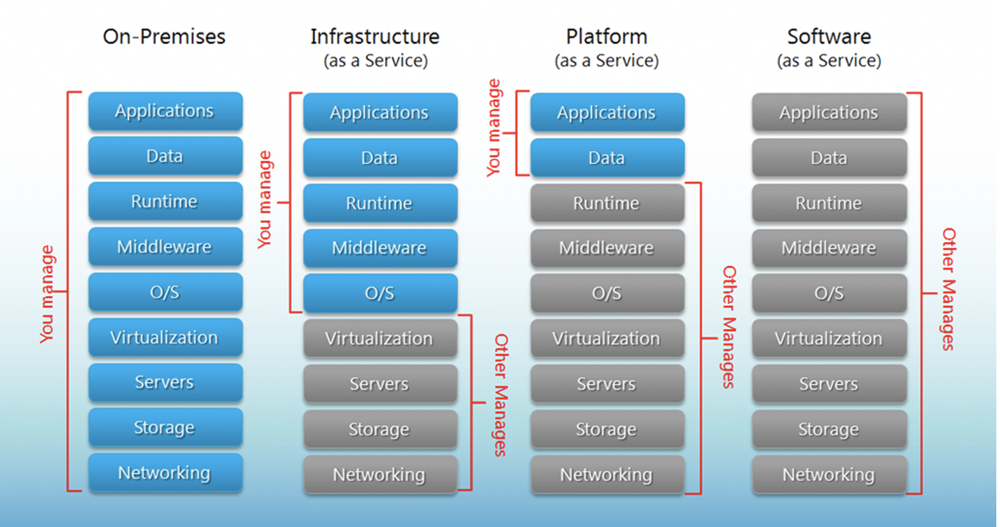

# Lecture 5
## <font color=red>Cloud Computing</font>
* Cloud computing is a model for enabling ubiquitous, convenient, on-demand network access to a shared pool of configurable computing resources that can be rapidly provisioned and released with minimal management effort or service provider interaction. 
## Common Cloud Models
* Deployment Models:
    * <font color=red>Private</font>
    * <font color=red>Community</font>
    * <font color=red>Public</font>
    * <font color=red>Hybrid</font>
* Delivery Models:
    * <font color=red>Software as a Service(SaaS)</font>
    * <font color=red>Platform as a Service(PaaS)</font>
    * <font color=red>Infrastructure as a Service(IaaS)</font>
* Essential Characteristics:
    * On-demand self-service
    * Broad network access
    * Resource pooling
    * Rapid elasticity
    * Measured service
## Deployment Models
### <font color=red>Public Clouds</font>
* Advantages:
    * Utility computing
    * Can focus on core business
    * Cost-effective
    * "Right-sizing"
    * Democratization of computing
* Disadvantages:
    * Security
    * Loss of control
    * Possible lock-in
    * Dependency of Cloud provider continued existence
### <font color=red>Private Clouds</font>
* Advantages
    * Control
    * Consolidation of resources
    * Easier of secure
    * More trust
* Disadvantages
    * Relevance to core business or not
    * Staff and management overheads
    * Hardware obsolescence
    * Over and under utilization challenges
### <font color=red>Hybrid Clouds</font>
* Examples
    * <font color=pink>Eucalyptus, VMWare vCloud Hybrid Service</font>
* Advantages:
    * Cloud-bursting: Use private cloud, but burst into public cloud when needed
* Disadvantages:
    * Hard to move data and resources when needed
    * Hard to decide when data can go to public cloud
    * Public cloud need to compliant with PCI-DSS(Payment Card Industry - Data Security Standard)
## Delivery Models
### <font color=red>Public SaaS</font>
* Examples
    * <font color=pink>Gmail</font>
    * <font color=pink>Sharepoint</font>
    * <font color=pink>Salesforce.com CRM</font>
    * <font color=pink>On-live</font>
    * <font color=pink>Gaikai</font>
    * <font color=pink>Microsoft Office 365</font>
* Comparison of Public SaaS:
>｜Cloud Name | Language and Developer Tools | Programming Models Supported by Provider | Target Applications and Storage Options|
>| ---- | ---- | ---- | ----| 
>| Google App Engine| Python, Java, GO, PHP + JVM languages(scala, groovy, jruby)| MapReduce, Web, DataStore and other APIs | Web Applications and BigTable storage|
>|Salesforce.com's Force.com | Apex, Eclipsed-based IDE, web-based wizard | Workflow, excel-like formula, web programming | Business applications such as CRM |
>|Microsoft Azure| .NET, Visual Studio, Azure tools| Unrestricted model | Enterprise and web apps|
>|Amazon Elastic MapReduce| Hive, Pig, Java, Ruby| MapReduce| Data processing and e-commerce|
>|Aneka|.NET, stand-alone SDK|Threads, task, MapReduce|.NET enterprise applications, HPC|
### <font color=red>Infrastructure as a Service(IaaS)</font>
* Example providers:
    * <font color=pink>Amazon Web Service(AWS)</font>
    * <font color=pink>Oracle Public Cloud</font>
    * <font color=pink>Rackspace Cloud</font>
    * <font color=pink>NeCTAR/OpenStack Research Cloud</font>
### Comparison between different deployment models
>
# Workshop 5 Automation with Ansible
## Automation
* Deploying complex cloud systems requires a lot of moving parts:
    * Easy to forget what software you installled, and what steps you took to configure system
    * Manual process is error-prone, can be non-repeatable
    * Snapshots are monolithic - provide no records of what has changed
* Automation:
    * Provides a record of what you did
    * Codifies knowledge about the system
    * Makes process repeatable
    * Makes it programmable
## Classification of Scripting tools
* <font color=red>Cloud-focused</font>
    * Used to interact with Cloud services
    * <font color=pink>Apache JClouds(Java based - supports multiple clouds)</font>
    * <font color=pink>Boto(Python - supports AWS and OpenStack)</font>
    * <font color=pink>OpenStackClient(Python - supports OpenStack)</font>
    * <font color=pink>CloudFormation(YAML/JSON - supports AWS, OpenStack Heat)</font>
* <font color=red>Shell Scripts</font>
    * <font color=pink>Bash</font>
    * <font color=pink>Perl</font>
* <font color=red>Configuration management tools</font>
    * Configuration management refers to the process of systematically handling changes to a system in a way that it maintains integrity overtime.
    * Automation si the mechanism used to make servers reach a desirable state, previously defined by provisioning scripts using tool-specific languages and features
    * <font color=pink>Chef(uses Ruby for creating cookbooks)</font>
    * <font color=pink>Puppet(uses its own configuration language)</font>
    * <font color=pink>Ansible(use YAML to express playbooks)</font>
    * <font color=pink>Fabric(Python library that uses SSH for application deployment and administration tasks)</font>
    * <font color=pink>Terraform, SaltStack, Docker</font>
## Ansible
* An automation tool for configuring and managing computers
    * Finer grained set up and configuration of software packages
* Combines multi-node software deployment
* Ad-hoc task execution and configuration management
### Ansible features
* Easy to learn
    * Playbooks in YAML, templates in Jinja2
    * Sequential execution
* Minimal requirements
    * No need for centralized management servers/daemons
    * Single command to install (```pip install ansible```)
    * Uses SSH to connect to target machine
* Idempotent(repeatable)
    * Executing N times no different to executing once
    * Prevents side-effects from re-running scripts
* Extensible
    * Write your own modules
* Support push or pull
    * Push by default but can use cron job to make it pull
    * Rolling updates
        * Useful for continuous deployment/zero downtime deployment
    * Inventory management
        * Dynamic inventory from external data sources
        * Execute tasks against host patterns
    * Ansible Vault for encrypted data
    * Ad-hoc commands
        * Execute a one-off command against your inventory
        ```bash
        $ ansible -i inventory_file -u ubuntu -m shell -a "reboot"
        ```
### Ansible & YAML & Jinja2
* Ansible Playbooks are expressed in <font color=red>YAML</font>
    * YAML: <font color=red>Y</font>AML <font color=red>A</font>in't <font color=red>M</font>arkup <font color=red>L</font>anguage
    * YAML is a human friendly data serialization standard for all programming languages
* Ansible uses <font color=red>Jinja2</font> templating for dynamic expression
    * Jinja2 is a modern and designer-friendly templating language for Python, modelled after *Django's* templates
## Ansible Structure
* Ansible script are called *Playbooks*, written as simple YAML files
>Example for simple folder hierarchy for Ansible
>>
## Ansible Playbooks
* Executed sequentially from a YAML file
```YAML
-hosts: webservers
    vars:
    package: ['httpd', 'python-dev']
  
    tasks:
        -name: Ensure the latest Apache and Python are installed
        apt:
            name: "{{ package }}"
            state: latest
        -name: Write the Apache config file
            file:
                src: /srv/httpd.conf
                dest: /etc/httpd.conf
        -name: Ensure Apache is installed
            service:
            name: httpd
            state: restarted
[webservers]:
www[01:50].example.com
192.168.0.[1:254]
```
     