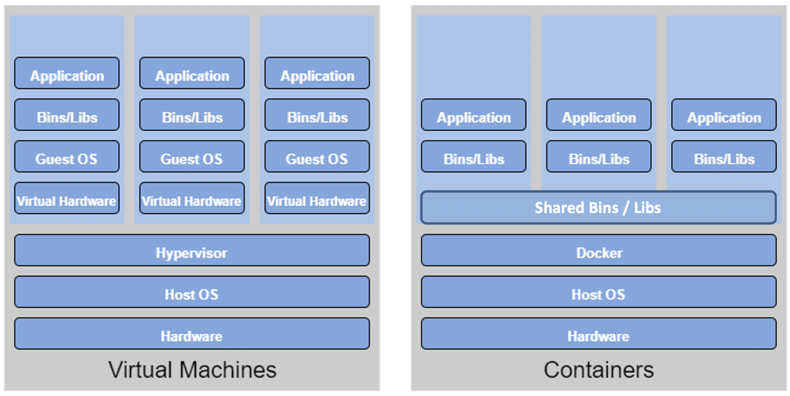
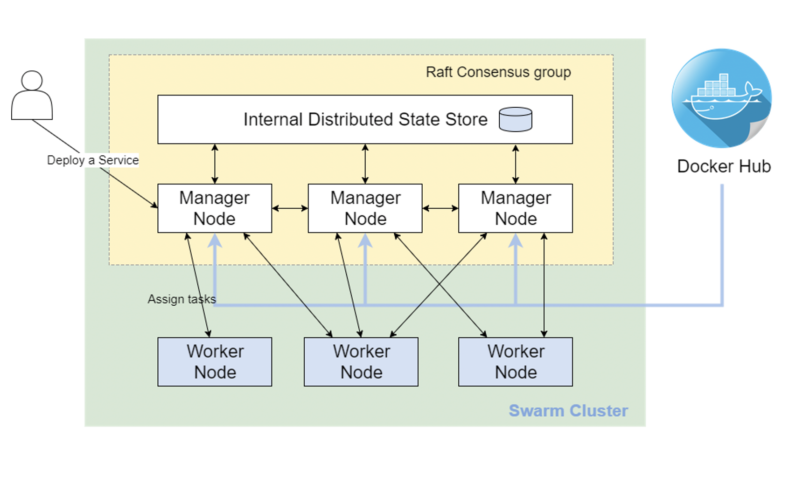

# Lecture 6 Web Services
## Architecture
* A <font color=red>system architecture</font> is the way different software components are distributed on computers, and the way in which they interact with each other.
* Architecture are often difficult to describe in words, hence diagram are often used. Such as UML
>Example of UML Diagram
>>
## <font color=red>Service-oriented Architectures</font>
* In distributed system, components have to interact in more loosely-coupled ways. <font color=red>Services</font> are often used for this. Typically combinations and commonality of services can be used to form a <font color=red>Service-oriented Architecture</font>.
## SoA Core Goals
* A set of externally facing services that a business wants to provide to external collaborators
* An architectural pattern based on service providers, one or more brokers, and service requestor based on agreed service descriptions.
* A set of architectural principles, patterns and criteria that support modularity, encapsulation, loose coupling, separation of concerns, reuse and composability. 
* A programming model complete with standards, tools and technologies that supports development and support of services. 
* A middleware solution optimized for service assembly orchestration, monitoring, and management. 
## SoA Design Principles
* <font color=pink>Standardized service contract</font>: Service adhere to a communications agreement, as defined collectively by one or more service-description documents.
* <font color=pink>Service loose coupling</font>: Services maintain a relationship that minimizes dependencies and only requires that they maintain an awareness of each other. 
* <font color=pink>Service abstraction</font>: Beyond descriptions in the service contract, services hide logic from the outside world. 
* <font color=pink>Service reusability</font>: Logic is divided into services with the intention of promoting reuse.
* <font color=pink>Service autonomy</font>: Services have control over the logic they encapsulate.
* <font color=pink>Service statelessness</font>: Services minimize resource consumption by deferring the management of state information when necessary.
* <font color=pink>Service discoverability</font>: Services are supplemented with communicative meta data by which they can be effectively discovered and interpreted.
* <font color=pink>Service composability</font>: Services are effective composition participants regardless of the size and complexity of the composition.
* <font color=pink>Service granularity</font>: A design consideration to provide optimal scope at the right granular level of the business functionality in a service operation. 
* <font color=pink>Service normalization</font>: Services are decomposed and/or consolidated to a level that minimizes redundancy, for performance optimization, access, and aggregation. 
* <font color=pink>Service optimization</font>: High-quality services that serve specific functions are generally preferable to general purpose low-quality ones.
* <font color=pink>Service encapsulation</font>: Many services are consolidated for use under a SoA and their inner workings hidden.
* <font color=pink>Service location transparency</font>: The ability of a service consumer to invoke a service regardless of its actual location in the network.
## Web Services
* <font color=red>Web Services</font> used to implement SoA.
* Two main flavors:
    * <font color=red>SOAP</font>-based Web Services
    * <font color=red>ReST</font>-based Web Services
* Both use *HTTP*
* Other flavors:
    * Geospatial services: <font color=red>WFS, WMS, WPSM</font>
    * Health services: <font color=red>HL7</font>
    * Statistics: <font color=red>SDMX</font>
## SOAP/WS vs ReST
|SOAP/WS|ReST|
|----|----|
|Built upon the *Remote Procedure Call* Paradigm which is a language independent function call that spans anther system|ReST is centered around resources, and the way they can be manipulated remotely.|
| A stack of protocols that covers every aspect of using a remote service, from service discovery, to service description, to the actual request/response.|ReST is more of a style to use HTTP than a separate protocol
## WSDL
* The <font color=red>Web Services Description Language(WSDL)</font> is an XML-based interface description language that describes the functionality offered by a web service.
* WSDL provides a machine-readable description of how the service can be called, what parameters it expects, and what results/data structures it returns:
    * <font color=pink>Definition</font>: what is does
    * <font color=pink>Target Namespace</font>: Context for naming things
    * <font color=pink>Data Types</font>: Simple/complex data structures inputs/outputs
    * <font color=pink>Messages</font>: Messages and structures exchanged between client and server
    * <font color=pink>Port Type</font>: Encapsulate input/output messages into one logical operation
    * <font color=pink>Bindings</font>: Bind the operation to the particular port type
    * <font color=pink>Service</font>: Name given to the web service itself.
# ReST-based Services
## <font color=red>ReST</font>
* <font color=red>Representational State Transfer(ReST)</font> is intended to evoke an image of how a well-designed web application behaves: A network of web pages<font color=pink> (a virtual state-machine)</font>, where the user progresses through an application by selecting links <font color=pink>(state transitions)</font>, resulting in the next page <font color=pink>(representing the next state of the application)</font> being transferred to the user and rendered for their use.
## Composition of a Name
* Clients requests Resource through Identifier (URL)
* Server/proxy sends representation of Resource
* Puts the client in a certain state
* Representation contains URLs allowing navigation
* Clients follows URL to fetch another resources
* Transitions clients into yet another state
* Representational State Transfer
## <font color=red>Resource-oriented Architecture(RoA)</font>
* A <font color=red>RoA</font> is a way of turning a problem into a ReSTful web service: an arrangement of URIs, HTTP, and XML that works like the rest of the Web
* A resource is anything that's important enough to be reference as a thing in itself
## Mapping Actions to HTTP Methods
|Action|HTTP Method|
|----|----|
|<font color=pink>C</font>reate Resource|*POST* to a new URI <br> *PUT* to an existing URI|
|<font color=pink>R</font>etrieve Resource|*GET*|
|<font color=pink>U</font>pdate Resource|*PUT* to an existing URI|
|<font color=pink>D</font>elete Resource|*DELETE*|
* *PUT* should be used when target resource url is know by the client 
* *POST* should be used when target resource url is server generated
## RoA Procedure
1. Figure out the data set
2. Split the data set into resources and for each kind of resource
3. Name the resources with URIs
4. Expose a subset of the uniform interface
5. Design the representation accepted from the client
6. Design the representation served to the client
7. Integrate this resource into existing resources, using hypermedia links and forms
* Consider the typical course of events: what's supposed to be happen
* Consider error conditions: what might going wrong?
## ReST Best Practices
1. Keep URIs short and create URIs that don't change
2. URIs should be opaque identifiers that meant to be discovered by following hyperlinks, not constructed by the client
3. Use nouns, not verbs in URLs
4. Make all HTTP GETs side-effect free. Doing so makes the request safe
5. Use links in responses to requests. Doing so connects your response with other data. It enables client applications into about 'what's the next step to take'. Contrast this to responses that do not contain links. Thus, the decision of "what's the next step to take' must be made out-of-band
6. Minimize the use of query strings. 
>E.g.
>Prefer: ```http://www.amazon.com/products/AXFC```
>Over: ```http://www.amazon.com/products?product-id=AXFC```
7. Use HTTP status codes to convey errors/success
>|2xx, 3xx|4xx|5xx|
>|----|----|----|
>|200 OK|400 Bad Request|500 Internal Server Error|
>|201 Created|401 Unauthorized|501 Not Implemented|
>|202 Accepted|401 Payment Required|502 Bad Gateway|
>|203 Non-Authoritative|403 Forbidden|503 Service Unavailable|
>|204 No Content|404 Not Found|504 Gateway Timeout|
>|205 Reset Content|405 Method Not Allowed|505 Version Not Supported|
>|206 Partial Content|406 Not Acceptable||
>|300 Multiple Choices|407 Proxy Auth Required||
>|301 Moved Permanently|408 Request Timeout||
>||409 Conflict||
8. Keep the ReST principles in mind:
    * Addressability
    * Uniform Interface
    * Resources and Representations instead of RPC
    * HATEOAS
### ReST - Uniform Interface
Uniform Interface has four constraints:
* <font color=pink>Identification of Resources</font>: Important resources are identified by one resource identifier mechanism
* <font color=pink>Manipulation of Resources through representation</font>: Each resource can have one or more representation.
* <font color=pink>Self-descriptive messages</font>: Requests and responses contain only data but additional headers describing how the content should be handled. 
* <font color=pink>HATEOAS</font>:
    * <font color=red>HATEOAS</font>: Hyper Media as the Engine of Application State
    * Resource representations contains links to identified resources
    * Resources and state can be used by navigating links
        * Links make interconnected resources navigable
        * Without navigation, identifying new resources is service-specific
    * ReSTful applications use <font color=pink>navigate</font> instead of <font color=pink>calling</font>
        * Representations contain information about possible traversals
        * Application navigates to the next resource depending on link semantics
        * Navigation can be delegated since all links use identifiers
### Making Resources Navigable
* Essential for using Hypermedia Driven Application State
* RPC-oriented systems need to expose the available functions
    * Functions are essential for interacting with a service
    * Introspection or interface descriptions make functions discoverable
### HTTP Methods
* <font color=pink>Safe Methods</font>: Do not change repeating a call is equivalent to not making a call at all.
* <font color=pink>Idempotent Methods</font>: Effect of repeating a call is equivalent to making a single call.
>|Safe Methods|*GET, OPTIONS, HEAD*|
>|----|----|
>|Idempotent Methods|*PUT, DELETE*|
>|Neither safe nor idempotent|POST|
# Workshop Containerization and Docker
## Virtualization vs Containerization
* Many advantages of <font color=red>virtualization</font>, such as application containment and horizontal scalability, come with a cost: resources. The guest OS and binaries can give rise to duplications between VMs wasting servers processor, memory and disk space and limiting the number of VMs each server can support.  
* <font color=red>Containerization</font> allows <font color=red>virtual instances</font> to share a single host OS to reduce these wasted resources since each container only holds the application and related binaries. The rest are shared among the containers.
>Figure of difference structures between Virtual Machines and Container:
>>
>Table of difference between Virtual Machines and Containers:
>|Parameter|Virtual Machines|Containers|
>|----|----|----|
>|Guest OS|Run on virtual HW, have their own OS kernels|Share same OS kernel|
>|Communication|Through Ethernet devices|IPC mechanisms(pipes, sockets)|
>|Security|Depends on the Hypervisor|Requires close scrutiny|
>|Performance|Small overhead incurs when instructions are translated from guest to host OS|Near native performance|
>|Isolation|File systems and libraries are not shared between guest and host OS|File systems can be shared and libraries are|
>|Startup time|Slow|Fast|
>|Storage|Large Size|Small Size|
## Container
* Similar concept of resource isolation and allocation as a virtual machine
* Without bundling the entire hardware environment and full OS
## Container Orchestration Tools
* <font color=red>Container Orchestration</font> technologies provides a framework for integrating and managing containers at scale.
* Features:
    * Networking
    * Scaling
    * Service discovery and load balancing
    * Health check and self-healing
    * Security
    * Rolling updates
* Goals:
    * Simplify container management processes
    * Help to manage availability and scaling of containers
* Products:
    * <font color=red>Kubernetes and Hosted Kubernetes</font>
    * <font color=red>Docker SWARM/ Docker Compose</font>
## Docker
### Terminology
* <font color=pink>Container</font>: A process that behaves like an independent machine, it is a runtime instance of a docker image.
* <font color=pink>Image</font>: A blueprint for a container
* <font color=pink>Dockerfile</font>: The recipe to create an image
* <font color=pink>Registry</font>: A hosted service containing repositories of images
* <font color=pink>Repository</font>: A sets of Docker images
* <font color=pink>Tag</font>: A label applied to a Docker image in repository
* <font color=pink>Docker Compose</font>: A tool for defining and running multi-containers Docker applications
* <font color=pink>Docker SWARM</font>: A standalone native clustering/ orchestration tool for Docker
## Manage Data in Docker
* By default, data inside a Docker container won't be persisted when a container is no longer exist.
* Can copy data in and out of a container
* Docker has two options for containers to store files on the host machine, so that the files are persisted even after the container stops:
    * <font color=red>Docker volume</font> (Manage by Docker, /var/lib/docker/volume)
    * <font color=red>Bind mounts</font> (Managed by user, any where on the file system)
## Networking in Docker
* <font color=red>HostL</font>: every container uses the host network stack; which means all containers share the same IP addresses, hence ports cannot be shared across container.<font color=pink> (Linux only)</font>
* <font color=red>Bridge</font>: Containers can reuse the same port, as they have different IP addresses, and expose a port of their own that belongs to the hosts, allowing the containers to be somewhat visible from the outside. 
### Docker commands
* Login to a public Docker Registry
```bash
docker login [OPTIONS] [SERVER]
Example:
docker login -username=foo
```
* Login to a private Docker Registry
```bash
docker login -u AWS
```
* Logout
```bash
docker logout [SERVER]
```
* Pulling an image from a public Docker Registry
```bash
docker pull NAME[:TAG]
Example:
docker pull nginx
```
* List all images
```bash
docker images [OPTIONS] [REPOSITORY[:TAG]]
```
* Tag an image
```bash
docker tag<SOURCE_IMAGE> <TARGET_IMAGE>
Example:
docker tag nginx alwynpan/com90024:nginx
```
* Push an image
```bash
docker push <NAME[:TAG]>
Example:
docker push alwynpan/comp90024:nginx
```
* Create a container, then start the container
```bash
docker create [OPTIONS] IMAGE [COMMAND] [ARG]
docker start [OPTIONS] CONTAINER [CONTAINER]
Example:
docker create --name nginx -p 8080:80 nginx
docker start nginx
```
* Run a container
```bash
docker run [OPTIONS] IMAGE [COMMAND] [ARG]
Example:
docker run --name nginx -p 8080:80 -d nginx
```
* List running containers
```bash
docker ps [OPTIONS]
```
* List all containers
```bash
docker ps -a
```
* Restart a container
```bash
docker restart [OPTIONS] CONTAINER [CONTAINER...]
Example:
docker restart nginx
```
* Stop the container
```bash
docker stop [OPTIONS] CONTAINER [CONTAINER...]
Example:
docker stop nginx
```
* Remove a non-running container
```bash
docker rm [OPTIONS] CONTAINER [CONTAINER...]
Example:
docker rm nginx
```
* Remove a running container
```bash
docker rm -f nginx
```
* Run a Shell within a Container
```bash
docker exec [OPTIONS] CONTAINER COMMAND [ARG...]
Example:
docker exec -ti -w /usr/share/nginx/html/ nginx sh
sed -i 's/nginx!/nignx in Docker!/g' index.html
```
* Create a volume
```bash
docker volume create [OPTIONS] [VOLUME]
Example:
docker volume create --name htdocs
```
* Start a container with a volume attached
```bash
docker run --name nginx-volume -p 8080:80 -v htdocs:/usr/share/nginx/html -d nginx
```
* Start a container with bind mount attached
```bash
docker run --name nginx-bind -p 8081:80 -v $(pwd)/htdocs:/usr/share/nginx/html -d nginx
```
* Create an image
```bash
docker build [OPTIONS] PATH
Example:
docker build -t demo2
```
* Create a container from the image
```bash
docker run --name demo2 -e WELCOME_STRING="COMP90024" -p 8081:80 -d demo2
```
### Docker Compose Commands
* Start the containers
```bash
docker-compose up [OPTIONS]
Example:
docker-compose up -d
```
* Stop the containers
```bash
docker-compose stop [OPTIONS] [SERVICE...]
```
* Remove the containers
```bash
docker-compose down [OPTIONS]
```
## <font color=red>Docker SWARM</font>
* <font color=pink>Raft consensus group</font> consists of internal distributed state store and all manager nodes.
* <font color=pink>Internal Distributed State Store</font> is a built-in key-value store of Docker Swarm mode.
* <font color=pink>Manager Mode</font> conducts orchestration and management tasks. Docker Swarm mode allows multiple manager nodes in a cluster. However, only one of the manager nodes can be selected as a leader.
* <font color=pink>Worker Mode</font> receives and executes tasks directly from the manager node.
* <font color=pink>Node Availability</font>: In Docker Swarm mode, all nodes with ACTIVE availability can be assigned new tasks, even the manager node can assign itself new tasks.
* <font color=pink>Service</font> consists of one or more replica taksks which are specified by users when first creating the service. 
* <font color=pink>Task</font>: In Docker Swarm, task refers to the combination of a single docker container and commands of how it will be run. 
>Example of Docker Swarm Architecture
>>
### Docker Swarm Commands
* create managers and workers
```bash
docker-machine create [OPTIONS] [ARG...]
Example:(Creating one manager and two workers)
docker-machine create manager
docker-machine create worker1
docker-machine create worker2
```
* List all nodes
```bash
docker-machine ls
```
* Login onto node
```bash
docker-machine ssh manager
```
* Create a Docker Swarm
```bash
docker swarm init [OPTIONS]
Example:
docker swarm init --advertise-addr 192.168.99.100
```
* Join a Docker Swarm
```bash
docker swarm join [OPTIONS]
Example:
docker-machine ssh worker1 docker docker swarm join --token [TOKEN]
```
* Create a service
```bash
docker service create [OPTIONS] IMAGE [COMMAND]
Example:
docker-machine ssh manager docker service create --replicas 3 -p 8083:80 --name nginx nginx:alpine
```
* List a service
```bash
docker service ls [OPTIONS]
Example:
docker-machine ssh manager docker service ls
```
* Check a service
```bash
docker service ps [OPTIONS] SERVICE [SERVICE...]
Example:
docker-machine ssh manager docker service ps nginx
```
* Scale up/down
```bash
docker service scale SERVICE=REPLICAS
Example:
docker-machine ssh manager docker service scale nginx=6
docker-machine ssh manager docker service scale nginx=2
```
* Rolling update
```bash
docker service update [OPTIONS] SERVICE
Example:
docker-machine ssh manager docker service update --image alwynpan/comp90024:demo1 nginx
```
