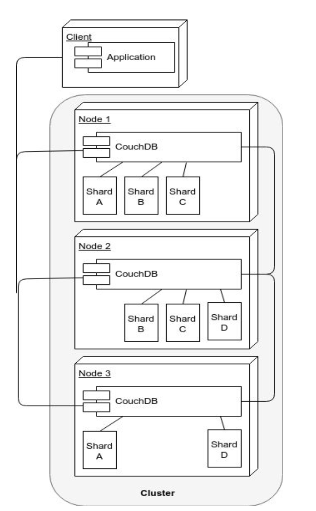

# Lecture 7 
# Big Data
## Four "V"s
* <font color=red>V</font>olume: The size of the data. (In Giga, Tera, Peta...)
* <font color=red>V</font>elocity: The frequency at which new data ios being brought into the system and analytics performed
* <font color=red>V</font>ariety: The variability and complexity of data schema. The more complex the data schemas you have, the higher the probability of them changing along the way, adding more complexity.
* <font color=red>V</font>eracity: The level of trust in the data accuracy; The more diverse sources you have, the more unstructured they are, the less veracity you have.
## Big data needs for Ad-hoc Solutions
* While relational DBMSs are extremely good at ensuring consistency, they rely on normalized data models that. In big data, it can no longer be taken for granted
* Therefore, it makes sense to use DBMSs that are built upon data models that are not relational. <font color=pink>(Relational model: tables and relationships amongst tables)</font>
* While there is nothing preventing SQL to be used in distributed environments, alternative query languages have been used for distributed databases, hence they are sometimes called <font color=red>NoSQL DBMSs</font>
## DBMSs for Distributed Environments
* A <font color=red>key-value store</font> is a DBMS that allows the retrieval of a chunk of data given a key: <font color=pink>fast, but crude</font>
    * E.g. <font color=pink>Redis, PostgreSQL, Hstore, Berkeley DB)</font>
* A <font color=red>BigTable DBMS</font> stores data in columns grouped into <font color=red>column families</font>, with rows potentially containing different columns of the same family.
    * E.g. <font color=pink>Apache Cassandra, Apache Accumulo</font>
* A <font color=red>Document-oriented DBMS</font> stores data as structured documents, usually expressed as XML or JSON
    * E.g. <font color=pink>Apache CouchDB, MongoDB</font>
## A Tale of Two Clusters
* Distributed databases are run over clusters<font color=pink> (Sets of connected computers)</font>
* Clusters are needed to:
    * Distribute the computing load over multiple computers.<font color=pink> To improve availability</font>
    * Storing multiple copies of data.<font color=pink> To achieve redundancy</font>
## CouchDB Cluster Architecture
* All nodes answer requests <font color=pink>(read or write)</font> at the same time.
* Sharding <font color=pink>(splitting of data across nodes)</font> is done on every node.
* When a node does not contain a document <font color=pink>(E.g. a document of Shard A is requested to Node 2)</font>, the node requests it from another node<font color=pink>(Node 1)</font> and returns it to the client. 
* Nodes can be added/removed easily, and their shards are re-balanced automatically upon addition/deletion od nodes.
>Example of a 3 nodes, 4 shards and 2 replicas CouchDB Cluster Architecture
>>
## MongoDB Cluster Architecture
* Sharding is done at the replica set level, hence it involves more than one cluster. <font color=pink>(A shard is on top of a replica set)</font>
* Only the primary node in a replica set answers write requests, but read requests can depending on the specifics of the configuration be answered by every node <font color=pink>(including secondary node)</font> in the set 
* Updates flow only from the primary to the secondary 
* If a primary node fails, or discovers it is connected to a minority of nodes, a secondary of the same replica set is elected as the primary
* Arbiters <font color=pink>(MongoDb instances without data)</font> can assist in breaking a tie elections
* Data are balanced across replica sets
* Since a quorum has to be reached, it is better to have an odd number of voting members.
>Example of MongoDB Cluster Architecture
>>
## MongoDB vs. CouchDB Clusters
* MongoDB clusters are considerably more complex then CouchDB clusters.
* MongoDB clusters are less available, as only primary nodes can talk to clients for read operations, and exclusively so for write operations
* MongoDB software routers <font color=pink>(MongoS)</font> must be embedded in application servers, while any HTTP client can connect to CouchDB
* Losing two nodes out of three in the CouchDB architecture as shown means losing access to one quarter of data.
* Losing two nodes in the MongoDB example implies losing write access to half the data, and possibly read access too, depending on the cluster configuration parameters and the nature <font color=pink>(primary or secondary)</font> of the lost nodes.
* Some features are not supported in MongoDB sharded environments
* While CouchDB uses MVCC, MongoDB uses a mix of two-phase commit <font color=pink>(for replicating data from primary to secondary nodes)</font> and Paxos-like <font color=pink>(to elect a primary node in a replica-set)</font>
* The different choices of strategies explains the different cluster architectures for these two DBMSs
## CAP Theore
* <font color=red>C</font>onsistency: Every client receiving an answer receives the same answer from all nodes in the cluster
* <font color=red>A</font>vailability: Every client receives an answer from any node in the cluster
* <font color=red>P</font>artition-tolerance: The cluster keeps on operating when one or more nodes cannot communicate with the rest of the cluster
>Figure of CAP Theorem
>>
* While the theorem shows all three qualities are symmetrical, consistency and availability are at odds when a partition happens
* "Hard" network partitions may be rare, but "soft" network partitions are not. <font color=pink>(a slow node may be considered dead even it is not)</font>; 
* Can have consequences that impact the cluster as a whole
* Traditional DBMS architectures were not concerned with network partitions since all data were supposed to be in a small, co-located cluster of servers
* The emphasis on numerous commodity servers, can result in an increased number of hardware failures
* The CAP theorem focus on considering trade-offs among different options
### Consistency and Availability: Two phase commit
* This is the usual algorithm used in relational DBMS's, it enforces consistency by:
    * Locking data that are within the transaction scope
    * Performing transactions on write-ahead logs
    * Completing transactions only when all nodes in the cluster have performed the transaction
    * aborts transactions when a partition is detected
* This procedure entails the following:
    * Reduced availability <font color=pink>(data lock, stop in case of partition)</font>
    * Enforced consistency <font color=pink>(every database is in a consistency state, and all are left in the same state)</font>
* Therefore, two-phase commit is a good solution when the cluster is co-located. Less good when it is distributed
### Consistency and Partition-Tolerance: Paxos
* Driven by consensus, and is both partition-tolerant and consistent
* In Paxos, every node is either a proposer or an accepter:
    * A <font color=red> proposer</font> proposes a value<font color=pink> (with a timestamp)</font>
    * An <font color=red> accepter</font> can accept or refuse a propose
* When a proposer has received a sufficient number of acceptances, and a confirmation message is sent to the accepters with the agreed value
* Paxos clusters can recover from partitions and maintain consistency, but smaller part of a partition <font color=pink>(the part that is not in the quorum)</font> will not sent responses, hence the availability is compromised.
### Availability and Partition-Tolerance: Multi-Version Concurrency Control(MVCC)
* MVCC is a method to ensure availability <font color=pink>(every node in a cluster always accept requests)</font>, and some sort of recovery from a partition by reconciling the singe databases with revisions. <font color=pink>(Data are not replaced, they are just given a new version number)</font>
* In MVCC, concurrent updates are possible without distributed locks, since the updates will have different revision numbers; the transaction that completes last will get a higher revision number, hence will be considered as the current value
* In case of cluster partition and concurrent requests with the same revision number going to two partitioned nodes, both are accepted, but once the partition is solved, there would be a conflict. Conflict that would have to be solved somehow. <font color=pink> (CouchDB returns a list of all current conflicts, which are then left to be solved by the application)</font>
### Addendum: The Peculiar Case of the Blockchain
* Blockchains can be described, inalterable, verifiable databases. 
* Bitcoin works on a cluster of peer-to-peer nodes, each containing a copy of the entire database, operated by different-possibly malicious-actors
* Since new nodes can enter the system at any time, and every node has the entire database, availability is not an issue even in case of partition, but consistency cannot be assured, since you cannot trust a single node. 
* To achieve consistency, Bitcoin uses a form of MVCC based proof-of-work <font color=pink>(Which is a proxy for the computing power used in a transactions)</font>  and on repeated confirmations by a majority of nodes of a history of transactions
* The guarantee of Bitcoin database security is that  no single actor can amass enough the cluster computing power. <font color=pink>(with 6 confirmations, an actor that controls 18% of the computing power has a 1% probaility of compromising a transaction)</font>.
## Documented-oriented DBMS for Big Data
* While relational DBMSs are extremely good for ensuring consistency and availability, the normalization that lies at the heart of a relational database model implies fine-grained data, which are less conductive to partition than coarse-grained data.
## Sharding
* <font color=red>Sharding</font> is the partitioning of a database horizontally. <font color=pink>i.e. The database rows are partitioned into subsets that are stored on different servers.</font> Every subset of rows are called <font color=red>shard</font>.
* Usually the number of shards is larger than the number of replicas, ans the number of nodes is larger than the number of replicas
* The main advantage of a sharded database lies in the improvement of performance through the distribution of computing load across nodes. In addition, it makes it easier to move data files around. <font colo=pink>i.e. when adding new nodes to the cluster</font>
* The number of shards that split a database dictates the number of nodes: the maximum number of nodes is equal to the number of shards
* There are different sharding strategies:
    * <font color=pink>Hash sharding</font>: To distribute rows evenly across the cluster
    * <font color=pink>Range sharding</font>: Similar rows that are stored on the same node.
### Replication and Sharding
* <font color=red>Replication</font> is the action of storing the same row on different nodes to make the database fault-tolerant.
* Replication and sharding can be combined with the objective of maximizing availability while maintaining a minimum level of data safety.
* ```n``` is the number of replicas <font color=pink>(How many times the same data item is repeated across the cluster)</font>
* ```q``` is the number of shards <font color=pink>(How many files a database is split)</font>
* ```n * q``` is the total number of shard files distributed in the different nodes of the cluster
### Partitions
* A <font color=red>partition</font> is a grouping of logically related rows in the same shard
* Partitioning improves performance by restricting queries to a single shard
* To be effective, partitions have to be relatively small
* A database has to be declared partitioned during the creation
### MapReduce Algorithms
* This family of algorithms is particularly suited to parallel computing of a SIMD
* The first step <font color=pink>Map</font>, distributes daa across machines, while the second state <font color=pink>Reduce</font> hierarchically summarizes them until the result is obtained
* Apart from parallelism, its advantage lies in moving the process to where data are and reducing network traffic.
* Pseudo code for MapReduce Algorithm:
```
function map(name, document):
    for each word w in document:
        emit (w, 1)
function reduce(word, partialCounts):
    sum=0
    for each pc in partialCounts:
        sum += px
    emit (word, sum)
```
# CouchDB
## Why using CouchDB
* Open-source, hence you can peruse the source code and see how it works
* Has MapReduce queries, hence you can understand how this programming paradigm works
* Easy to setup a cluster
* Has sharding, replication and partitions
* HTTP API makes it easy to interact with.
## Main Features
* <font color=pink>Documented-oriented DBMS</font>, where documents are expressed in JSON
* <font color=pink>HTTP ReST API</font>
* <font color=pink>Web-based admin interface</font>
* <font color=pink>Web-ready</font>: since it talks HTTP and produce JSON, it can be both the data and logic tier of a three-tier application, hence avoiding the marshaling and unmarshaling of data objects
* <font color=pink>Support for MapReduce algorithms</font>, including aggregation at different levels
* <font color=pink>JavaScript as the default data manipulation language</font>
* <font color=pink>Full-text Search</font>
* <font color=pink>Support of MongoDB query language</font>
* <font color=pink>Support of replication</font>
* <font color=pink>Support of partition</font>
* <font color=pink>Support of sharding</font>
* <font color=pink>Support of clusterized databases</font>
## CouchDB Databases
* A CouchDB instance can have many databases. Each database can have its own set of functions and can be stored in different shards
* Adding and deleting a data is done through a HTTP call:
```bash
curl -X PUT "http://localhost:5984/exampledb"
curl -X DELETE "http://localhost:5984/exampledb"
```
* Listing all databases of an instance:
```bash
curl -X GET "http://localhost:5984/_all_dbs"
Output: Body is a JSON object
$ ['exampledb', 'twitter', 'instagram']
```
* In every CouchDB instance there are system databases. These are prefixed by underscore. <font color=pink> E.g. ```_users```</font>
## Insertion and retrieval of documents
* Insert a document:
```bash
curl -X POST "http://localhost:5984.exampledb" --header "Content-Type: application/json" --data '{"type": "account", "holder": "Alice", "initialbalance": 1000}'
Output:
{"ok":true,"id":"c43bcff2cdbb577d8ab2933cdc0011f8","rev":"1-b8a039a8143b474b 3601b389081a9eec"}
```
* To retrieve a document:
```bash
curl -X GET "http://localhost:5984/exampledb/c43bcff2cdbb577d8ab2933cdc0011f8"
Output:
{"_id":"c43bcff2cd577d8ab2933cdc0011f8","_rev":"1-b8a039a8143b474b3601b38908 1a9eec", "type": "account", "holder": "Alice", "initialbalance": 1000}
```
## System Properties of Documents
* ```_id```: The ID of a single document which can be set during the document load; by default it is generated by CouchDB and guaranteed to be increasing
* ```_rev```: Revision number of a document. It is guaranteed to be increasing per-document.
* Request to set the ID of a document:
```bash
curl -X PUT "http://localhost:5984/exampledb/charlie" --header "Content-Type: application/json" --data '{"type": "account", "holder": "Charlie", "initialbalance": 100}'
Output:
{"ok":true,"id":"charlie","rev":"1-faff5448bf3051ac4fb8f1cc2b04bc51"}
```
### MVCC and Revision Numbers
>Example of how two clients querying a single database instance do not lock data and still avoid inconsistency by using number for transactions
>|Time|Client 1|Client2|
>|----|----|----|
>|t1|POST obj1, {email:"a@x.au"} ==> OK, rev:1||
>|t2||PUT obj1, rev:1, {email:"b@x.au"} ==> OK, rev:2|
>|t3|PUT obj1, rev:1,{email:"c@x.au"} ==> ERROR||
>|t4|GET obj1 ==> OK, rev:2, {name:"b@x.au"}||
>|t5|PUT obj1, rev:2, {name: "c@x.au"} ==> OK, rev:3||
* MVCC relies on monotonically increasing revision numbers, and preservation of old object versions to ensure availability
### The Way to Avoid Conflicts in MVCC
* State which revision to update refers to:
```bash
curl -X PUT "http://localhost:5984/exampledb/charlie?rev=1-faff5448bf3051ac4fb8f1cc2b04bc51" --header "Content-Type:application/json" --data '{"type": "account", "holder": "Charlie", "initialbalance": 200}'
```
### What happens when a conflict happens on a cluster of CouchDB Nodes
* When the revision number is not sent when documents are updated a ```409``` is raised in a single-node database, but something similar may happen on a clustered database even if the revision number is sent
* When a cluster is partitioned and two nodes receive two different updates of the same document, two different revisions are added. However, only one of these is returned as the current revision. <font color=pink> (the winning revision is computed deterministically, hence guaranteed to be the same on any node of the cluster)</font>. At any rate, the losing revision is still stored in the database, and can be used to solve the conflict. 
## Deletion of Documents
* Deleting a document:
```bash 
curl -X DELETE "http://localhost:5984/exampledb/charlie?rev=2-c0716f36b7cb2b2d31102fe807697573"
```
* Actually documents are not deleted until they are purged, hence they can be retrieved with a bit of effort
* Delete a document permanently:
```bash
curl -X POST "http://localhost:5984/exampledb/_purge" --header "Content-Type:application/json" --data '{"charlie": ["3-320d11c2d78a18ccc0220086c418cc41"]}'
```
## Bulk-manage documents
* Document can be bulk loaded, deleted or updated via the CouchDB bulk docs API:
```bash
curl -v -X POST "http://localhost:5984/exampledb/_bulk_docs" --header "Content-Type:application/json" --data '{"docs":[{"name":"joe"},{"name":"bob"}]}'
```
* The same POST request can be used to update documents. 
## Attachments of the document
* A document can have one or more attachments of whatever MIME-type is needed, including binary ones.
```bash
 curl -X PUT "http://localhost:5984/exampledb/text/original?rev=1-26074febbe9a4a0e818f7d5587 d7411a" --header "Content-Type:image/png" --data @./scannedtext.png
 ```
 ## Querying a CouchDB Database
 * CouchDB has three mechanisms to select a set of documents that exhibit certain features:
    * <font color=red>MapReduce Views</font>: Results of MapReduce processes that are written as B-tree indexes to disk and become part of the database
    * <font color=red>Mango Queries</font>: Queries expressed in JSON, following the MongoDB queries syntax
    * <font color=red>Full-text Search</font>: Queries that can search from specific works or portions of words
# Views
* CouchDB views are not:
    * Relational SQL Queries
    * Relational Views
    * Indexes
* Views are:
    * Similar to Index-organized tables in Oracle, which are defined as: <font color=pink>a storage organization that is variant of a primary B-tree. Unlike an ordinary(heap-organized) table whose data is stored as an unordered collection(heap), data for an index-organized table is stored in a B-tree index structure in a primary key sorted manner. Each leaf block in the index structure stores both the key and non-key columns</font>
* Views are fast and store aggregated data.
### Example of View
* Suppose database composed of document like:
```JSON
{"_id": "c43bcff2cdbb577d8ab2933cdc18f402", "name": "Chris White",
"type": "transaction",
"amount": 100}
```
* MapReduce:
    * map part: ``` function(doc) {emit ([doc.name], doc.amount);}```
    * reduce part: ```funtion(keys, values, rereduce){return sum(values);}```
* ```keys``` parameter: an array of keys, as returned by the view. <font color=pink> (null when rereduce si true)</font>
* ```values``` parameter: an array of values, as returned by the view
* ```rereduce``` parameter: 
    * If false, the reduce is still in its first stage <font color=pink>(values are the disaggregated ones)</font>;
    * If true, the reduce has happened at least once, and the function works on aggregated keys and values. <font color=pink> (hence the keys parameter is null)</font>
* Keys can be composite:
```javascript
function(doc) {
    if (doc.type === "text" ) {
        var words= doc.contents.split(/[\s\.,]+/); 
        for (var i in words) {
            if (words[i].length > 1) { 
                emit([words[i].substring(0,1),words[i]], 1);
            }
        }
    }
}
Output:
["a", "ad"], 1
["a", "adipisicing"], 1 
["a", "aliqua"], 1
```
* Views can be called from HTTP: ``` http://localhost:5984/exampledb/_design/example/_view/wc2 ?group_level=2&startkey=[“a”,null]&endkey=[“c”,{}]```
* Views:
    * are grouped into design documents
    * may be passed the level of aggregation
    * may return only a subset of keys
    * are persisted to disk space
    * Since there is no schema and documents of different types are often stored in the same database, it is useful to add a type attribute to docs, which come in handy when defining views
    * are computed in the background by a daemon called *ken* hence it may take some time before an update operation is refleced in the views
    * are re-computed every time one of the views in the same design document is updated, hence be careful in packing too many views in the same design document
    * can be defined in languages other than javascript
    * can use libraries
    * cannot be passed custom parameters either during indexing or during querying.
* Computation of views can be influenced only by the document itself
* Keys are case-sensitive, as they are RDBMS indexes
* Pagination is available through the use of ```skip``` and ```limit``` parameters
* Since views are updated only when used, their results would have to wait for the view update. Unless ```stale``` parameter is et to ```update_after```. <font color=pink> (Forcing the update of the view to happen after the results are returned to the client)</font>
* The Reduce part of a View can be more complex than adding values. 
* Reduce function must be referentially transparent, associative and commutative. The order of computations must not influence the result.
### CouchDB Joins
* Views can be used to simulate joins. Order rows by a common key
### List and Show Functions
* Views are limited, since they can produce only JSON and cannot change their behavior
* To address these shortcomings, CouchDB offer List and Show functions 
    * Both these two classes of functions can modify their behavior when HTTP request parameters are sent, and both can produce non-JSON output
    * List functions transform a view into a list of something
    * Show function transform an entire document into something else.
## Replication in CouchDB
* There is a system ```_replicator``` database that holds all the replications to be performed on the CouchDB instance; adding a replication is just a POST away:
```bash
curl -H 'Content-Type: application/json' -X POST http://localhost:5984/_replicate -d ' {"source": "http://myserver:5984/foo", "target": "bar", "create_target": true, "continuous": true}'
```
* Note that ```continuous``` attribute is set to true; If this were false, the database instance would be replicated only once
* To cancel a replication, just issue that same exact JSON, but with an additional ```cancel``` attribute set to true.
* Replications are uni-directional, for a properly balanced system, you need to add two replication
## Partitioned Databases
* A partitioned database can be created by adding the parameter ```partitioned```:
```bash
curl -X PUT "http://localhost:5984/testpart?partitioned=true"
--user '<username>:<password>'
```