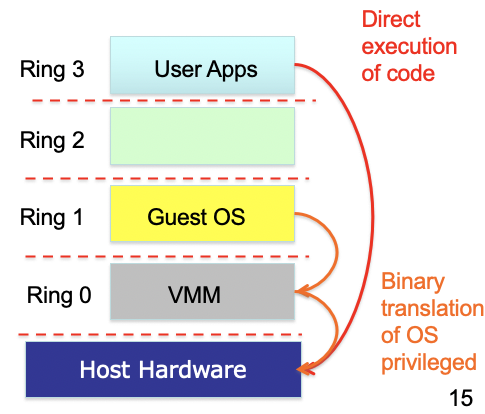
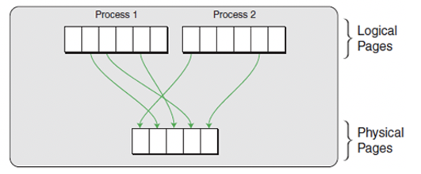

# Lecture 8.1 Virtualization
## Virtualization Terminology
* <font color=red>Virtual Machine Monitor/Hypervisor</font>: The virtualization layer between the underlying hardware and virtual machines and guest operating systems it supports
    * The environment of the VM should appear to be the same as the physical machine
    * Minor decrease in performance only
    * Appears as though in control of system resources
* <font color=red>Virtual Machine</font>: A representation of a real machine using hardware/software that can host a guest operating system
* <font color=red>Guest Operating System</font>: An operating system that runs in a virtual machine environment that would otherwise run directly on a separate physical system.
>Example of virtualization architecture
>>
## Kernel-User Mode Separation
* Process run in lower privileged mode
* OS Kernel runs in privileged Kernel mode
* OS typically virtualize memory, CPU, disk, and etc, giving appearance of complete access to CPU/memory/disk to application processes
    * Each process has illusion of access to some/all of the memory or the CPU
* Context switches can catch sensitive calls
    * E.g. <font color=pink>Add two numbers vs change bios settings</font>
    * Sensitive calls -> instruction sets are typically devices specific
> Architecture of Kernel-User mode separation
>>
## What happens in VM
* VMM/Hypervisor: Gives perception of a whole machine
* <font color=red>VHD(Virtual Hard Disk)</font>: A virtual hard disk drive. May contain what is found on a physical hard disk, such as a disk partitions and a file system, which in turn can contain files and folders
* <font color=red>VMDK(Virtual Machine Disk)</font>: Describes containers for virtual hard disk drives to be used in a virtual machines like *VMware*
* <font color=red>qcow2(QEMU Copy On Write)</font>file format for disk image files used by QEMU. It uses a disk storage optimization strategy that delays allocation of storage until it is actually needed。
* Guest OS apps "think" they write to hard disk translated to virtualized host hard drive by VMM
## Virtualization Motivation
* Server consolidation
    * Increased utilization
    * Reduced energy consumption
* Personal Virtual machines can be created on demand
    * No hardware purchase needed
    * Public cloud computing
* Security/Isolation
    * Share a single machine with multiple users
* Hardware independence
    * Relocate to different hardware
## Virtualization Principles
* Properties of interest
    * <font color=red>Fidelity</font>: Software on the VMM executes behavior identical to that demonstrated when running on the machine directly, barring timing effects
    * <font color=red>Performance</font>: An overwhelming majority of guest instructions executed by hardware without VMM intervention
    * <font color=red>Safety</font>: The VMM manageres all hardware resources
* <font color=red>Popek and Goldberg Theorem</font>: For any conventional third generation computer, a virtual machine monitor may be constructed if the set of sensitive instructions for that computer is a subset of the set of privileged instructions
* Privilege Rings
    * Ring 0: Typically hardware interactions
    * Ring 1: Typically device drivers
    * Specific gates between rings
    * Allows to ensure spyware can't turn on web cam on recording device
>Example of a privilege Rings
>>
    
## Classification of Instructions
* <font color=red>Privileged Instructions</font>: Instructions that trap of the processor is in user mode and do not trap in kernel mode.
* <font color=red>Sensitive Instructions</font>: Instructions whose behavior depends on the mode or configuration of the hardware
    * Different behaviors depending on whether in user or kernel mode
* <font color=red>Innocuous Instructions</font>: Instructions that are neither privileged nor sensitive
    * Read data, add numbers
### x86 Virtualizability 
* <font color=red>x86</font> architecture was historically not virtualizable, due to sensitive instructions that could not be trapped. E.g. Instructions such as:
    * <font color=pink>SMSW</font>: Storing machine status word
    * <font color=pink>SGDT, SLDT</font>: store global/local descriptor table register
    * <font color=pink>POPF</font>: Interrupt flag of user/kernel mode
## Virtualization Strategy
VMM needs to support:
* <font color=pink>De-privileging</font>:
    * VMM emulates the effect on system/hardware resources of privileged instructions whose execution traps into the VMM.<font color=pink> Trap-and-emulate</font>
    * Typically achieved by running GustOS at a lower hardware priority level than VMM
    * Problematic on some architectures where privileged instructions do not trap when executed at de-privileged level
* <font color=pink>Primary/shadow structures</font>:
    * VMM maintains shadow copies of critical structures whose primary versions are manipulated by the GuestOS. <font color=pink>E.g. Memory page tables</font>
    * Primary copies needed to insure correct versions are visible to GuestOS
* <font color=pink>Memory Traces</font>
    * Controlling access to memory so that the shadow and primary structure remain coherent
    * Common strategy: write-protect primary copies so that update operations cause page faults which can be caught, interpreted, and addressed
>Example of a Virtualization Architecture
>>
* Major VMM and Hypervisor Providers
>|VMM Provider|Host CPU|Guest CPU|Host OS|Guest OS|VM Architecture|
>|----|----|----|----|----|----|
>|VMWare Workstation|x86, x86-64|x86, x86-64|Windows, Linux|Windows, Linux, Solaris, FreeBSD, OS/2|Full Virtualization|
>|VMWare ESX Server|x86, x86-64|x86, x86-64|No Host OS|Same as VMWare workstation|Baremetal hypervisor|
>|Xen|x86, x86-64, IA-64|x86, x86-64, IA-64|NetBSD, Linux, Solaris|Windows, Linux, Solaris, FreeBSD, OS/2, NetBSD|Para-virtualization|
>|KVM|||Linux|Linux, Windows, FreeBSD, Solaris|Hardware Virtualization|
## Aspects of VMMs
* <font color=pink>Full virtualization</font>: Allow an unmodified guest OS to run in isolation by simulating full hardware
* <font color=pink>Para-virtualization</font>: VMM/Hypervisor exposes special interface to guest OS for better performance. Requires a modified/hypervisor-aware Guest OS
    * Can optimize systems to use this interface since not all instructions need to be trapped/dealt with.
* <font color=pink>Hardware-assisted virtualization</font>: Hardware provides architectural support for running a Hypervisor
    * New processors typically have this
    * Requires that all sensitive instructions trappable
* <font color=pink>Binary Translation</font>: Trap and execute occurs by scanning guest instruction stream and replacing sensitive instructions with emulated code
    * Don't need hardware support, but can be much harder to achieve
* <font color=pink>Bare Metal Hypervisor</font>: VMM runs directly on actual hardware.
    * Boots up and runs on actual physical machines
    * VMM has to support device drivers.
* <font color=pink>Hosted Virtualization</font>: VMM runs on top of another operating system
### Full Virtualization
* Advantages:
    * Guest is unaware it is executing within a VM
    * Guest OS need not to be modified
    * No hardware or OS assistance required
    * Can run legacy OS
* Disadvantages:
    * Can be less efficient
* User/kernel split typically at:
    * VMM run Ring 0
    * Apps run in Ring 3
* Virtualization uses extra rings; VMM traps privileged instructions and translates to hardware specific instructions
>Example of Full Virtualization
>>
### Para-Virtualization
* Advantages:
    * Lower virtualization overheads, so better performance
* Disadvantages:
    * Need to modify guest OS
    * Less portable
    * Less compatibility
>Example of para-virtualization
>>
### Hardware-assisted Virtualization
* Advantages:
    * Good Performance
    * Easier to implement
    * Advanced implementation supports hardware assisted DMA, memory virtualization
* Disadvantages:
    * Needs hardware support
* New Ring -1: Supported Page tables, virtual memory mgt, direct memory access for high speed reads. 
>Example of Hardware-assisted Virtualization
>>
### Binary Translation
* Advantages:
    * Guest OS need not be modified
    * No hardware or OS assistance required
    * Can run legacy OS
* Disadvantages:
    * Overheads
    * Complicated
    * Need to replace instructions 'on-the-fly'
    * Library support to help this.
> Example of Binary Translation
>>
## Operating System Level Virtualization
* Lightweight VMs
* Instead of whole-system virtualization, the OS creates mini-containers
    * A subset of the OS is often good enough for many use cases
    * Akin to an advanced version of 'chroot'
        * Operation that changes apparent root directory for current running process and subprocesses. Program run in such a modified environment cannot access files and commands outside that environmental directory tree.
* Examples: <font color=pink>LXC, Docker, OpenVZ, FreeBSD Jails</font>
* Advantages:
    * Lightweight
    * Many more VMs on same hardware
    * Can be used to package applications and all OS dependencies into container
* Disadvantages:
    * Can only run apps designed for the same OS
    * Cannot host a different guest OS
    * Can only use native file systems
    * Uses same resources as other containers
## Memory Virtualization
* Conventionally page tables store the logical page number -> physical page number mappings
    * Seems like more memory than actually have
>Example of Memory Virtualization
>>
>Inside a virtual machine:
>>
## Shadow Page Tables
* VMM maintains shadow page tables in lock-step with the page tables
* Adds additional management overhead
* Hardware performs guest -> physical and physical -> machine translation
>Example of Shadow Page Tables
>>
## Live Migration from Virtualization Perspective
>
# Lecture 8.2 OpenStack
## Many associated/underpinning services:
* <font color=red>Nova</font>: Compute Service
* <font color=red>Glance</font>: Image Service
* <font color=red>Clinder</font>: Block Storage Service
* <font color=red>Swift</font>: Object Storage Service
* <font color=red>Keystone</font>: Security Management
* <font color=red>Heat</font>: Orchestration Service
* <font color=red>Neutron</font>: Network Service
* <font color=red>Zun</font>: Container Service
* <font color=red>Trove</font>: Database Service
* <font color=red>Horizon</font>: Dashboard Service
* <font color=red>Searchlight</font>: Search Service
>OpenStack Architecture
>>
## Key Services in OpenStack
* Identity Service: <font color=red>Keystone</font>
    * Provides an authentication and authorization service for OpenStack services
        * Tracks users/permissions
    * Provides a catalog of endpoints for all OpenStack services
        * Each service registered during install
            * Know where they are and who can do what with them
            * Project membership, firewall rules, image management
    * Generic authorization system for OpenStack
* Compute: <font color=red>Nova</font>
    * Manages the lifecycle of compute instances in an OpenStack environment
    * Responsibilities include spawning, scheduling and decommissioning of virtual machines on demand
    * Virtualization agnostic
        * <font color=pink>Libvirt</font>
        * <font color=pink>XenAPI, Hyper-V, VMWare ESX</font>
        * <font color=pink>Docker</font>
    * API:
        * <font color=pink>Nova-api</font>: Accepts/responds to end user API calls; Supports OpenStack Compute & EC2 & admin APIs
    * Compute Core:
        * <font color=pink>Nova-Compute</font>: Daemon that creates/terminates VMs through hypervisor APIs
        * <font color=pink>Nova-Scheduler</font>: Schedules VM instance requests from queue and determines which server host to run
        * <font color=pink>Nova-Conductor</font>: Mediates interactions between compute services and other components
    * Networking
        * <font color=pink>Nova-Network</font>: Accepts networks tasks from queue and manipulates network
* Object Storage: <font color=red>Swift</font>:
    * Stores and retrieves arbitrary unstructured data objects via ReSTful API.
    * Fault tolerant with data replication and scale-put architecture
        * Available from anywhere; Persists until deleted
        * Allows to write objects and files to multiple drives, ensuring the data is replicated across a server cluster
    * Can be sued with/without Nova compute
    * Client; Admin support
        * <font color=pink>Swift client</font>: Allows uses to submit command to ReST API through command line clients to configure/connect object storage to VMs
* Block Storage: <font color=red>Cinder</font>
    * Provides persistent block storage to virtual machines (instances) and supports creation and management of block storage devices
    * Cinder access associated with a VM:
        * <font color=pink>Cider-api</font>: Routes requests to cinder-volume
        * <font color=pink>Cinder-volume</font>: Interacts with block storage service and scheduler to read/write requests; Can interact with multiple flavors of storage. <font color=pink>(flexible driver architecture)</font>
        * <font color=pink>Cinder-scheduler</font>: Selects optimal storage provider node to create volumes
        * <font color=pink>Cinder-backup</font>: Provides backup to any types of volumes to backup storage provider
            * Can interact with variety of storage solutions
* Image Service: <font color=red>Glance</font>
    * Accepts requests for disk or server images and their associated metedata (from Swift) and retrieves / installs (through Nova)
        * <font color=pink>Glance-api</font>: Image discovery, retrieval and storage requests
        * <font color=pink>Glance-registry</font>: Stores, processes and retrieves metadata about images
* Networking: <font color=red>Neutron</font>
    * Supports networking of OpenStack services
    * Offers an API for users to define networks and the attachments into them
    * Pluggable architecture that supports multiple networking vendors and technologies
    * <font color=pink>Neutron-server</font>: Accepts and routes API requests to appropriate plugins for action
        * Port managements
        * More broadly configuration of availability zone networking
* Dashboard: <font color=red>Horizon</font>
    * Provides a web-based self-service portal to interact with underlying OpenStack services, such as launching an instance, assigning IP addresses and configuring access controls
    * Based on Python/Django web application
    * Mod_wsgi: Apache plug realizing web service gateway interface
    * Requires Nova, Keystone, Glance, Neutron
* Database Service:<font color=red>Trove</font>
    * Provides scalable and reliable Cloud database(DBaaS) functionality for both relational and non-relational database engines
        * Resources isolation, high performance, automates deployment, config, patching, backups, restores, monitoring
        * Use image service for each DB type and <font color=pink>trove-manage</font> to offer them tenants/user communities
* Data Processing Service: <font color=red>Sahara</font>
    * Provides capabilities to provision and scale Hadoop cluster in OpenStack by specifying parameters such as Hadoop version, cluster topology and node hardware details
        * User fills in details and Sahara supports the automated deployment of infrastructure with support for addition/removal of worker nodes on demand
* Orchestration Service: <font color=red>Heat</font>
    * Template-driven service to manage lifecycle of applications deployed on OpenStack
    * Stack: Another name for the template and procedure behind creating infrastructure and the required resources from the template file
    * Can be integrate with automation tools such as <font color=pink>Chef, Puppet, Ansible</font>
    * Heat details:
        * <font color=pink>heat_template_version</font>: Allows to specify which version of Heat the template was written for
        * <font color=pink>Description</font>: Describes the intent of the template to a human audience
        * <font color=pink>Parameters</font>: The arguments that the user might be required to provide
        * <font color=pink>Resources</font>: The specifications of resources that are to be created
        * <font color=pink>Outputs</font>: Any expected values that are to be returned once the template has been processed
    * Creating Stacks:
        1. Create the template file according to your requirements
        2. Provide environment details <font color=pink>(name of key file, image id)</font>
        3. Select a name for your stack and confirm the parameters
        4. Make sure rollback checkbox is marked, so if anything goes wrong, all partially created resources get dumped.
# Lecture 8.3 Serverless
## Disambiguation
* *FaaS* is also know as <font color='red'>Serverless computing</font>
* The idea behind Serverless/*FaaS* is to develop software application without bothering with the infrastructure. <font color='pink'>(Especially scaling-up and down as load increases or decreases)</font>
* Therefore, it is more *Server-unseen* than *Server-less*
* A *FaaS* service allows function to be added, removed, updated, executed, and auto-scaled
* *FaaS* is an extreme form of *microservice architecture*
## Functions
* A <font color='red'>function</font> in computer science is typically a piece of code that takes in parameters and returns a value
* Function are the founding concept of functional programming - one of the oldest programming paradigms
* Functions are free of side-effects, ephemeral, and stateless, which make them ideal fir parallel execution and rapid scaling-up and -down, hence their use in *FaaS*
## *FaaS*
* Simpler deployment. <font color='pink'>(The service provider takes care of the infrastructure)</font>
* Reduced computing costs. <font color='pink'>(Only the time during which functions are executed is billed)</font>
* Reduced application complexity due to loosely-coupled architecture. 
## *FaaS* Application
* Functions are triggered by events
* Functions can call each other
* Functions and events can be combined to build software applications
* <font color='pink'>E.g. A function can be triggered every hour, or every time disk space on a volume is scarce, or when a pull-request is closed on GitHub, or when a message is stored in a queue.</font>
* Combining event-driven scenarios and functions resembles how User Interface software is built: user actions trigger the execution of pieces of code.  
## *FaaS* Services and Frameworks
* The first widely available FaaS service was Amazon's AWS Lambda. SInce then Google Cloud Functions and Azure Functions by Microsoft
* All of the FaaS above allow functions to use the service of their respective platforms, thus providing a rich development environment. 
* There are several open-source frameworks <font color='pink'>(funtainers or function containers)</font> such as *Apache OpenWisk, OpenFaas, and Kubernetes Knative*
* The main difference between proprietary FaaS services and open-source FaaS frameworks is that the latter can be deployed on your cluster, peered into, disassembled and improved by you.
## Side-effect Free Functions
* A function that does not modify the state of the system is said to be side-effect free. <font color='pink'>E.g. A function that takes an image and returns a thumbnail of that image</font>
* A function that changes the system somehow is not side-effect free. <font color='pink'>E.g. A function that writes to the file system the thumbnail of an image</font>
* Side-effect free functions can be run in parallel, and are guaranteed to return the same output given the same input.
* Side-effects are almost inevitable in a relatively complex system. Therefore, consideration must be given on how to make functions with side effects run in parallel, as typically required in FaaS environments. 
## Stateful/Stateless Functions
* A subset of functions with side-effects is composed of <font color='red'>stateful functions</font>.
* A stateful function is one whose output changes in relation to internally stored information <font color='pink'>(hence its input cannot entirely predict its output) E.g. A function that adds items to a 'shopping cart' and retains that information internally.</font>
* Conversely, a stateless function is one that does not store information internally. <font color='pink'> Adding an item to a 'shopping cart' stored in a DBMS service and not internally would make the function stateless, but not side-effect free.</font>
* This is important in FaaS services since there are multiple instances of the same function, and there is no guarantee the same user would call the same function instance twice. 
## Synchronous/Asynchronous Functions
* By default functions in FaaS are <font color='red'>synchronous</font>, hence they return their result immediately.
* However, there may be functions that take longer to return a result, hence they incur timeouts and lock connections with clients in the process, hence it is better to transform them into <font color='red'>asynchronous functions</font>.
* Asynchronous functions return a code that informs the client that the execution has started, and then trigger an event when execution completes
* In more complex cases a publish/subscribe pattern involving a queuing system can be used to deal with asynchronous funtions.
## OpenFaaS
* OpenFaaS is an open-source framework that used Docker Containers to deliver FaaS functionality.
* Every function in OpenFaaS is a Docker Container, ensuring loose coupling between functions. Functions can be written in different languages and mixed freely.
* Functions are passed a request as an object in the language of choice and return a response as an object.
* OpenFaaS can use either Docker Swarm or Kubernetes to manage cluster of nodes on which functions run
* By using Docker containers as functions, OpenFaaS allow to freely mix different languages and environments at the cont of decreased performance, as containers are inherently heavier than threads. However, by using a bit of finesse, a container with a single executable, can weight only a few megabytes. 
## Calling Functions Defined in OpenFaaS
* Calling a function in OpenFaaS is done via `POST HTTP` request, as in: 
    ```
    curl -XPOST "http://0.0.0.0:8080/function/wcmp" --data "Lorem ipsum dixit"
    ```
* You can use either `GET` or `POST` methods, but `POST` allows data of arbitrary size to be passed in the body.
* Functions are not grouped into namespaces. You can get around this limitations with proxy server acting as facade. 
    * <font color='pink'> Converting the `/maps/select/byRectangle` path to request to a function named `maps__select__byRectangle`</font>
### Example of Node.js Function in OpenFaaS
```javascript
module.exports = (context, callback) => {
    try {
        const result = {
            status: "You said: " + JSON.stringify(context)
        };
    } catch (err) {
        callback(err, null);
    }
    callback(null, result);
}
```
### Example of Python Function in OpenFaaS
```python
import requests
import json
def handle(req):
    result = {'found': False}
    json_req = json.loads(req)
    r = requests.get(json_req["url"])
    if json_req['term'] in r.text:
        result = {'found': True}
    print(json.dumps(result))
```
## Auto-scalability in OpenFaaS
* OpenFaaS can add more Docker containers when a function is called more often, and remove containers when the function is called less often.
* The scaling-up and -down of functions can be tied to memory or CPU utilization as well. 