* [Lecture 1](#L1)
* [Lecture 3](#L3)
* [Lecture 4](#L4)
* [Lecture 5](#L5)
* [Lecture 6](#L6)
* [Lecture 7](#L7)
* [Lecture 8](#L8)
* [Lecture 9](#L9)
* [Lecture 10](#L10)
<h1 id='L1'>Lecture 1</h1>

### What is Cloud Computing?
* Cloud Computing is a jargon term without a commonly accepted non-ambiguous scientific or technical definition.
* Cloud Computing is a colloquial expression used to describe a variety of different types of computing concepts that involve a large number of computers that are connected through a real-time communication network.
### Cloud Characteristics
* <font color='red'>On-demand self-service</font>: A consumer can provision computing capabilities as needed without requiring human interaction with each service provider.
* <font color='red'>Networked access</font>: Capabilities are available over the network and accessed through standard mechanisms that promote use by heterogeneous client platforms.
* <font color='red'>Resource pooling</font>: The provider’s computing resources are pooled to serve multiple consumers using a multi-tenant model potentially with different physical and virtual resources that can be dynamically assigned and reassigned according to consumer demand. 
* <font color='red'>Rapid elasticity</font>: Capabilities can be elastically provisioned and released, in some case automatically, to scale rapidly upon demand.
* <font color='red'>Measured service</font>: Cloud systems automatically control and optimize resource use by leveraging a metering capability at some level of abstraction appropriate to the type of service
<h1 id='L3'>Lecture 3</h1>

## Compute Scaling
* ### <font color='red'>Vertical Computational Scaling</font>: 
    - Have faster processors: Switch n GHz CPU for a 2n GHz = two times faster
    - Limits of fundamental physics
* ### <font color='red'>Horizontal Computational Scaling</font>:
    - Have more processors:
        * Easy to add more; Cost increase.
        * Harder to design, develop, test, debug, deploy and understand.
* ### <font color='red'>Single machine multiple cores</font>:
    - Typical laptop/PC/servers
* ### <font color='red'>Loosely coupled collection/cluster of machines</font>:
    - Pooling/sharing of resources
        * Dedicated vs available only when not in use by others.
        * Web services: <font color='green'>Condor, Seti@home, Boinc</font>
* ### <font color='red'>Tightly coupled cluster of machines</font>:
    - Typical HPC/HTC set-up
        * Many servers in same rack/server room(Often with fast message passing interconnects)
* ### <font color='red'>Widely distributed clusters of machines</font>:
    - <font color='green'>UK NGS, EGEE, etc.</font> Distributed systems more generally.
* ### <font color='red'>Hybrid combinations of above</font>:
    * Leads to many challenges with distributed systems.
        * Shared state
        * Message passing paradigms <font color='pink'>(dangers of delayed/lost messages)</font>
## Limitations
* ### Add more processes
    * If n processors are thrown at a problem. How much faster will it go:
    * Terminologies:
        * *T(1)* = time for serial computation
        * *T(N)* = time for N parallel computations
        * *S(N)* = speed up
        > $$ S(N) = \frac{T(1)}{T(N)}$$
        * Proportion of speed up depend on parts of program that can't be parallelized.
## <font color='blue'>*Amdahl's Law*:</font>
* 
>$$ T(1) = \sigma + \pi$$
>$$ T(N) = \sigma + \frac{\pi}{N}$$
>$$ S = \frac{T(1)}{T(N)} = \frac{\sigma+\pi}{1+(\frac{\pi}{\sigma})*(\frac{1}{N})}$$
>$$ \frac{\pi}{\sigma} = \frac{1-\alpha}{\alpha} $$
>$$ where \ \alpha \ is \ fraction \ of \ running \ time \ that \ sequential \ program \ spends \ on \ $$ 
>$$non-parallel \ parts \ of \ a \ computation \ approximates \ to \ S = \frac{1}{\alpha}$$
>$$ Therefore \ S = \frac{1+\frac{(1-\alpha)}{\alpha}}{1+\frac{(1-\alpha)}{N\alpha}} = \frac{1}{\alpha + \frac{(1-\alpha)}{N}} \thickapprox \frac{1}{\alpha}$$
* E.g. If 95% of the program can be parallelized, the theoretical maximum speedup using parallel computing would be <font color='red'> 20 times</font>, no matter how many processors are used.     
    * <font color='pink'>If the non-parallelizable part takes 1 hour, then no matter how many cores you throw at it, it won't complete in less than 1 hour.</font>
### Over Simplifications of *Amdahl's Law*
* Consider a program that executes a single loop, where all iterations cna be computed independently. <font color='pink'> i.e. code can be parallelized by splitting the loop into several parts. </font>The overhead is replicated as many times as there are are processors. In effect, loop overhead acts as a further overhead in running the code. Also getting data to/from many processors overheads
    * <font color='red'>In a nutshell *Amdahl's Law* greatly simplifies the real world</font>
* It also assumes a fixed problem size - sometimes can't predict length of time required of jobs.
## <font color='blue'> *Gustafson-Barsis's Law*</font>
* Gives the 'scaled speed-up':
> $$ T(1) = \sigma + N \pi \quad T(N) = \sigma + \pi $$
> $$ S(N) = \frac{T(1)}{T(N)} = \frac{\sigma + N\pi}{\sigma + \pi} = \frac{\sigma}{\sigma + \pi} + \frac{N\pi}{\sigma + \pi}$$
> $$ Where \ \pi \ is \ fixed \ parallel \ time \ per \ process$$
> $$ And \ \alpha \ is \ fraction \ of \ running \ time \ sequential \ program \ spends \ on \ parallel \ parts$$
> $$ So: \ \frac{\pi}{\sigma} = \frac{1-\alpha}{\alpha}$$
> $$ Therefore: \ S(N) = \alpha + N(1-\alpha) = N - \alpha(N-1)$$
* E.g. Speed up *S* using *N* processes is given as a linear formula dependent on the number of processes and the fraction of time to urn sequential parts. *Gustafson's Law* processes that programmer tend to set the size of problems to use the available equipment to solve problems within a practical fixed time. Faster (more parallel) equipment available, larger problems can be solved in the same time. 
## Computer Architecture
* A computer comprises:
    * CPU for executing programs
        * ALU, FPU
        * Load/store unit
        * Registers <font color='pink'>(fast memory locations)</font>
        * Program counter <font color='pink'>(address of instruction that is executing)</font>
        * Memory interface
    * Memory that stores/executing programs and related data
    * I/O systems <font color='pink'>(keyboards, networks, etc)</font>
    * Permanent storage for read/writing data into out of memory
    * Of key importance is the balance of all of these:
        * Superfast CPU's starved of data
        * Jobs killing clusters
    * There are many different ways to design/architect computers
* ### <font color='blue'>*Flynn's Taxonomy*</font>
    * #### <font color='red'>Single Instruction, Single Data Stream(SISD)</font>
        * Sequential computer which exploits no parallelism in either the instruction or data streams
        * Single control unit (CU/CPU) fetches single Instruction Stream from memory,. The CU/CPU then generates appropriate control signals to direct to direct single processing element to operate on single Stream. <font color='pink'>i.e. one operation at a time.</font>
        * Obsolete
        >E.g. Example architecture of SISD
        >>
    * #### <font color='red'>Multiple Instruction, Single Data Stream(MISD)</font>
        * Parallel computing architecture where many functional units(PU/CPU) perform different operations on the same data.
        * Examples include fault checking computer architectures. <font color='pink'>E.g. Running multiples error checking processes on same data stream.</font>
        >E.g. Example architecture of MISD
        >>
    * #### <font color='red'>Single Instruction, Multiple Data Stream(SIMD)</font>
        * Multiple processing elements that perform the same operation on multiple data points simultaneously.
        * Focus is on data level parallelism. <font color='pink'>i.e. Many parallel computations, but only a single process at a given moment.</font>
        * Many modern computers use *SIMD* instructions. <font color='pink'>E.g. To improve performance of multimedia use such as for image processing.</font>
        >E.g. Example architecture for SIMD
        >>
    * #### <font color='red'>Multiple Instruction, Multiple Data Stream(MIMD)</font>
        * Number of processors that function asynchronously and independently.
        * At any time, different processors may be executing different instruction on different pieces of data.
        * Machines can be shared memory or distributed memory categories.
            * Depends on how *MIMD* processors access memory.
        * Most systems these days operate on *MIMD*. <font color='pink'>E.g. HPC</font>
        >E.g. Example architecture of MIMD
        >>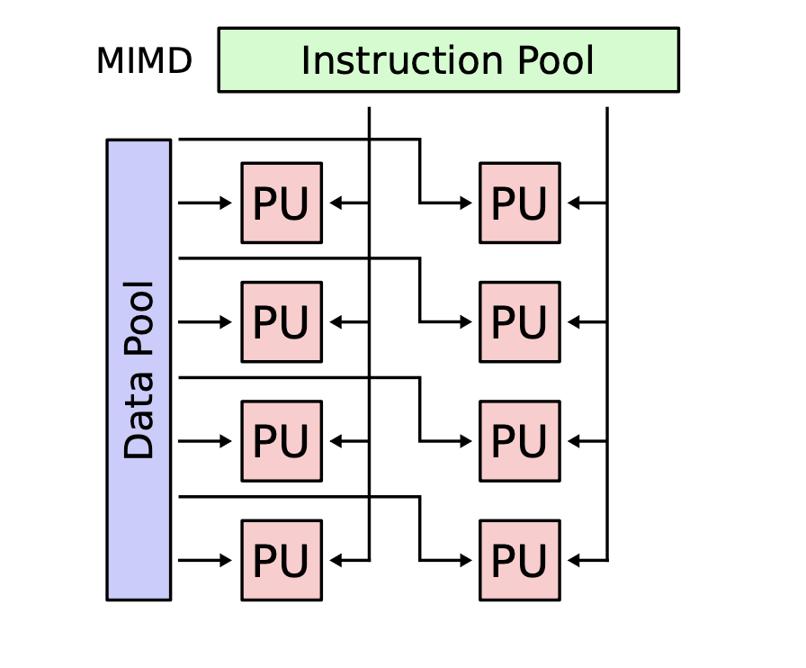
## Approaches for Parallelism
### Explicit vs Implicit Parallelism
* <font color=red>Implicit Parallelism</font>
    * Supported by parallel languages and parallelizing compliers that take care of identifying parallelism, the scheduling od calculations and the placement of data.
* <font color=red>Explicit Parallelism</font>
    * The programmer is responsible for most of the parallelization effort such as task decomposition, mapping tasks to processors, inter-process communications.
    * This approach assumes user is the best judge of how parallelism can be exploited for a particular application
        * <font color=pink>E.g. SPARTAN HPC cluster</font>
        ``` 
        #SBATCH --ntasks=2 --cpus-per-task=4
        vs
        #SBATCH --ntasks=1 --cpus-per-task=8
        ```
### Hardware Parallelization
* #### <font color=red>Hardware Threading CPU</font>
    * <font color=red>Cache</font>: Much faster than reading/writing to main memory; <font color=red>Instruction cache, data cache(multiple level) and translation lookaside buffer</font> used for virtual-physical address translatio.
    * Parallelization by adding extra CPU to allow more instructions to be processed per cycle. Usually shares arithmetic units. Heavy use of one type of computation can tie up all the available units of the CPU preventing other thread from using them.
* #### <font color=red>Multi-Core</font>
    * Multiple cores that can process data and perform computational tasks in parallel. Typically share same cache but issue of cache read/write performance and cache coherence. Possibility of cache stalls. <font color=pink> (CPU not doing anything whilst waiting for caching)</font>
    * Many chips have mixture. <font color=pink> (L1 cache on single cores, L2 cache on pair of cores, L3 cache shared by all cores)</font>
    * Typical to have different cache speed and cache sizes.
* #### <font color=red>Symmetric Multiprocessing (SMP)</font>
    * Two or more identical processors connected to a single, shared memory, with full access to all I/O devices, controlled by a single OS instance that treats all processors equally. Each processors executes different programs and works on different data but with same capability of sharing common resources <font color=pink>(memory, I/O device, etc)</font>
    * Processors can be connected in a variety of ways: <font color=red> buses, crossbar switches, meshes.</font>. More complex to program since need to program both for CPU and inter-processor communications.
* #### <font color=red>Non-Uniform Memory Access (NUMA)</font>
    * <font color=red>NUMA</font> provides speed-up by allowing a processor to access its own local memory faster than non-local memory. Improved performance as long as data are localized to specific processes/processors. Key is allocating memory/processors in NUMA friendly ways. <font color=pink> E.g. To avoid scheduling/locking and inter-processor communication.</font> Approaches such as <font color=red>ccNUMA</font> with range of cache coherency protocols/products.
### Operating System Parallelism Approaches
* Most modern multi-core operating systems support different forms of parallelization
    * parallel vs. interleaved semantics
        * A || B vs A ||| B
* Compute parallelism
    * <font color=red>Processes</font>
        * used to realize tasks, structure activities
    * <font color=red>Threads</font>
        * Native threads: <font color=red>Fork, Spawn, Join</font>
        * Green threads: Scheduled by a virtual machine instead of by the OS
* Data parallelism:
    * Caching (cache coherency)
    * OS implies on a computer
### Software Parallelism Approaches
* Many languages now support a range of parallelization/concurrency features:
    * <font color=pink>Threads, thread pools, lock, semaphores, etc.</font>
* Many languages developed specifically for parallel/concurrent systems
* Key issues that need to be tackled
    * <font color=red>Deadlock</font>: processes involved constantly waiting for each other.
    * <font color=red>Livelock</font>: processes involved in livelock constantly change with regard to one another, but none are progressing.
## <font color=red>Message Passing Interface(MPI)</font>
* Widely adopted approach for message in parallel systems
* Mappings to major languages <font color=pink>Fortan, C, C++, Python, Java</font>
* Key MPI functions:
    * `MPI_init`: initiate MPI computation
    * `MPI_Finalize`: terminate computation
    * `MPI_COMM_SIZE`: determine number of processors
    * `MPI_COMM_RANK`: determine my process identifier
    * `MPI_SEND`: send a message
    * `MPI_RECV`: receive a message
* Supports point-point, broadcast communications
### Example: HelloWorld MPI
```c
#include <stdio.h>
#include <mpi.h>

int main (argc, argv)
int argc;
char *argv[];
{	
    int rank, size;	
    MPI_Init (&argc, &argv); /* starts MPI */	
    MPI_Comm_rank (MPI_COMM_WORLD, &rank); /* get current process id */
    MPI_Comm_size (MPI_COMM_WORLD, &size); /* get number of processes */	
    printf( "Hello world from process %d of %d\n", rank, size );	
    MPI_Finalize();	
    return 0;
}
$mpicc -o hello_world hello_world.c
$ mpirun -np 4 hello_world
Hello world from process 1 of 4
Hello world from process 2 of 4
Hello world from process 3 of 4
Hello world from process 0 of 4
```
## Erroneous Assumptions of Distributed Systems
1. The network is reliable
2. Latency is zero
3. Bandwidth is infinite
4. The network is secure
5. Topology doesn't change
6. There is one administrator
7. Transport cost is zero
8. The network is homogeneous
9. Time is ubiquitous
## Design Stages of Parallel Programs
* Partitioning
    * Decomposition of computational activities and data into smaller tasks
    * Numerous paradigms:
        * <font color=pink>Master-worker, SPMD, pipeline, divided and conquer, speculation</font>
* Communication
    * Flow of information and coordination among tasks that are created in the partitioning state.
* Agglomeration
    * Tasks and communication structure created in the above stages are evaluated for performance and implementation cost
    * Tasks may be grouped into larger tasks to improve communication
    * Individual communications can be bundled
* Mapping/Scheduling
    * Assigning tasks to processor such that job completion time is minimized and resource utilization is maximized.
### <font color=red>Master Worker/Slave Model</font>
* Master decomposes the problem into small tasks, distributes to workers and gathers partial results to produce the final result.
* Realized in many ways of different levels of granularity. <font color=pink>E.g. Threads through to web service workflow definition and enactment.</font>
>Example of Master-Worker Model:
>> 
### <font color=red>Single-Program Multiple-Data</font>
* Commonly exploited model
    * <font color=pink>Bioinformatics, MapReduce, etc</font>
* Each process executes the same piece of code, but on different parts of the data.
* Data is typically split among the available processors.
* Data splitting and analysis can be done in many ways.
>Example of Single-Program Multiple-Data:
>>
### <font color=red>Data Pipelining</font>
* Suitable for applications involving multiple stages of execution, that typically operate on large number of datasets.
> Example of Data Pipelining:
>>
### <font color=red>Divide and Conquer</font>
* A problem is divided into two or more sub problems, and each of these sub problems are solved independently, and their results are combined.
* Three operations: <font color=pink>split, compute, join</font>
* Master-worker/task-farming is like divide and conquer with master doing both split and join operation
> Example of Divide and Conquer:
>>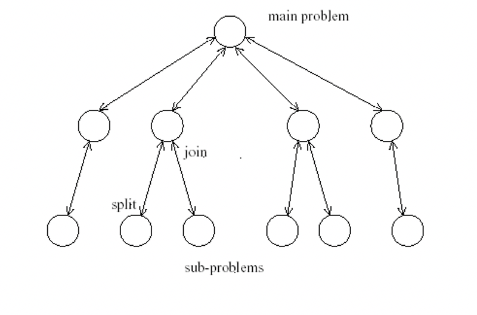
### Speculative Parallelism
* Used when it is quite difficult to achieve parallelism through the previous paradigms:
    * Problems with complex dependencies: <font color=pink>Use "look ahead" execution</font>
    * Consider a producer P and a consumer C such that C depends on P for the value of some variable V. If the value of V is predictable, we can execute C speculatively using a predicted value in parallel with P
        * If the prediction turns out to be correct, we gain performance since C doesn't wait for P anymore
        * If the prediction is incorrect, we have to take corrective action, cancel C and restart C with the right value of V again.
> Example of Speculative Parallelism
>>
<h1 id='L4'>Lecture 4</h1>

## <font color=red>High Performance Computing(HPC)</font>
* <font color=red>High-Performance computing</font> is any computer system whose architecture allows for above average performance. 
* <font color=red>Clustered computing</font> is when two or more computers serve a single resource. This improves performance and provides redundancy; Typically a collection of smaller computers strapped together with a high-speed local network. 
* The clustered HPC is the most efficient, economical, and scalable method. 
## Parallel and Research Programming
* <font color=red>Parallel computing</font> refers to the submission of jobs or processes over multiple processors and by splitting up the data or tasks between them. <font color=pink>(Random number generation as data parallel, driving a vehicle as task parallel)</font>
## HPC Cluster Design
>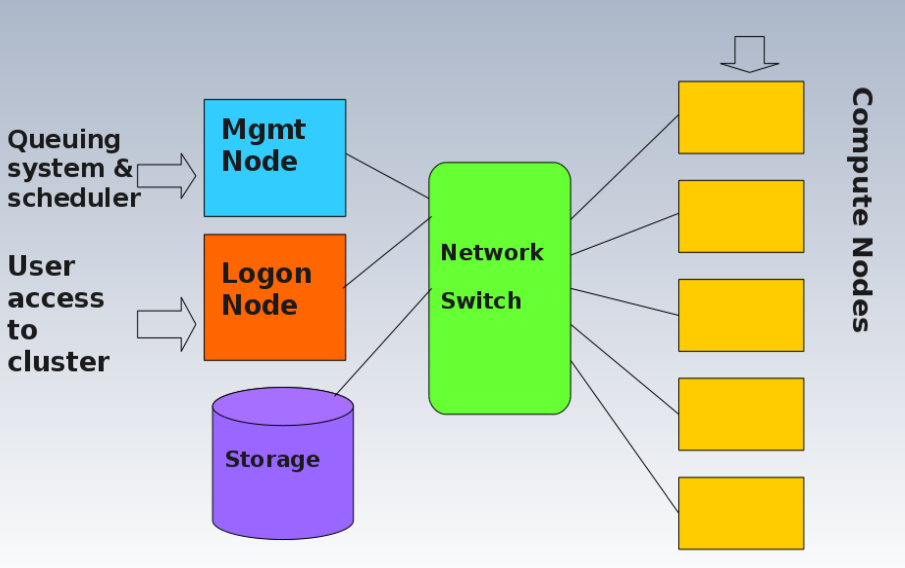
## Important elements for HPC other than performance
* Correctness of code and signal
* Clarity of code and architecture
* Reliability of code and equipment
* Modularity of code and components
* Readability of code and hardware documentation
* Compatibility of code and hardware
- Common rule in parallel programming: <font color=pink>Develop a working serial version of code first and then work out what parts can be made parallel</font>
## Spartan Instructions
### Module Commands
```help```: Provides a list of the switches, subcommands, and subcommand arguments that are available through the environment modules package
```
module help
```
```avail```: Lists all the modules which are available to be loaded
```
module avail
```
```whatis```: Provides a description of the module listed
```
module whatis <modulefile>
```
```display```: Use this command to see exactly what a given modulefile will do to your environment
```
module display <modulefile>
```
```load```: Adds one or more modulefiles to the user's current environment
``` 
module load <modulefile>
```
```unload```: Removes any listed modules from the user's current environment
```
module unload <modulefile>
```
```switch```: Unload one modulefile and loads another.
```
module switch <modulefile1> <modulefile2>
```
```purge```: Removes all modules from the user's environment
```
module purge
```
### Submitting and Running Jobs
1. Setup and launch consists of writing a short script that initially makes resource requests and then commands, and optionally checking queueing system
>Core command for checking queue:
>```
>squeue | less
>```
> Alternative command for checking queue:
>```
>showq -p cloud | less
>```
>Core command for job submission:
>```
>sbatch[jobscript]
>```
>    
2. Check job status
>Core command for checking job in Slurm:
>```
>squeue -j [jobid]
>```
>Detailed command in Slurm:
>```
>scontrol show job [jobid]
>```
>Core command for deleting job in Slurm:
>```
>scancel [jobid]
>```
3. Slurm provides an error and output files.
### Example of submission script
```bash
#!/bin/bash
#SBATCH --partition=cloud
#SBATCH --time=01:00:00
#SBATCH --nodes=1
#SBATCH --ntasks-per-node=1
module load my-app-complier/version
my-app data
```
After the script is written it can be submitted to the scheduler.
```bash
sbatch [filename].slurm
```
### Job Arrays
* Job arrays allow the same batch script and the same resources requests, and lauches multiple jobs simultaneouly. 
* E.g. Submits 10 batch jobs:
```bash
#SBATCH --array=1-10
myapp ${SLURM_ARRAY_TASK_ID}.csv
```
### Dependencies: Job Pipelines
* A dependency condition is established on which the launching of a batch script depends, creating a conditional pipeline.
* E.g.
```
#SBATCH --dependency=afterok:myfirstjobid mysecondjob
```
* Dependency types
    * ```after:jobid[:jobid]```: job can begin after the specified jobs have started
    * ``` afterany:jobid[:jobid]```: job can begin after the specified jobs have terminated
    * ```afternotok:jobid[:jobid]```: job can begin after the specified jobs have failed
    * ```afterok:jobid[:jobid]```: job can begin after the specified job have run to completion with an exit code of zero
    * ```singleton```: job can begin execution after all previously lauched jobs with the same name and user have ended
## Shared Memory Parallel Programming
* One form of parallel programming is <font color=red>multipthreading</font>, whereby a master thread forks a number of sub-threads and divides tasks between them. The threads will then run concurrently and are then joined at a subsequent point to resume normal serial application. 
* One implementation of multithreading is <font color=red>OpenMP(Open Multiple Threading)</font>. It is an Application Program Interface that includes directives for multi-threading, shared memory parallel programming. 
> Example for OpenMP:
>> 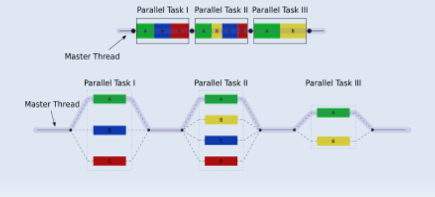
Example for Shared Memory Parallel Programming
```c
#include <stdio.h> 
#include "omp.h" int main(void)
{
    int id;
    #pragma omp parallel num_threads(8) private(id) 
    {
    int id = omp_get_thread_num();
    printf("Hello world %d\n", id);
    }
return 0; 
}

program hello2omp
    include "omp_lib.h"
    integer :: id
    !$omp parallel num_threads(8) private(id)
        id = omp_get_thread_num() print *, "Hello world", id
    !$omp end parallel
end program hello2omp
```
## Distributed Memory Parallel Programming
* Moving from shared memory to parallel programming involves a conceptual change from multi-threaded programming to a message passing paradigm. In this case, <font color=red>MPI(Message Passing Interface)</font> is one of the most popular standards, along with a popular implementation as <font color=red>OpenMPI</font>.
* The core principle is that many processors should be able to cooperate to solve a problem by passing messages to each through a common communication networks.
* The programmer is responsible for identifying opportunities for parallelism and implementing algorithms for parallelization using MPI.
> Example for MPI:
>> 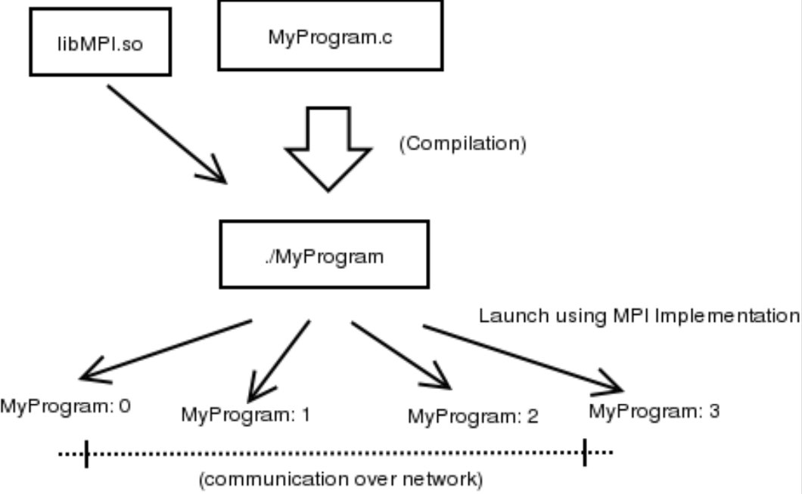
```c
#include <stdio.h> 
#include "mpi.h"
int main( argc, argv ) 
int argc;
char **argv;
{
    int rank, size;
    MPI_Init( &argc, &argv );
    MPI_Comm_size( MPI_COMM_WORLD, &size ); MPI_Comm_rank( MPI_COMM_WORLD, &rank );
    printf( "Hello world from process %d of %d\n", rank, size ); 
    MPI_Finalize();
    return 0;
}
!   Fortran MPI Hello World 
    program hello
    include 'mpif.h'
    integer rank, size, ierror, tag, status(MPI_STATUS_SIZE)

    call MPI_INIT(ierror)
    call MPI_COMM_SIZE(MPI_COMM_WORLD, size, ierror) call MPI_COMM_RANK(MPI_COMM_WORLD, rank, ierror) 
    print*, 'node', rank, ': Hello world'
    call MPI_FINALIZE(ierror)
    end
```
# MPI Workshop
## MPI Programming Basics
* Many parallel programs can be written using just these six functions:
    * ```MPI_INIT```
    * ```MPI_FINALIZE```
    * ```MPI_COMM_SIZE```
    * ```MPI_COMM_RANK```
    * ```MPI_SEND```
    * ```MPI__RECV```
* ```MPI_SEND``` and ```MPI_RECV``` function can be substituted with collective operations such as ```MPI_BCAST``` and ```MPI_REDUCE```
### Collective Operations in MPI
* ```MPI_BCAST```: Distributed data from one process (the root) to all others in a communicator
* ```MPI_REDUCE```: Combines data from all processes in communicator and returns it to one process
## Example of MPI4Py
```python
from mpi4py import MPI
import sys

size = MPI.COMM_WORLD.Get_size()
rank = MPI.COMM_WORLD.Get_rank()
print("Helloworld! I am process %d of %d.\n"%(rank, size))
```
<h1 id='L5'>Lecture 5</h1>

## <font color=red>Cloud Computing</font>
* Cloud computing is a model for enabling ubiquitous, convenient, on-demand network access to a shared pool of configurable computing resources that can be rapidly provisioned and released with minimal management effort or service provider interaction. 
## Common Cloud Models
* Deployment Models:
    * <font color=red>Private</font>
    * <font color=red>Community</font>
    * <font color=red>Public</font>
    * <font color=red>Hybrid</font>
* Delivery Models:
    * <font color=red>Software as a Service(SaaS)</font>
    * <font color=red>Platform as a Service(PaaS)</font>
    * <font color=red>Infrastructure as a Service(IaaS)</font>
* Essential Characteristics:
    * On-demand self-service
    * Broad network access
    * Resource pooling
    * Rapid elasticity
    * Measured service
## Deployment Models
### <font color=red>Public Clouds</font>
* Advantages:
    * Utility computing
    * Can focus on core business
    * Cost-effective
    * "Right-sizing"
    * Democratization of computing
* Disadvantages:
    * Security
    * Loss of control
    * Possible lock-in
    * Dependency of Cloud provider continued existence
### <font color=red>Private Clouds</font>
* Advantages
    * Control
    * Consolidation of resources
    * Easier of secure
    * More trust
* Disadvantages
    * Relevance to core business or not
    * Staff and management overheads
    * Hardware obsolescence
    * Over and under utilization challenges
### <font color=red>Hybrid Clouds</font>
* Examples
    * <font color=pink>Eucalyptus, VMWare vCloud Hybrid Service</font>
* Advantages:
    * Cloud-bursting: Use private cloud, but burst into public cloud when needed
* Disadvantages:
    * Hard to move data and resources when needed
    * Hard to decide when data can go to public cloud
    * Public cloud need to compliant with PCI-DSS(Payment Card Industry - Data Security Standard)
## Delivery Models
### <font color=red>Public SaaS</font>
* Examples
    * <font color=pink>Gmail</font>
    * <font color=pink>Sharepoint</font>
    * <font color=pink>Salesforce.com CRM</font>
    * <font color=pink>On-live</font>
    * <font color=pink>Gaikai</font>
    * <font color=pink>Microsoft Office 365</font>
* Comparison of Public SaaS:
>｜Cloud Name | Language and Developer Tools | Programming Models Supported by Provider | Target Applications and Storage Options|
>| ---- | ---- | ---- | ----| 
>| Google App Engine| Python, Java, GO, PHP + JVM languages(scala, groovy, jruby)| MapReduce, Web, DataStore and other APIs | Web Applications and BigTable storage|
>|Salesforce.com's Force.com | Apex, Eclipsed-based IDE, web-based wizard | Workflow, excel-like formula, web programming | Business applications such as CRM |
>|Microsoft Azure| .NET, Visual Studio, Azure tools| Unrestricted model | Enterprise and web apps|
>|Amazon Elastic MapReduce| Hive, Pig, Java, Ruby| MapReduce| Data processing and e-commerce|
>|Aneka|.NET, stand-alone SDK|Threads, task, MapReduce|.NET enterprise applications, HPC|
### <font color=red>Infrastructure as a Service(IaaS)</font>
* Example providers:
    * <font color=pink>Amazon Web Service(AWS)</font>
    * <font color=pink>Oracle Public Cloud</font>
    * <font color=pink>Rackspace Cloud</font>
    * <font color=pink>NeCTAR/OpenStack Research Cloud</font>
### Comparison between different deployment models
>
# Workshop 5 Automation with Ansible
## Automation
* Deploying complex cloud systems requires a lot of moving parts:
    * Easy to forget what software you installled, and what steps you took to configure system
    * Manual process is error-prone, can be non-repeatable
    * Snapshots are monolithic - provide no records of what has changed
* Automation:
    * Provides a record of what you did
    * Codifies knowledge about the system
    * Makes process repeatable
    * Makes it programmable
## Classification of Scripting tools
* <font color=red>Cloud-focused</font>
    * Used to interact with Cloud services
    * <font color=pink>Apache JClouds(Java based - supports multiple clouds)</font>
    * <font color=pink>Boto(Python - supports AWS and OpenStack)</font>
    * <font color=pink>OpenStackClient(Python - supports OpenStack)</font>
    * <font color=pink>CloudFormation(YAML/JSON - supports AWS, OpenStack Heat)</font>
* <font color=red>Shell Scripts</font>
    * <font color=pink>Bash</font>
    * <font color=pink>Perl</font>
* <font color=red>Configuration management tools</font>
    * Configuration management refers to the process of systematically handling changes to a system in a way that it maintains integrity overtime.
    * Automation si the mechanism used to make servers reach a desirable state, previously defined by provisioning scripts using tool-specific languages and features
    * <font color=pink>Chef(uses Ruby for creating cookbooks)</font>
    * <font color=pink>Puppet(uses its own configuration language)</font>
    * <font color=pink>Ansible(use YAML to express playbooks)</font>
    * <font color=pink>Fabric(Python library that uses SSH for application deployment and administration tasks)</font>
    * <font color=pink>Terraform, SaltStack, Docker</font>
## Ansible
* An automation tool for configuring and managing computers
    * Finer grained set up and configuration of software packages
* Combines multi-node software deployment
* Ad-hoc task execution and configuration management
### Ansible features
* Easy to learn
    * Playbooks in YAML, templates in Jinja2
    * Sequential execution
* Minimal requirements
    * No need for centralized management servers/daemons
    * Single command to install (```pip install ansible```)
    * Uses SSH to connect to target machine
* Idempotent(repeatable)
    * Executing N times no different to executing once
    * Prevents side-effects from re-running scripts
* Extensible
    * Write your own modules
* Support push or pull
    * Push by default but can use cron job to make it pull
    * Rolling updates
        * Useful for continuous deployment/zero downtime deployment
    * Inventory management
        * Dynamic inventory from external data sources
        * Execute tasks against host patterns
    * Ansible Vault for encrypted data
    * Ad-hoc commands
        * Execute a one-off command against your inventory
        ```bash
        $ ansible -i inventory_file -u ubuntu -m shell -a "reboot"
        ```
### Ansible & YAML & Jinja2
* Ansible Playbooks are expressed in <font color=red>YAML</font>
    * YAML: <font color=red>Y</font>AML <font color=red>A</font>in't <font color=red>M</font>arkup <font color=red>L</font>anguage
    * YAML is a human friendly data serialization standard for all programming languages
* Ansible uses <font color=red>Jinja2</font> templating for dynamic expression
    * Jinja2 is a modern and designer-friendly templating language for Python, modelled after *Django's* templates
## Ansible Structure
* Ansible script are called *Playbooks*, written as simple YAML files
>Example for simple folder hierarchy for Ansible
>>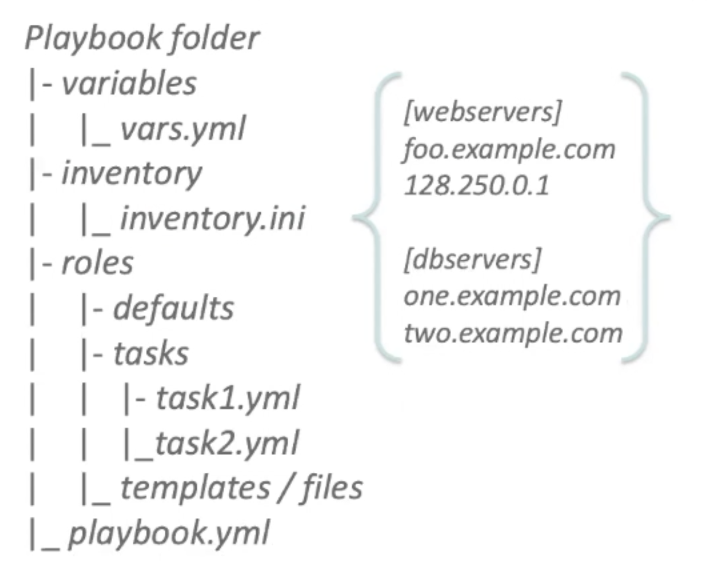
## Ansible Playbooks
* Executed sequentially from a YAML file
```YAML
-hosts: webservers
    vars:
    package: ['httpd', 'python-dev']
  
    tasks:
        -name: Ensure the latest Apache and Python are installed
        apt:
            name: "{{ package }}"
            state: latest
        -name: Write the Apache config file
            file:
                src: /srv/httpd.conf
                dest: /etc/httpd.conf
        -name: Ensure Apache is installed
            service:
            name: httpd
            state: restarted
[webservers]:
www[01:50].example.com
192.168.0.[1:254]
```
<h1 id='L6'>Lecture 6 Web Services</h1>

## Architecture
* A <font color=red>system architecture</font> is the way different software components are distributed on computers, and the way in which they interact with each other.
* Architecture are often difficult to describe in words, hence diagram are often used. Such as UML
>Example of UML Diagram
>>
## <font color=red>Service-oriented Architectures</font>
* In distributed system, components have to interact in more loosely-coupled ways. <font color=red>Services</font> are often used for this. Typically combinations and commonality of services can be used to form a <font color=red>Service-oriented Architecture</font>.
## SoA Core Goals
* A set of externally facing services that a business wants to provide to external collaborators
* An architectural pattern based on service providers, one or more brokers, and service requestor based on agreed service descriptions.
* A set of architectural principles, patterns and criteria that support modularity, encapsulation, loose coupling, separation of concerns, reuse and composability. 
* A programming model complete with standards, tools and technologies that supports development and support of services. 
* A middleware solution optimized for service assembly orchestration, monitoring, and management. 
## SoA Design Principles
* <font color=pink>Standardized service contract</font>: Service adhere to a communications agreement, as defined collectively by one or more service-description documents.
* <font color=pink>Service loose coupling</font>: Services maintain a relationship that minimizes dependencies and only requires that they maintain an awareness of each other. 
* <font color=pink>Service abstraction</font>: Beyond descriptions in the service contract, services hide logic from the outside world. 
* <font color=pink>Service reusability</font>: Logic is divided into services with the intention of promoting reuse.
* <font color=pink>Service autonomy</font>: Services have control over the logic they encapsulate.
* <font color=pink>Service statelessness</font>: Services minimize resource consumption by deferring the management of state information when necessary.
* <font color=pink>Service discoverability</font>: Services are supplemented with communicative meta data by which they can be effectively discovered and interpreted.
* <font color=pink>Service composability</font>: Services are effective composition participants regardless of the size and complexity of the composition.
* <font color=pink>Service granularity</font>: A design consideration to provide optimal scope at the right granular level of the business functionality in a service operation. 
* <font color=pink>Service normalization</font>: Services are decomposed and/or consolidated to a level that minimizes redundancy, for performance optimization, access, and aggregation. 
* <font color=pink>Service optimization</font>: High-quality services that serve specific functions are generally preferable to general purpose low-quality ones.
* <font color=pink>Service encapsulation</font>: Many services are consolidated for use under a SoA and their inner workings hidden.
* <font color=pink>Service location transparency</font>: The ability of a service consumer to invoke a service regardless of its actual location in the network.
## Web Services
* <font color=red>Web Services</font> used to implement SoA.
* Two main flavors:
    * <font color=red>SOAP</font>-based Web Services
    * <font color=red>ReST</font>-based Web Services
* Both use *HTTP*
* Other flavors:
    * Geospatial services: <font color=red>WFS, WMS, WPSM</font>
    * Health services: <font color=red>HL7</font>
    * Statistics: <font color=red>SDMX</font>
## SOAP/WS vs ReST
|SOAP/WS|ReST|
|----|----|
|Built upon the *Remote Procedure Call* Paradigm which is a language independent function call that spans anther system|ReST is centered around resources, and the way they can be manipulated remotely.|
| A stack of protocols that covers every aspect of using a remote service, from service discovery, to service description, to the actual request/response.|ReST is more of a style to use HTTP than a separate protocol
## WSDL
* The <font color=red>Web Services Description Language(WSDL)</font> is an XML-based interface description language that describes the functionality offered by a web service.
* WSDL provides a machine-readable description of how the service can be called, what parameters it expects, and what results/data structures it returns:
    * <font color=pink>Definition</font>: what is does
    * <font color=pink>Target Namespace</font>: Context for naming things
    * <font color=pink>Data Types</font>: Simple/complex data structures inputs/outputs
    * <font color=pink>Messages</font>: Messages and structures exchanged between client and server
    * <font color=pink>Port Type</font>: Encapsulate input/output messages into one logical operation
    * <font color=pink>Bindings</font>: Bind the operation to the particular port type
    * <font color=pink>Service</font>: Name given to the web service itself.
# ReST-based Services
## <font color=red>ReST</font>
* <font color=red>Representational State Transfer(ReST)</font> is intended to evoke an image of how a well-designed web application behaves: A network of web pages<font color=pink> (a virtual state-machine)</font>, where the user progresses through an application by selecting links <font color=pink>(state transitions)</font>, resulting in the next page <font color=pink>(representing the next state of the application)</font> being transferred to the user and rendered for their use.
## Composition of a Name
* Clients requests Resource through Identifier (URL)
* Server/proxy sends representation of Resource
* Puts the client in a certain state
* Representation contains URLs allowing navigation
* Clients follows URL to fetch another resources
* Transitions clients into yet another state
* Representational State Transfer
## <font color=red>Resource-oriented Architecture(RoA)</font>
* A <font color=red>RoA</font> is a way of turning a problem into a ReSTful web service: an arrangement of URIs, HTTP, and XML that works like the rest of the Web
* A resource is anything that's important enough to be reference as a thing in itself
## Mapping Actions to HTTP Methods
|Action|HTTP Method|
|----|----|
|<font color=pink>C</font>reate Resource|*POST* to a new URI <br> *PUT* to an existing URI|
|<font color=pink>R</font>etrieve Resource|*GET*|
|<font color=pink>U</font>pdate Resource|*PUT* to an existing URI|
|<font color=pink>D</font>elete Resource|*DELETE*|
* *PUT* should be used when target resource url is know by the client 
* *POST* should be used when target resource url is server generated
## RoA Procedure
1. Figure out the data set
2. Split the data set into resources and for each kind of resource
3. Name the resources with URIs
4. Expose a subset of the uniform interface
5. Design the representation accepted from the client
6. Design the representation served to the client
7. Integrate this resource into existing resources, using hypermedia links and forms
* Consider the typical course of events: what's supposed to be happen
* Consider error conditions: what might going wrong?
## ReST Best Practices
1. Keep URIs short and create URIs that don't change
2. URIs should be opaque identifiers that meant to be discovered by following hyperlinks, not constructed by the client
3. Use nouns, not verbs in URLs
4. Make all HTTP GETs side-effect free. Doing so makes the request safe
5. Use links in responses to requests. Doing so connects your response with other data. It enables client applications into about 'what's the next step to take'. Contrast this to responses that do not contain links. Thus, the decision of "what's the next step to take' must be made out-of-band
6. Minimize the use of query strings. 
>E.g.
>Prefer: ```http://www.amazon.com/products/AXFC```
>Over: ```http://www.amazon.com/products?product-id=AXFC```
7. Use HTTP status codes to convey errors/success
>|2xx, 3xx|4xx|5xx|
>|----|----|----|
>|200 OK|400 Bad Request|500 Internal Server Error|
>|201 Created|401 Unauthorized|501 Not Implemented|
>|202 Accepted|401 Payment Required|502 Bad Gateway|
>|203 Non-Authoritative|403 Forbidden|503 Service Unavailable|
>|204 No Content|404 Not Found|504 Gateway Timeout|
>|205 Reset Content|405 Method Not Allowed|505 Version Not Supported|
>|206 Partial Content|406 Not Acceptable||
>|300 Multiple Choices|407 Proxy Auth Required||
>|301 Moved Permanently|408 Request Timeout||
>||409 Conflict||
8. Keep the ReST principles in mind:
    * Addressability
    * Uniform Interface
    * Resources and Representations instead of RPC
    * HATEOAS
### ReST - Uniform Interface
Uniform Interface has four constraints:
* <font color=pink>Identification of Resources</font>: Important resources are identified by one resource identifier mechanism
* <font color=pink>Manipulation of Resources through representation</font>: Each resource can have one or more representation.
* <font color=pink>Self-descriptive messages</font>: Requests and responses contain only data but additional headers describing how the content should be handled. 
* <font color=pink>HATEOAS</font>:
    * <font color=red>HATEOAS</font>: Hyper Media as the Engine of Application State
    * Resource representations contains links to identified resources
    * Resources and state can be used by navigating links
        * Links make interconnected resources navigable
        * Without navigation, identifying new resources is service-specific
    * ReSTful applications use <font color=pink>navigate</font> instead of <font color=pink>calling</font>
        * Representations contain information about possible traversals
        * Application navigates to the next resource depending on link semantics
        * Navigation can be delegated since all links use identifiers
### Making Resources Navigable
* Essential for using Hypermedia Driven Application State
* RPC-oriented systems need to expose the available functions
    * Functions are essential for interacting with a service
    * Introspection or interface descriptions make functions discoverable
### HTTP Methods
* <font color=pink>Safe Methods</font>: Do not change repeating a call is equivalent to not making a call at all.
* <font color=pink>Idempotent Methods</font>: Effect of repeating a call is equivalent to making a single call.
>|Safe Methods|*GET, OPTIONS, HEAD*|
>|----|----|
>|Idempotent Methods|*PUT, DELETE*|
>|Neither safe nor idempotent|POST|
# Workshop Containerization and Docker
## Virtualization vs Containerization
* Many advantages of <font color=red>virtualization</font>, such as application containment and horizontal scalability, come with a cost: resources. The guest OS and binaries can give rise to duplications between VMs wasting servers processor, memory and disk space and limiting the number of VMs each server can support.  
* <font color=red>Containerization</font> allows <font color=red>virtual instances</font> to share a single host OS to reduce these wasted resources since each container only holds the application and related binaries. The rest are shared among the containers.
>Figure of difference structures between Virtual Machines and Container:
>>
>Table of difference between Virtual Machines and Containers:
>|Parameter|Virtual Machines|Containers|
>|----|----|----|
>|Guest OS|Run on virtual HW, have their own OS kernels|Share same OS kernel|
>|Communication|Through Ethernet devices|IPC mechanisms(pipes, sockets)|
>|Security|Depends on the Hypervisor|Requires close scrutiny|
>|Performance|Small overhead incurs when instructions are translated from guest to host OS|Near native performance|
>|Isolation|File systems and libraries are not shared between guest and host OS|File systems can be shared and libraries are|
>|Startup time|Slow|Fast|
>|Storage|Large Size|Small Size|
## Container
* Similar concept of resource isolation and allocation as a virtual machine
* Without bundling the entire hardware environment and full OS
## Container Orchestration Tools
* <font color=red>Container Orchestration</font> technologies provides a framework for integrating and managing containers at scale.
* Features:
    * Networking
    * Scaling
    * Service discovery and load balancing
    * Health check and self-healing
    * Security
    * Rolling updates
* Goals:
    * Simplify container management processes
    * Help to manage availability and scaling of containers
* Products:
    * <font color=red>Kubernetes and Hosted Kubernetes</font>
    * <font color=red>Docker SWARM/ Docker Compose</font>
## Docker
### Terminology
* <font color=pink>Container</font>: A process that behaves like an independent machine, it is a runtime instance of a docker image.
* <font color=pink>Image</font>: A blueprint for a container
* <font color=pink>Dockerfile</font>: The recipe to create an image
* <font color=pink>Registry</font>: A hosted service containing repositories of images
* <font color=pink>Repository</font>: A sets of Docker images
* <font color=pink>Tag</font>: A label applied to a Docker image in repository
* <font color=pink>Docker Compose</font>: A tool for defining and running multi-containers Docker applications
* <font color=pink>Docker SWARM</font>: A standalone native clustering/ orchestration tool for Docker
## Manage Data in Docker
* By default, data inside a Docker container won't be persisted when a container is no longer exist.
* Can copy data in and out of a container
* Docker has two options for containers to store files on the host machine, so that the files are persisted even after the container stops:
    * <font color=red>Docker volume</font> (Manage by Docker, /var/lib/docker/volume)
    * <font color=red>Bind mounts</font> (Managed by user, any where on the file system)
## Networking in Docker
* <font color=red>HostL</font>: every container uses the host network stack; which means all containers share the same IP addresses, hence ports cannot be shared across container.<font color=pink> (Linux only)</font>
* <font color=red>Bridge</font>: Containers can reuse the same port, as they have different IP addresses, and expose a port of their own that belongs to the hosts, allowing the containers to be somewhat visible from the outside. 
### Docker commands
* Login to a public Docker Registry
```bash
docker login [OPTIONS] [SERVER]
Example:
docker login -username=foo
```
* Login to a private Docker Registry
```bash
docker login -u AWS
```
* Logout
```bash
docker logout [SERVER]
```
* Pulling an image from a public Docker Registry
```bash
docker pull NAME[:TAG]
Example:
docker pull nginx
```
* List all images
```bash
docker images [OPTIONS] [REPOSITORY[:TAG]]
```
* Tag an image
```bash
docker tag<SOURCE_IMAGE> <TARGET_IMAGE>
Example:
docker tag nginx alwynpan/com90024:nginx
```
* Push an image
```bash
docker push <NAME[:TAG]>
Example:
docker push alwynpan/comp90024:nginx
```
* Create a container, then start the container
```bash
docker create [OPTIONS] IMAGE [COMMAND] [ARG]
docker start [OPTIONS] CONTAINER [CONTAINER]
Example:
docker create --name nginx -p 8080:80 nginx
docker start nginx
```
* Run a container
```bash
docker run [OPTIONS] IMAGE [COMMAND] [ARG]
Example:
docker run --name nginx -p 8080:80 -d nginx
```
* List running containers
```bash
docker ps [OPTIONS]
```
* List all containers
```bash
docker ps -a
```
* Restart a container
```bash
docker restart [OPTIONS] CONTAINER [CONTAINER...]
Example:
docker restart nginx
```
* Stop the container
```bash
docker stop [OPTIONS] CONTAINER [CONTAINER...]
Example:
docker stop nginx
```
* Remove a non-running container
```bash
docker rm [OPTIONS] CONTAINER [CONTAINER...]
Example:
docker rm nginx
```
* Remove a running container
```bash
docker rm -f nginx
```
* Run a Shell within a Container
```bash
docker exec [OPTIONS] CONTAINER COMMAND [ARG...]
Example:
docker exec -ti -w /usr/share/nginx/html/ nginx sh
sed -i 's/nginx!/nignx in Docker!/g' index.html
```
* Create a volume
```bash
docker volume create [OPTIONS] [VOLUME]
Example:
docker volume create --name htdocs
```
* Start a container with a volume attached
```bash
docker run --name nginx-volume -p 8080:80 -v htdocs:/usr/share/nginx/html -d nginx
```
* Start a container with bind mount attached
```bash
docker run --name nginx-bind -p 8081:80 -v $(pwd)/htdocs:/usr/share/nginx/html -d nginx
```
* Create an image
```bash
docker build [OPTIONS] PATH
Example:
docker build -t demo2
```
* Create a container from the image
```bash
docker run --name demo2 -e WELCOME_STRING="COMP90024" -p 8081:80 -d demo2
```
### Docker Compose Commands
* Start the containers
```bash
docker-compose up [OPTIONS]
Example:
docker-compose up -d
```
* Stop the containers
```bash
docker-compose stop [OPTIONS] [SERVICE...]
```
* Remove the containers
```bash
docker-compose down [OPTIONS]
```
## <font color=red>Docker SWARM</font>
* <font color=pink>Raft consensus group</font> consists of internal distributed state store and all manager nodes.
* <font color=pink>Internal Distributed State Store</font> is a built-in key-value store of Docker Swarm mode.
* <font color=pink>Manager Mode</font> conducts orchestration and management tasks. Docker Swarm mode allows multiple manager nodes in a cluster. However, only one of the manager nodes can be selected as a leader.
* <font color=pink>Worker Mode</font> receives and executes tasks directly from the manager node.
* <font color=pink>Node Availability</font>: In Docker Swarm mode, all nodes with ACTIVE availability can be assigned new tasks, even the manager node can assign itself new tasks.
* <font color=pink>Service</font> consists of one or more replica taksks which are specified by users when first creating the service. 
* <font color=pink>Task</font>: In Docker Swarm, task refers to the combination of a single docker container and commands of how it will be run. 
>Example of Docker Swarm Architecture
>>
### Docker Swarm Commands
* create managers and workers
```bash
docker-machine create [OPTIONS] [ARG...]
Example:(Creating one manager and two workers)
docker-machine create manager
docker-machine create worker1
docker-machine create worker2
```
* List all nodes
```bash
docker-machine ls
```
* Login onto node
```bash
docker-machine ssh manager
```
* Create a Docker Swarm
```bash
docker swarm init [OPTIONS]
Example:
docker swarm init --advertise-addr 192.168.99.100
```
* Join a Docker Swarm
```bash
docker swarm join [OPTIONS]
Example:
docker-machine ssh worker1 docker docker swarm join --token [TOKEN]
```
* Create a service
```bash
docker service create [OPTIONS] IMAGE [COMMAND]
Example:
docker-machine ssh manager docker service create --replicas 3 -p 8083:80 --name nginx nginx:alpine
```
* List a service
```bash
docker service ls [OPTIONS]
Example:
docker-machine ssh manager docker service ls
```
* Check a service
```bash
docker service ps [OPTIONS] SERVICE [SERVICE...]
Example:
docker-machine ssh manager docker service ps nginx
```
* Scale up/down
```bash
docker service scale SERVICE=REPLICAS
Example:
docker-machine ssh manager docker service scale nginx=6
docker-machine ssh manager docker service scale nginx=2
```
* Rolling update
```bash
docker service update [OPTIONS] SERVICE
Example:
docker-machine ssh manager docker service update --image alwynpan/comp90024:demo1 nginx
```
<h1 id='L7'>Lecture 7 Big Data</h1>

## Four "V"s
* <font color=red>V</font>olume: The size of the data. (In Giga, Tera, Peta...)
* <font color=red>V</font>elocity: The frequency at which new data ios being brought into the system and analytics performed
* <font color=red>V</font>ariety: The variability and complexity of data schema. The more complex the data schemas you have, the higher the probability of them changing along the way, adding more complexity.
* <font color=red>V</font>eracity: The level of trust in the data accuracy; The more diverse sources you have, the more unstructured they are, the less veracity you have.
## Big data needs for Ad-hoc Solutions
* While relational DBMSs are extremely good at ensuring consistency, they rely on normalized data models that. In big data, it can no longer be taken for granted
* Therefore, it makes sense to use DBMSs that are built upon data models that are not relational. <font color=pink>(Relational model: tables and relationships amongst tables)</font>
* While there is nothing preventing SQL to be used in distributed environments, alternative query languages have been used for distributed databases, hence they are sometimes called <font color=red>NoSQL DBMSs</font>
## DBMSs for Distributed Environments
* A <font color=red>key-value store</font> is a DBMS that allows the retrieval of a chunk of data given a key: <font color=pink>fast, but crude</font>
    * E.g. <font color=pink>Redis, PostgreSQL, Hstore, Berkeley DB)</font>
* A <font color=red>BigTable DBMS</font> stores data in columns grouped into <font color=red>column families</font>, with rows potentially containing different columns of the same family.
    * E.g. <font color=pink>Apache Cassandra, Apache Accumulo</font>
* A <font color=red>Document-oriented DBMS</font> stores data as structured documents, usually expressed as XML or JSON
    * E.g. <font color=pink>Apache CouchDB, MongoDB</font>
## A Tale of Two Clusters
* Distributed databases are run over clusters<font color=pink> (Sets of connected computers)</font>
* Clusters are needed to:
    * Distribute the computing load over multiple computers.<font color=pink> To improve availability</font>
    * Storing multiple copies of data.<font color=pink> To achieve redundancy</font>
## CouchDB Cluster Architecture
* All nodes answer requests <font color=pink>(read or write)</font> at the same time.
* Sharding <font color=pink>(splitting of data across nodes)</font> is done on every node.
* When a node does not contain a document <font color=pink>(E.g. a document of Shard A is requested to Node 2)</font>, the node requests it from another node<font color=pink>(Node 1)</font> and returns it to the client. 
* Nodes can be added/removed easily, and their shards are re-balanced automatically upon addition/deletion od nodes.
>Example of a 3 nodes, 4 shards and 2 replicas CouchDB Cluster Architecture
>>
## MongoDB Cluster Architecture
* Sharding is done at the replica set level, hence it involves more than one cluster. <font color=pink>(A shard is on top of a replica set)</font>
* Only the primary node in a replica set answers write requests, but read requests can depending on the specifics of the configuration be answered by every node <font color=pink>(including secondary node)</font> in the set 
* Updates flow only from the primary to the secondary 
* If a primary node fails, or discovers it is connected to a minority of nodes, a secondary of the same replica set is elected as the primary
* Arbiters <font color=pink>(MongoDb instances without data)</font> can assist in breaking a tie elections
* Data are balanced across replica sets
* Since a quorum has to be reached, it is better to have an odd number of voting members.
>Example of MongoDB Cluster Architecture
>>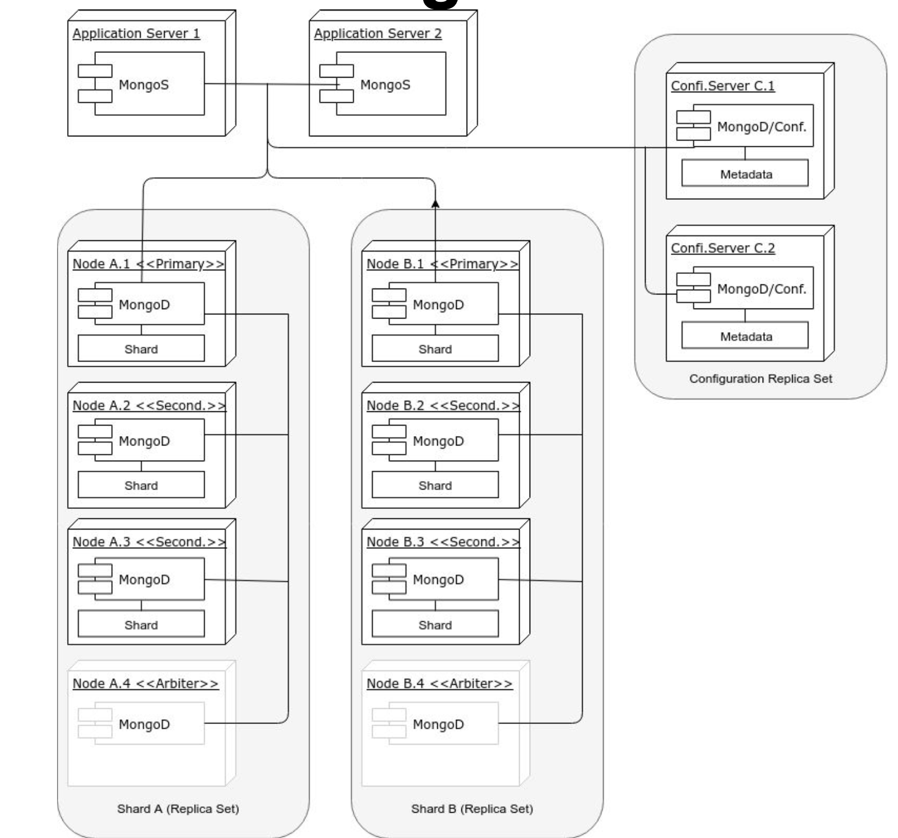
## MongoDB vs. CouchDB Clusters
* MongoDB clusters are considerably more complex then CouchDB clusters.
* MongoDB clusters are less available, as only primary nodes can talk to clients for read operations, and exclusively so for write operations
* MongoDB software routers <font color=pink>(MongoS)</font> must be embedded in application servers, while any HTTP client can connect to CouchDB
* Losing two nodes out of three in the CouchDB architecture as shown means losing access to one quarter of data.
* Losing two nodes in the MongoDB example implies losing write access to half the data, and possibly read access too, depending on the cluster configuration parameters and the nature <font color=pink>(primary or secondary)</font> of the lost nodes.
* Some features are not supported in MongoDB sharded environments
* While CouchDB uses MVCC, MongoDB uses a mix of two-phase commit <font color=pink>(for replicating data from primary to secondary nodes)</font> and Paxos-like <font color=pink>(to elect a primary node in a replica-set)</font>
* The different choices of strategies explains the different cluster architectures for these two DBMSs
## CAP Theore
* <font color=red>C</font>onsistency: Every client receiving an answer receives the same answer from all nodes in the cluster
* <font color=red>A</font>vailability: Every client receives an answer from any node in the cluster
* <font color=red>P</font>artition-tolerance: The cluster keeps on operating when one or more nodes cannot communicate with the rest of the cluster
>Figure of CAP Theorem
>>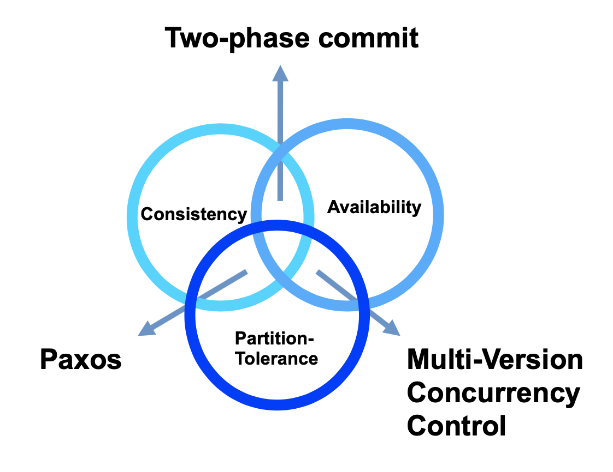
* While the theorem shows all three qualities are symmetrical, consistency and availability are at odds when a partition happens
* "Hard" network partitions may be rare, but "soft" network partitions are not. <font color=pink>(a slow node may be considered dead even it is not)</font>; 
* Can have consequences that impact the cluster as a whole
* Traditional DBMS architectures were not concerned with network partitions since all data were supposed to be in a small, co-located cluster of servers
* The emphasis on numerous commodity servers, can result in an increased number of hardware failures
* The CAP theorem focus on considering trade-offs among different options
### Consistency and Availability: Two phase commit
* This is the usual algorithm used in relational DBMS's, it enforces consistency by:
    * Locking data that are within the transaction scope
    * Performing transactions on write-ahead logs
    * Completing transactions only when all nodes in the cluster have performed the transaction
    * aborts transactions when a partition is detected
* This procedure entails the following:
    * Reduced availability <font color=pink>(data lock, stop in case of partition)</font>
    * Enforced consistency <font color=pink>(every database is in a consistency state, and all are left in the same state)</font>
* Therefore, two-phase commit is a good solution when the cluster is co-located. Less good when it is distributed
### Consistency and Partition-Tolerance: Paxos
* Driven by consensus, and is both partition-tolerant and consistent
* In Paxos, every node is either a proposer or an accepter:
    * A <font color=red> proposer</font> proposes a value<font color=pink> (with a timestamp)</font>
    * An <font color=red> accepter</font> can accept or refuse a propose
* When a proposer has received a sufficient number of acceptances, and a confirmation message is sent to the accepters with the agreed value
* Paxos clusters can recover from partitions and maintain consistency, but smaller part of a partition <font color=pink>(the part that is not in the quorum)</font> will not sent responses, hence the availability is compromised.
### Availability and Partition-Tolerance: Multi-Version Concurrency Control(MVCC)
* MVCC is a method to ensure availability <font color=pink>(every node in a cluster always accept requests)</font>, and some sort of recovery from a partition by reconciling the singe databases with revisions. <font color=pink>(Data are not replaced, they are just given a new version number)</font>
* In MVCC, concurrent updates are possible without distributed locks, since the updates will have different revision numbers; the transaction that completes last will get a higher revision number, hence will be considered as the current value
* In case of cluster partition and concurrent requests with the same revision number going to two partitioned nodes, both are accepted, but once the partition is solved, there would be a conflict. Conflict that would have to be solved somehow. <font color=pink> (CouchDB returns a list of all current conflicts, which are then left to be solved by the application)</font>
### Addendum: The Peculiar Case of the Blockchain
* Blockchains can be described, inalterable, verifiable databases. 
* Bitcoin works on a cluster of peer-to-peer nodes, each containing a copy of the entire database, operated by different-possibly malicious-actors
* Since new nodes can enter the system at any time, and every node has the entire database, availability is not an issue even in case of partition, but consistency cannot be assured, since you cannot trust a single node. 
* To achieve consistency, Bitcoin uses a form of MVCC based proof-of-work <font color=pink>(Which is a proxy for the computing power used in a transactions)</font>  and on repeated confirmations by a majority of nodes of a history of transactions
* The guarantee of Bitcoin database security is that  no single actor can amass enough the cluster computing power. <font color=pink>(with 6 confirmations, an actor that controls 18% of the computing power has a 1% probaility of compromising a transaction)</font>.
## Documented-oriented DBMS for Big Data
* While relational DBMSs are extremely good for ensuring consistency and availability, the normalization that lies at the heart of a relational database model implies fine-grained data, which are less conductive to partition than coarse-grained data.
## Sharding
* <font color=red>Sharding</font> is the partitioning of a database horizontally. <font color=pink>i.e. The database rows are partitioned into subsets that are stored on different servers.</font> Every subset of rows are called <font color=red>shard</font>.
* Usually the number of shards is larger than the number of replicas, ans the number of nodes is larger than the number of replicas
* The main advantage of a sharded database lies in the improvement of performance through the distribution of computing load across nodes. In addition, it makes it easier to move data files around. <font colo=pink>i.e. when adding new nodes to the cluster</font>
* The number of shards that split a database dictates the number of nodes: the maximum number of nodes is equal to the number of shards
* There are different sharding strategies:
    * <font color=pink>Hash sharding</font>: To distribute rows evenly across the cluster
    * <font color=pink>Range sharding</font>: Similar rows that are stored on the same node.
### Replication and Sharding
* <font color=red>Replication</font> is the action of storing the same row on different nodes to make the database fault-tolerant.
* Replication and sharding can be combined with the objective of maximizing availability while maintaining a minimum level of data safety.
* ```n``` is the number of replicas <font color=pink>(How many times the same data item is repeated across the cluster)</font>
* ```q``` is the number of shards <font color=pink>(How many files a database is split)</font>
* ```n * q``` is the total number of shard files distributed in the different nodes of the cluster
### Partitions
* A <font color=red>partition</font> is a grouping of logically related rows in the same shard
* Partitioning improves performance by restricting queries to a single shard
* To be effective, partitions have to be relatively small
* A database has to be declared partitioned during the creation
### MapReduce Algorithms
* This family of algorithms is particularly suited to parallel computing of a SIMD
* The first step <font color=pink>Map</font>, distributes daa across machines, while the second state <font color=pink>Reduce</font> hierarchically summarizes them until the result is obtained
* Apart from parallelism, its advantage lies in moving the process to where data are and reducing network traffic.
* Pseudo code for MapReduce Algorithm:
```
function map(name, document):
    for each word w in document:
        emit (w, 1)
function reduce(word, partialCounts):
    sum=0
    for each pc in partialCounts:
        sum += px
    emit (word, sum)
```
# CouchDB
## Why using CouchDB
* Open-source, hence you can peruse the source code and see how it works
* Has MapReduce queries, hence you can understand how this programming paradigm works
* Easy to setup a cluster
* Has sharding, replication and partitions
* HTTP API makes it easy to interact with.
## Main Features
* <font color=pink>Documented-oriented DBMS</font>, where documents are expressed in JSON
* <font color=pink>HTTP ReST API</font>
* <font color=pink>Web-based admin interface</font>
* <font color=pink>Web-ready</font>: since it talks HTTP and produce JSON, it can be both the data and logic tier of a three-tier application, hence avoiding the marshaling and unmarshaling of data objects
* <font color=pink>Support for MapReduce algorithms</font>, including aggregation at different levels
* <font color=pink>JavaScript as the default data manipulation language</font>
* <font color=pink>Full-text Search</font>
* <font color=pink>Support of MongoDB query language</font>
* <font color=pink>Support of replication</font>
* <font color=pink>Support of partition</font>
* <font color=pink>Support of sharding</font>
* <font color=pink>Support of clusterized databases</font>
## CouchDB Databases
* A CouchDB instance can have many databases. Each database can have its own set of functions and can be stored in different shards
* Adding and deleting a data is done through a HTTP call:
```bash
curl -X PUT "http://localhost:5984/exampledb"
curl -X DELETE "http://localhost:5984/exampledb"
```
* Listing all databases of an instance:
```bash
curl -X GET "http://localhost:5984/_all_dbs"
Output: Body is a JSON object
$ ['exampledb', 'twitter', 'instagram']
```
* In every CouchDB instance there are system databases. These are prefixed by underscore. <font color=pink> E.g. ```_users```</font>
## Insertion and retrieval of documents
* Insert a document:
```bash
curl -X POST "http://localhost:5984.exampledb" --header "Content-Type: application/json" --data '{"type": "account", "holder": "Alice", "initialbalance": 1000}'
Output:
{"ok":true,"id":"c43bcff2cdbb577d8ab2933cdc0011f8","rev":"1-b8a039a8143b474b 3601b389081a9eec"}
```
* To retrieve a document:
```bash
curl -X GET "http://localhost:5984/exampledb/c43bcff2cdbb577d8ab2933cdc0011f8"
Output:
{"_id":"c43bcff2cd577d8ab2933cdc0011f8","_rev":"1-b8a039a8143b474b3601b38908 1a9eec", "type": "account", "holder": "Alice", "initialbalance": 1000}
```
## System Properties of Documents
* ```_id```: The ID of a single document which can be set during the document load; by default it is generated by CouchDB and guaranteed to be increasing
* ```_rev```: Revision number of a document. It is guaranteed to be increasing per-document.
* Request to set the ID of a document:
```bash
curl -X PUT "http://localhost:5984/exampledb/charlie" --header "Content-Type: application/json" --data '{"type": "account", "holder": "Charlie", "initialbalance": 100}'
Output:
{"ok":true,"id":"charlie","rev":"1-faff5448bf3051ac4fb8f1cc2b04bc51"}
```
### MVCC and Revision Numbers
>Example of how two clients querying a single database instance do not lock data and still avoid inconsistency by using number for transactions
>|Time|Client 1|Client2|
>|----|----|----|
>|t1|POST obj1, {email:"a@x.au"} ==> OK, rev:1||
>|t2||PUT obj1, rev:1, {email:"b@x.au"} ==> OK, rev:2|
>|t3|PUT obj1, rev:1,{email:"c@x.au"} ==> ERROR||
>|t4|GET obj1 ==> OK, rev:2, {name:"b@x.au"}||
>|t5|PUT obj1, rev:2, {name: "c@x.au"} ==> OK, rev:3||
* MVCC relies on monotonically increasing revision numbers, and preservation of old object versions to ensure availability
### The Way to Avoid Conflicts in MVCC
* State which revision to update refers to:
```bash
curl -X PUT "http://localhost:5984/exampledb/charlie?rev=1-faff5448bf3051ac4fb8f1cc2b04bc51" --header "Content-Type:application/json" --data '{"type": "account", "holder": "Charlie", "initialbalance": 200}'
```
### What happens when a conflict happens on a cluster of CouchDB Nodes
* When the revision number is not sent when documents are updated a ```409``` is raised in a single-node database, but something similar may happen on a clustered database even if the revision number is sent
* When a cluster is partitioned and two nodes receive two different updates of the same document, two different revisions are added. However, only one of these is returned as the current revision. <font color=pink> (the winning revision is computed deterministically, hence guaranteed to be the same on any node of the cluster)</font>. At any rate, the losing revision is still stored in the database, and can be used to solve the conflict. 
## Deletion of Documents
* Deleting a document:
```bash 
curl -X DELETE "http://localhost:5984/exampledb/charlie?rev=2-c0716f36b7cb2b2d31102fe807697573"
```
* Actually documents are not deleted until they are purged, hence they can be retrieved with a bit of effort
* Delete a document permanently:
```bash
curl -X POST "http://localhost:5984/exampledb/_purge" --header "Content-Type:application/json" --data '{"charlie": ["3-320d11c2d78a18ccc0220086c418cc41"]}'
```
## Bulk-manage documents
* Document can be bulk loaded, deleted or updated via the CouchDB bulk docs API:
```bash
curl -v -X POST "http://localhost:5984/exampledb/_bulk_docs" --header "Content-Type:application/json" --data '{"docs":[{"name":"joe"},{"name":"bob"}]}'
```
* The same POST request can be used to update documents. 
## Attachments of the document
* A document can have one or more attachments of whatever MIME-type is needed, including binary ones.
```bash
 curl -X PUT "http://localhost:5984/exampledb/text/original?rev=1-26074febbe9a4a0e818f7d5587 d7411a" --header "Content-Type:image/png" --data @./scannedtext.png
 ```
 ## Querying a CouchDB Database
 * CouchDB has three mechanisms to select a set of documents that exhibit certain features:
    * <font color=red>MapReduce Views</font>: Results of MapReduce processes that are written as B-tree indexes to disk and become part of the database
    * <font color=red>Mango Queries</font>: Queries expressed in JSON, following the MongoDB queries syntax
    * <font color=red>Full-text Search</font>: Queries that can search from specific works or portions of words
# Views
* CouchDB views are not:
    * Relational SQL Queries
    * Relational Views
    * Indexes
* Views are:
    * Similar to Index-organized tables in Oracle, which are defined as: <font color=pink>a storage organization that is variant of a primary B-tree. Unlike an ordinary(heap-organized) table whose data is stored as an unordered collection(heap), data for an index-organized table is stored in a B-tree index structure in a primary key sorted manner. Each leaf block in the index structure stores both the key and non-key columns</font>
* Views are fast and store aggregated data.
### Example of View
* Suppose database composed of document like:
```JSON
{"_id": "c43bcff2cdbb577d8ab2933cdc18f402", "name": "Chris White",
"type": "transaction",
"amount": 100}
```
* MapReduce:
    * map part: ``` function(doc) {emit ([doc.name], doc.amount);}```
    * reduce part: ```funtion(keys, values, rereduce){return sum(values);}```
* ```keys``` parameter: an array of keys, as returned by the view. <font color=pink> (null when rereduce si true)</font>
* ```values``` parameter: an array of values, as returned by the view
* ```rereduce``` parameter: 
    * If false, the reduce is still in its first stage <font color=pink>(values are the disaggregated ones)</font>;
    * If true, the reduce has happened at least once, and the function works on aggregated keys and values. <font color=pink> (hence the keys parameter is null)</font>
* Keys can be composite:
```javascript
function(doc) {
    if (doc.type === "text" ) {
        var words= doc.contents.split(/[\s\.,]+/); 
        for (var i in words) {
            if (words[i].length > 1) { 
                emit([words[i].substring(0,1),words[i]], 1);
            }
        }
    }
}
Output:
["a", "ad"], 1
["a", "adipisicing"], 1 
["a", "aliqua"], 1
```
* Views can be called from HTTP: ``` http://localhost:5984/exampledb/_design/example/_view/wc2 ?group_level=2&startkey=[“a”,null]&endkey=[“c”,{}]```
* Views:
    * are grouped into design documents
    * may be passed the level of aggregation
    * may return only a subset of keys
    * are persisted to disk space
    * Since there is no schema and documents of different types are often stored in the same database, it is useful to add a type attribute to docs, which come in handy when defining views
    * are computed in the background by a daemon called *ken* hence it may take some time before an update operation is refleced in the views
    * are re-computed every time one of the views in the same design document is updated, hence be careful in packing too many views in the same design document
    * can be defined in languages other than javascript
    * can use libraries
    * cannot be passed custom parameters either during indexing or during querying.
* Computation of views can be influenced only by the document itself
* Keys are case-sensitive, as they are RDBMS indexes
* Pagination is available through the use of ```skip``` and ```limit``` parameters
* Since views are updated only when used, their results would have to wait for the view update. Unless ```stale``` parameter is et to ```update_after```. <font color=pink> (Forcing the update of the view to happen after the results are returned to the client)</font>
* The Reduce part of a View can be more complex than adding values. 
* Reduce function must be referentially transparent, associative and commutative. The order of computations must not influence the result.
### CouchDB Joins
* Views can be used to simulate joins. Order rows by a common key
### List and Show Functions
* Views are limited, since they can produce only JSON and cannot change their behavior
* To address these shortcomings, CouchDB offer List and Show functions 
    * Both these two classes of functions can modify their behavior when HTTP request parameters are sent, and both can produce non-JSON output
    * List functions transform a view into a list of something
    * Show function transform an entire document into something else.
## Replication in CouchDB
* There is a system ```_replicator``` database that holds all the replications to be performed on the CouchDB instance; adding a replication is just a POST away:
```bash
curl -H 'Content-Type: application/json' -X POST http://localhost:5984/_replicate -d ' {"source": "http://myserver:5984/foo", "target": "bar", "create_target": true, "continuous": true}'
```
* Note that ```continuous``` attribute is set to true; If this were false, the database instance would be replicated only once
* To cancel a replication, just issue that same exact JSON, but with an additional ```cancel``` attribute set to true.
* Replications are uni-directional, for a properly balanced system, you need to add two replication
## Partitioned Databases
* A partitioned database can be created by adding the parameter ```partitioned```:
```bash
curl -X PUT "http://localhost:5984/testpart?partitioned=true"
--user '<username>:<password>'
```
<h1 id='L8'>Lecture 8.1 Virtualization</h1>

## Virtualization Terminology
* <font color=red>Virtual Machine Monitor/Hypervisor</font>: The virtualization layer between the underlying hardware and virtual machines and guest operating systems it supports
    * The environment of the VM should appear to be the same as the physical machine
    * Minor decrease in performance only
    * Appears as though in control of system resources
* <font color=red>Virtual Machine</font>: A representation of a real machine using hardware/software that can host a guest operating system
* <font color=red>Guest Operating System</font>: An operating system that runs in a virtual machine environment that would otherwise run directly on a separate physical system.
>Example of virtualization architecture
>>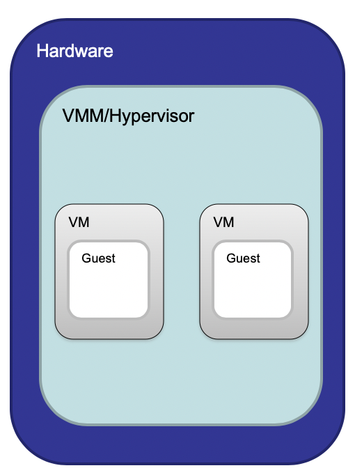
## Kernel-User Mode Separation
* Process run in lower privileged mode
* OS Kernel runs in privileged Kernel mode
* OS typically virtualize memory, CPU, disk, and etc, giving appearance of complete access to CPU/memory/disk to application processes
    * Each process has illusion of access to some/all of the memory or the CPU
* Context switches can catch sensitive calls
    * E.g. <font color=pink>Add two numbers vs change bios settings</font>
    * Sensitive calls -> instruction sets are typically devices specific
> Architecture of Kernel-User mode separation
>>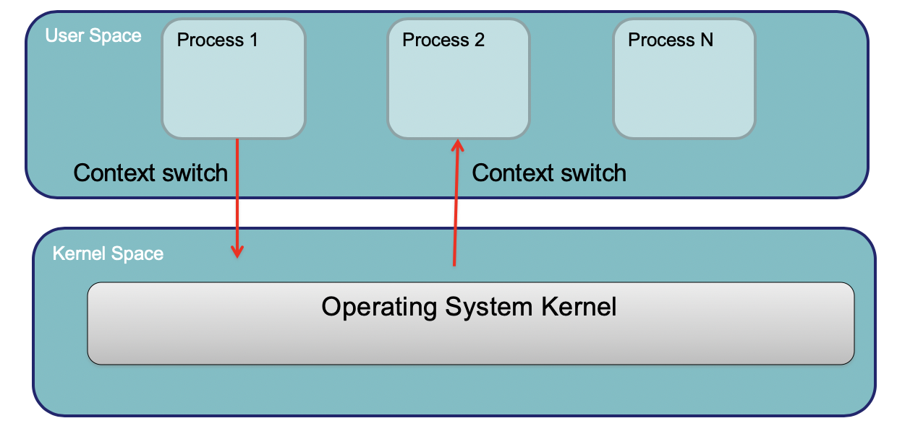
## What happens in VM
* VMM/Hypervisor: Gives perception of a whole machine
* <font color=red>VHD(Virtual Hard Disk)</font>: A virtual hard disk drive. May contain what is found on a physical hard disk, such as a disk partitions and a file system, which in turn can contain files and folders
* <font color=red>VMDK(Virtual Machine Disk)</font>: Describes containers for virtual hard disk drives to be used in a virtual machines like *VMware*
* <font color=red>qcow2(QEMU Copy On Write)</font>file format for disk image files used by QEMU. It uses a disk storage optimization strategy that delays allocation of storage until it is actually needed。
* Guest OS apps "think" they write to hard disk translated to virtualized host hard drive by VMM
## Virtualization Motivation
* Server consolidation
    * Increased utilization
    * Reduced energy consumption
* Personal Virtual machines can be created on demand
    * No hardware purchase needed
    * Public cloud computing
* Security/Isolation
    * Share a single machine with multiple users
* Hardware independence
    * Relocate to different hardware
## Virtualization Principles
* Properties of interest
    * <font color=red>Fidelity</font>: Software on the VMM executes behavior identical to that demonstrated when running on the machine directly, barring timing effects
    * <font color=red>Performance</font>: An overwhelming majority of guest instructions executed by hardware without VMM intervention
    * <font color=red>Safety</font>: The VMM manageres all hardware resources
* <font color=red>Popek and Goldberg Theorem</font>: For any conventional third generation computer, a virtual machine monitor may be constructed if the set of sensitive instructions for that computer is a subset of the set of privileged instructions
* Privilege Rings
    * Ring 0: Typically hardware interactions
    * Ring 1: Typically device drivers
    * Specific gates between rings
    * Allows to ensure spyware can't turn on web cam on recording device
>Example of a privilege Rings
>>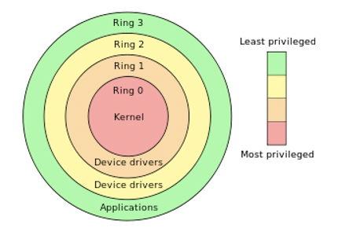
    
## Classification of Instructions
* <font color=red>Privileged Instructions</font>: Instructions that trap of the processor is in user mode and do not trap in kernel mode.
* <font color=red>Sensitive Instructions</font>: Instructions whose behavior depends on the mode or configuration of the hardware
    * Different behaviors depending on whether in user or kernel mode
* <font color=red>Innocuous Instructions</font>: Instructions that are neither privileged nor sensitive
    * Read data, add numbers
### x86 Virtualizability 
* <font color=red>x86</font> architecture was historically not virtualizable, due to sensitive instructions that could not be trapped. E.g. Instructions such as:
    * <font color=pink>SMSW</font>: Storing machine status word
    * <font color=pink>SGDT, SLDT</font>: store global/local descriptor table register
    * <font color=pink>POPF</font>: Interrupt flag of user/kernel mode
## Virtualization Strategy
VMM needs to support:
* <font color=pink>De-privileging</font>:
    * VMM emulates the effect on system/hardware resources of privileged instructions whose execution traps into the VMM.<font color=pink> Trap-and-emulate</font>
    * Typically achieved by running GustOS at a lower hardware priority level than VMM
    * Problematic on some architectures where privileged instructions do not trap when executed at de-privileged level
* <font color=pink>Primary/shadow structures</font>:
    * VMM maintains shadow copies of critical structures whose primary versions are manipulated by the GuestOS. <font color=pink>E.g. Memory page tables</font>
    * Primary copies needed to insure correct versions are visible to GuestOS
* <font color=pink>Memory Traces</font>
    * Controlling access to memory so that the shadow and primary structure remain coherent
    * Common strategy: write-protect primary copies so that update operations cause page faults which can be caught, interpreted, and addressed
>Example of a Virtualization Architecture
>>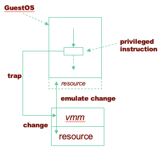
* Major VMM and Hypervisor Providers
>|VMM Provider|Host CPU|Guest CPU|Host OS|Guest OS|VM Architecture|
>|----|----|----|----|----|----|
>|VMWare Workstation|x86, x86-64|x86, x86-64|Windows, Linux|Windows, Linux, Solaris, FreeBSD, OS/2|Full Virtualization|
>|VMWare ESX Server|x86, x86-64|x86, x86-64|No Host OS|Same as VMWare workstation|Baremetal hypervisor|
>|Xen|x86, x86-64, IA-64|x86, x86-64, IA-64|NetBSD, Linux, Solaris|Windows, Linux, Solaris, FreeBSD, OS/2, NetBSD|Para-virtualization|
>|KVM|||Linux|Linux, Windows, FreeBSD, Solaris|Hardware Virtualization|
## Aspects of VMMs
* <font color=pink>Full virtualization</font>: Allow an unmodified guest OS to run in isolation by simulating full hardware
* <font color=pink>Para-virtualization</font>: VMM/Hypervisor exposes special interface to guest OS for better performance. Requires a modified/hypervisor-aware Guest OS
    * Can optimize systems to use this interface since not all instructions need to be trapped/dealt with.
* <font color=pink>Hardware-assisted virtualization</font>: Hardware provides architectural support for running a Hypervisor
    * New processors typically have this
    * Requires that all sensitive instructions trappable
* <font color=pink>Binary Translation</font>: Trap and execute occurs by scanning guest instruction stream and replacing sensitive instructions with emulated code
    * Don't need hardware support, but can be much harder to achieve
* <font color=pink>Bare Metal Hypervisor</font>: VMM runs directly on actual hardware.
    * Boots up and runs on actual physical machines
    * VMM has to support device drivers.
* <font color=pink>Hosted Virtualization</font>: VMM runs on top of another operating system
### Full Virtualization
* Advantages:
    * Guest is unaware it is executing within a VM
    * Guest OS need not to be modified
    * No hardware or OS assistance required
    * Can run legacy OS
* Disadvantages:
    * Can be less efficient
* User/kernel split typically at:
    * VMM run Ring 0
    * Apps run in Ring 3
* Virtualization uses extra rings; VMM traps privileged instructions and translates to hardware specific instructions
>Example of Full Virtualization
>>
### Para-Virtualization
* Advantages:
    * Lower virtualization overheads, so better performance
* Disadvantages:
    * Need to modify guest OS
    * Less portable
    * Less compatibility
>Example of para-virtualization
>>
### Hardware-assisted Virtualization
* Advantages:
    * Good Performance
    * Easier to implement
    * Advanced implementation supports hardware assisted DMA, memory virtualization
* Disadvantages:
    * Needs hardware support
* New Ring -1: Supported Page tables, virtual memory mgt, direct memory access for high speed reads. 
>Example of Hardware-assisted Virtualization
>>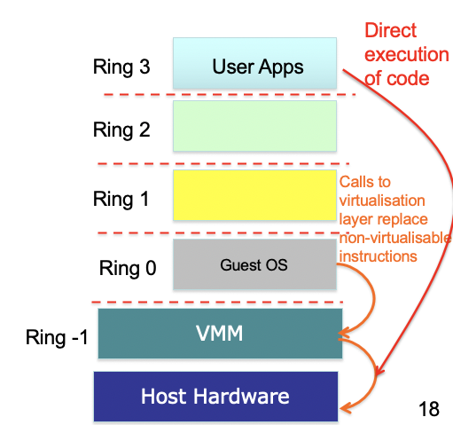
### Binary Translation
* Advantages:
    * Guest OS need not be modified
    * No hardware or OS assistance required
    * Can run legacy OS
* Disadvantages:
    * Overheads
    * Complicated
    * Need to replace instructions 'on-the-fly'
    * Library support to help this.
> Example of Binary Translation
>>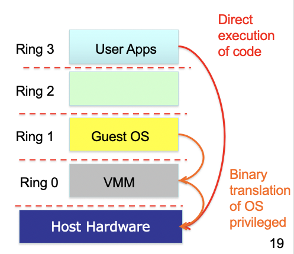
## Operating System Level Virtualization
* Lightweight VMs
* Instead of whole-system virtualization, the OS creates mini-containers
    * A subset of the OS is often good enough for many use cases
    * Akin to an advanced version of 'chroot'
        * Operation that changes apparent root directory for current running process and subprocesses. Program run in such a modified environment cannot access files and commands outside that environmental directory tree.
* Examples: <font color=pink>LXC, Docker, OpenVZ, FreeBSD Jails</font>
* Advantages:
    * Lightweight
    * Many more VMs on same hardware
    * Can be used to package applications and all OS dependencies into container
* Disadvantages:
    * Can only run apps designed for the same OS
    * Cannot host a different guest OS
    * Can only use native file systems
    * Uses same resources as other containers
## Memory Virtualization
* Conventionally page tables store the logical page number -> physical page number mappings
    * Seems like more memory than actually have
>Example of Memory Virtualization
>>
>Inside a virtual machine:
>>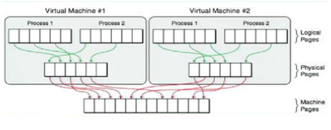
## Shadow Page Tables
* VMM maintains shadow page tables in lock-step with the page tables
* Adds additional management overhead
* Hardware performs guest -> physical and physical -> machine translation
>Example of Shadow Page Tables
>>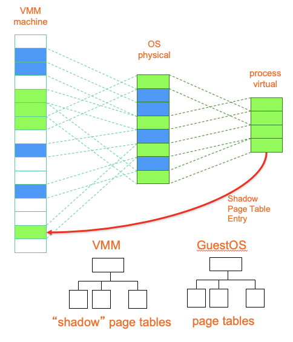
## Live Migration from Virtualization Perspective
>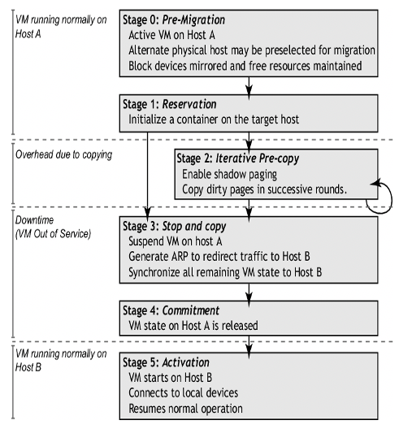
# Lecture 8.2 OpenStack
## Many associated/underpinning services:
* <font color=red>Nova</font>: Compute Service
* <font color=red>Glance</font>: Image Service
* <font color=red>Clinder</font>: Block Storage Service
* <font color=red>Swift</font>: Object Storage Service
* <font color=red>Keystone</font>: Security Management
* <font color=red>Heat</font>: Orchestration Service
* <font color=red>Neutron</font>: Network Service
* <font color=red>Zun</font>: Container Service
* <font color=red>Trove</font>: Database Service
* <font color=red>Horizon</font>: Dashboard Service
* <font color=red>Searchlight</font>: Search Service
>OpenStack Architecture
>>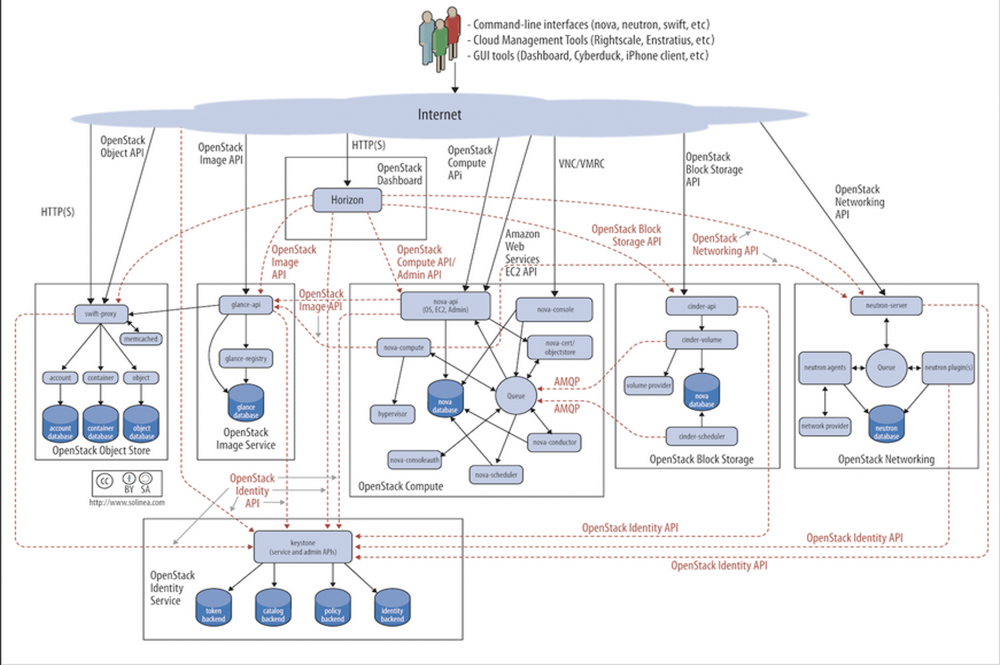
## Key Services in OpenStack
* Identity Service: <font color=red>Keystone</font>
    * Provides an authentication and authorization service for OpenStack services
        * Tracks users/permissions
    * Provides a catalog of endpoints for all OpenStack services
        * Each service registered during install
            * Know where they are and who can do what with them
            * Project membership, firewall rules, image management
    * Generic authorization system for OpenStack
* Compute: <font color=red>Nova</font>
    * Manages the lifecycle of compute instances in an OpenStack environment
    * Responsibilities include spawning, scheduling and decommissioning of virtual machines on demand
    * Virtualization agnostic
        * <font color=pink>Libvirt</font>
        * <font color=pink>XenAPI, Hyper-V, VMWare ESX</font>
        * <font color=pink>Docker</font>
    * API:
        * <font color=pink>Nova-api</font>: Accepts/responds to end user API calls; Supports OpenStack Compute & EC2 & admin APIs
    * Compute Core:
        * <font color=pink>Nova-Compute</font>: Daemon that creates/terminates VMs through hypervisor APIs
        * <font color=pink>Nova-Scheduler</font>: Schedules VM instance requests from queue and determines which server host to run
        * <font color=pink>Nova-Conductor</font>: Mediates interactions between compute services and other components
    * Networking
        * <font color=pink>Nova-Network</font>: Accepts networks tasks from queue and manipulates network
* Object Storage: <font color=red>Swift</font>:
    * Stores and retrieves arbitrary unstructured data objects via ReSTful API.
    * Fault tolerant with data replication and scale-put architecture
        * Available from anywhere; Persists until deleted
        * Allows to write objects and files to multiple drives, ensuring the data is replicated across a server cluster
    * Can be sued with/without Nova compute
    * Client; Admin support
        * <font color=pink>Swift client</font>: Allows uses to submit command to ReST API through command line clients to configure/connect object storage to VMs
* Block Storage: <font color=red>Cinder</font>
    * Provides persistent block storage to virtual machines (instances) and supports creation and management of block storage devices
    * Cinder access associated with a VM:
        * <font color=pink>Cider-api</font>: Routes requests to cinder-volume
        * <font color=pink>Cinder-volume</font>: Interacts with block storage service and scheduler to read/write requests; Can interact with multiple flavors of storage. <font color=pink>(flexible driver architecture)</font>
        * <font color=pink>Cinder-scheduler</font>: Selects optimal storage provider node to create volumes
        * <font color=pink>Cinder-backup</font>: Provides backup to any types of volumes to backup storage provider
            * Can interact with variety of storage solutions
* Image Service: <font color=red>Glance</font>
    * Accepts requests for disk or server images and their associated metedata (from Swift) and retrieves / installs (through Nova)
        * <font color=pink>Glance-api</font>: Image discovery, retrieval and storage requests
        * <font color=pink>Glance-registry</font>: Stores, processes and retrieves metadata about images
* Networking: <font color=red>Neutron</font>
    * Supports networking of OpenStack services
    * Offers an API for users to define networks and the attachments into them
    * Pluggable architecture that supports multiple networking vendors and technologies
    * <font color=pink>Neutron-server</font>: Accepts and routes API requests to appropriate plugins for action
        * Port managements
        * More broadly configuration of availability zone networking
* Dashboard: <font color=red>Horizon</font>
    * Provides a web-based self-service portal to interact with underlying OpenStack services, such as launching an instance, assigning IP addresses and configuring access controls
    * Based on Python/Django web application
    * Mod_wsgi: Apache plug realizing web service gateway interface
    * Requires Nova, Keystone, Glance, Neutron
* Database Service:<font color=red>Trove</font>
    * Provides scalable and reliable Cloud database(DBaaS) functionality for both relational and non-relational database engines
        * Resources isolation, high performance, automates deployment, config, patching, backups, restores, monitoring
        * Use image service for each DB type and <font color=pink>trove-manage</font> to offer them tenants/user communities
* Data Processing Service: <font color=red>Sahara</font>
    * Provides capabilities to provision and scale Hadoop cluster in OpenStack by specifying parameters such as Hadoop version, cluster topology and node hardware details
        * User fills in details and Sahara supports the automated deployment of infrastructure with support for addition/removal of worker nodes on demand
* Orchestration Service: <font color=red>Heat</font>
    * Template-driven service to manage lifecycle of applications deployed on OpenStack
    * Stack: Another name for the template and procedure behind creating infrastructure and the required resources from the template file
    * Can be integrate with automation tools such as <font color=pink>Chef, Puppet, Ansible</font>
    * Heat details:
        * <font color=pink>heat_template_version</font>: Allows to specify which version of Heat the template was written for
        * <font color=pink>Description</font>: Describes the intent of the template to a human audience
        * <font color=pink>Parameters</font>: The arguments that the user might be required to provide
        * <font color=pink>Resources</font>: The specifications of resources that are to be created
        * <font color=pink>Outputs</font>: Any expected values that are to be returned once the template has been processed
    * Creating Stacks:
        1. Create the template file according to your requirements
        2. Provide environment details <font color=pink>(name of key file, image id)</font>
        3. Select a name for your stack and confirm the parameters
        4. Make sure rollback checkbox is marked, so if anything goes wrong, all partially created resources get dumped.
# Lecture 8.3 Serverless
## Disambiguation
* *FaaS* is also know as <font color='red'>Serverless computing</font>
* The idea behind Serverless/*FaaS* is to develop software application without bothering with the infrastructure. <font color='pink'>(Especially scaling-up and down as load increases or decreases)</font>
* Therefore, it is more *Server-unseen* than *Server-less*
* A *FaaS* service allows function to be added, removed, updated, executed, and auto-scaled
* *FaaS* is an extreme form of *microservice architecture*
## Functions
* A <font color='red'>function</font> in computer science is typically a piece of code that takes in parameters and returns a value
* Function are the founding concept of functional programming - one of the oldest programming paradigms
* Functions are free of side-effects, ephemeral, and stateless, which make them ideal fir parallel execution and rapid scaling-up and -down, hence their use in *FaaS*
## *FaaS*
* Simpler deployment. <font color='pink'>(The service provider takes care of the infrastructure)</font>
* Reduced computing costs. <font color='pink'>(Only the time during which functions are executed is billed)</font>
* Reduced application complexity due to loosely-coupled architecture. 
## *FaaS* Application
* Functions are triggered by events
* Functions can call each other
* Functions and events can be combined to build software applications
* <font color='pink'>E.g. A function can be triggered every hour, or every time disk space on a volume is scarce, or when a pull-request is closed on GitHub, or when a message is stored in a queue.</font>
* Combining event-driven scenarios and functions resembles how User Interface software is built: user actions trigger the execution of pieces of code.  
## *FaaS* Services and Frameworks
* The first widely available FaaS service was Amazon's AWS Lambda. SInce then Google Cloud Functions and Azure Functions by Microsoft
* All of the FaaS above allow functions to use the service of their respective platforms, thus providing a rich development environment. 
* There are several open-source frameworks <font color='pink'>(funtainers or function containers)</font> such as *Apache OpenWisk, OpenFaas, and Kubernetes Knative*
* The main difference between proprietary FaaS services and open-source FaaS frameworks is that the latter can be deployed on your cluster, peered into, disassembled and improved by you.
## Side-effect Free Functions
* A function that does not modify the state of the system is said to be side-effect free. <font color='pink'>E.g. A function that takes an image and returns a thumbnail of that image</font>
* A function that changes the system somehow is not side-effect free. <font color='pink'>E.g. A function that writes to the file system the thumbnail of an image</font>
* Side-effect free functions can be run in parallel, and are guaranteed to return the same output given the same input.
* Side-effects are almost inevitable in a relatively complex system. Therefore, consideration must be given on how to make functions with side effects run in parallel, as typically required in FaaS environments. 
## Stateful/Stateless Functions
* A subset of functions with side-effects is composed of <font color='red'>stateful functions</font>.
* A stateful function is one whose output changes in relation to internally stored information <font color='pink'>(hence its input cannot entirely predict its output) E.g. A function that adds items to a 'shopping cart' and retains that information internally.</font>
* Conversely, a stateless function is one that does not store information internally. <font color='pink'> Adding an item to a 'shopping cart' stored in a DBMS service and not internally would make the function stateless, but not side-effect free.</font>
* This is important in FaaS services since there are multiple instances of the same function, and there is no guarantee the same user would call the same function instance twice. 
## Synchronous/Asynchronous Functions
* By default functions in FaaS are <font color='red'>synchronous</font>, hence they return their result immediately.
* However, there may be functions that take longer to return a result, hence they incur timeouts and lock connections with clients in the process, hence it is better to transform them into <font color='red'>asynchronous functions</font>.
* Asynchronous functions return a code that informs the client that the execution has started, and then trigger an event when execution completes
* In more complex cases a publish/subscribe pattern involving a queuing system can be used to deal with asynchronous funtions.
## OpenFaaS
* OpenFaaS is an open-source framework that used Docker Containers to deliver FaaS functionality.
* Every function in OpenFaaS is a Docker Container, ensuring loose coupling between functions. Functions can be written in different languages and mixed freely.
* Functions are passed a request as an object in the language of choice and return a response as an object.
* OpenFaaS can use either Docker Swarm or Kubernetes to manage cluster of nodes on which functions run
* By using Docker containers as functions, OpenFaaS allow to freely mix different languages and environments at the cont of decreased performance, as containers are inherently heavier than threads. However, by using a bit of finesse, a container with a single executable, can weight only a few megabytes. 
## Calling Functions Defined in OpenFaaS
* Calling a function in OpenFaaS is done via `POST HTTP` request, as in: 
    ```
    curl -XPOST "http://0.0.0.0:8080/function/wcmp" --data "Lorem ipsum dixit"
    ```
* You can use either `GET` or `POST` methods, but `POST` allows data of arbitrary size to be passed in the body.
* Functions are not grouped into namespaces. You can get around this limitations with proxy server acting as facade. 
    * <font color='pink'> Converting the `/maps/select/byRectangle` path to request to a function named `maps__select__byRectangle`</font>
### Example of Node.js Function in OpenFaaS
```javascript
module.exports = (context, callback) => {
    try {
        const result = {
            status: "You said: " + JSON.stringify(context)
        };
    } catch (err) {
        callback(err, null);
    }
    callback(null, result);
}
```
### Example of Python Function in OpenFaaS
```python
import requests
import json
def handle(req):
    result = {'found': False}
    json_req = json.loads(req)
    r = requests.get(json_req["url"])
    if json_req['term'] in r.text:
        result = {'found': True}
    print(json.dumps(result))
```
## Auto-scalability in OpenFaaS
* OpenFaaS can add more Docker containers when a function is called more often, and remove containers when the function is called less often.
* The scaling-up and -down of functions can be tied to memory or CPU utilization as well. 
<h1 id='L9'>Lecture 9 Big Data Analytics</h1>

## Examples of Data Analytics:
* Full-text searching <font color=pink>(similar to the Google search engine)</font>
* Aggregation of data <font color=pink>(summing up the number of hits by web-page, day, month, etc)</font>
* Clustering <font color=pink>(grouping customer into classes based on their spending habits)</font>
* Sentiment analysis <font color=pink>(deciding whether a tweet oon a given topic express a positive or negative sentiment)</font>
* Recommendations <font color=pink> (suggesting additional products to a client during checkout based on the choices made by other clients who bought a similar product)</font>
## Challenges of Big Data Analytics
### A framework for analyzing big data has to distribute both data and processing over many nodes, which implies:
* Reading and writing distributed datasets
* Preserving data in the presence of failing data nodes
* Supporting the execution of MapReduce tasks
* Being fault-tolerant
* Coordinating the execution of tasks across a cluster
## Tools for Analytics
* There are many tools that can perform data analytics:
    * Statistical packages <font color=pink>(R, Stata, SAS, SPSS, etc)</font>
    * Business Intelligence tools <font color=pink>(Tableau, Business Object, Pentaho, etc)</font>
    * Information retrieval tools <font color=pink> ElasticSearch, IBM, TextExtender, etc)</font>
* When it comes to big data, the majority of applications are built on top of an open-source framework: *<font color=red>Apache Hadoop</font>*
# *Apache Hadoop*
## The Hadoop Ecosystem
Apache Hadoop started as a way to distribute files over a cluster and execute MapReduce tasks, but many tools have now been built on foundation to add further functionality.
* DBMSs <font color=pink> (Hive, HBase, Accumulo)</font>
* Business Intelligence tools <font color=pink> (Apache Pig)</font>
* Distributed configuration tools <font color=pink> (Apache Zookeeper) </font>
* Distributed resource management tools <font color=pink> (YARN, Mesos) </font>
* Machine learning libraries <font color=pink> (Mahout)</font>
* Object storage <font color='pink'> (Ozone)</font>
## <font color=red>Hadoop Distributed File System</font>
The core of Hadoop is fault tolerant file system that has been explicitly designed to span many nodes.
*HDFS* blocks are much larger than blocks used by an ordinary file system, the reasons for this unusual size are:
* Reduced need for memory to store information about where the blocks are.<font color=pink> (metadata)</font>
* More efficient use of the network. With a large block, a reduced number network connection needs to be kept open.
* Reduced need for seek operation on big files.
* Efficient when most data of a block have to be processed.
## HDFS Architecture
A HDFS file is a collection of blocks stored in <font color=red>datanodes </font>, with metadata, such as the position of those blocks, that is stored in <font color=red>namenodes</font>
> Example of HDFS Architecture
>>
## <font color=red>The Hadoop Resource Manager (YARN)</font>
* The other main component of Hadoop is the MapReduce task manager, <font color=red>YARN</font><font color=pink> (Yet Another Resource Negotiator)</font>
* YARN deals with executing MapReduce jobs on a cluster. It is composed of a central *Resource Manager* <font color=pink>(on the master) </font>and many *Node Managers* that reside on slave machines
* Every time a MapReduce job is scheduled for execution on a Hadoop cluster, YARN starts an *Application Master* that negotiates resources with Resource Manager and starts *Containers* on the slave nodes. <font color=pink>(Note: Containers are the processes were the actual processing is done, not to be confused with Docker containers)</font>
## HDFS Shell
* Managing the files on a HDFS cluster cannot be done on the operating system shell, hence a custom HDFS shell must be used.
* The HDFS file system shell replicates many of the usual commands <font color=pink>(ls, rm, etc)</font>, with some other commands dedicated to loading files from the operating system to the cluster:
```
$HADOOP_HOME/bin/hadoop fs -copyFromLocal <localsrc> <dst>
```
* In addition, the status of the HDFS cluster and its contents can be seen on a web application <font color=pink>(Normally found on port 50070 of the master node)</font>
## Programming on Hadoop
* The main programming language to write MapReduce jobs on Hadoop is Java, but many other languages can be used via different APIs.
* Indeed any language that can read from standard input and write to standard output can be used.
* Practically, the `hadoop` command is used to load the program, with the `-file` option, and send it to the cluster, and the mapper and reducer are specified with the `-mapper` and `-reducer` options. <font color=pink>(`aggregate` uses the Hadoop internal aggregator library)</font>:
```
$HADOOP_HOME/bin/hadoop jar \
 $HADOOP_HOME/hadoop-streaming.jar \
    -D mapreduce.job.reduces=12 \
    -input myInputDir \
    -output myOutputDir \
    -mapper myAggregateorForKeyCount.py \
    -reducer aggregate \
    -file myAggregatorForKeyCount.py
```
# *Apache Spark*
## <font color=red>Spark</font>
* While Hadoop MapReduce works well, it is geared towards performing relatively simple jobs on large datasets.
* However, when complex jobs are performed, there is a strong incentive for caching data in memory and in having finer-grained control on the execution of jobs.
* Apache Spark was designed to reduce the latency inherent in the Hadoop approach for the execution of MapReduce jobs.
* Spark can operate within the Hadoop architecture, using YARN and Zookeeper to manage computing resources, and storing data on HDFS.
## Spark Architecture
* One of the strong points of Spark is the tightly-coupled nature of its main components:
>Example of Spark Architecture
>>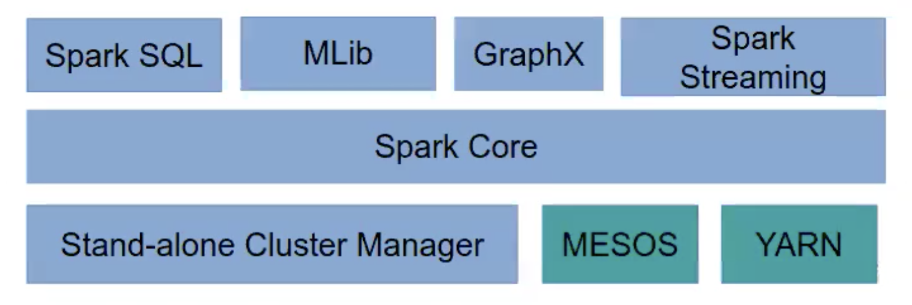
* Spark ships with a cluster manager of its own, but it can work with other managers, such as YARN or MESOS.
## Programming on Spark
* Spark is mostly written in Scala, and uses this language by default in its interactive shell. However, the APIs of Spark can be accessed by different languages: R, Python, and Java.
* Scala is a multi-paradigm language <font color=pink> (both functional and object-oriented)</font> that runs on the Java Virtual Machine and can use Java libraries and Java objects
* The most popular languages used to develop Spark application are Java and Python
* Other than Scala, there is a Python Shell
## Getting Data In and Out of Spark
* Spark can read and write data in many formats, from text file to database tables, and it can used different file systems and DBMSs
* The simplest way to get data into Spark is reading from a CSV file from the local file system:
```
csv = sc.textFile("file.csv")
```
* With a small change, Spark can be made to read from HDFS file systems or Amazon S3:
```
csv = sc.textFile("hdfs://file.csv")
csv = sc.textFile("s3://myBucket/myFile.csv")
```
* The text lines in the file would have to be parsed and put into objects before they can be sued by Spark
* Another popular format is JSON, which can be parsed and streamed back into a file using Java libraries such as Jackson or Gson
* An efficient data format that is unique to Hadoop is the *sequence* file. This is a flat file composed of key/value pairs.
* Another option is to load/save data is the use of serialized Java objects. <font color=pink>(The Kryo library, rather than the native Java serialization is commonly used)</font>
* While this option is simple to implement, it is neither fast nor robust. 
* HDFS or distributed DBMSs can be used in conjunction with Spark
* SQL queries can also be used to extract data:
```
df = sqlContext.sql("SELECT * FROM table")
```
* Relational DBMSs can be a source of data. <font color=pink>via JDBC</font>
* CouchDB, MongoDB, and Elastic Search connectors are also available.
## The Spark Shell
* The Spark Shell allows to send commands to the cluster interactively in either Scala or Python
* A simple program in Python to count the occurrences of the word "Spark" in the README of the framework: 
```python
./bin/pyspark
>>> textFile = sc.textFile("README.md")
>>> textFile.filter(lambda line: "Spark" in line).count()
15
```
* While the shell can be extremely useful, it prevents Spark from deploying all of its optimizations, leading to poor performances.
## Non-interactive Jobs in Spark
The usual word count, but in Java 7
``` java
JavaRDD<String> input = sc.textFile(inputFile);
JavaRDD<String> words = input.flatMap(
    new FlatMapFunction<String, String>(){
        public Iterable<String> call(String x) {
            return Arrays.asList(x.split(" "));
        }
    }
);
JavaPairRDD<String, Integer> counts = 
words.mapToPair(new PairFunction<String, String, Integer>(){
    public Tuple2<String, Integer> call(String, x){
        return new Tuple2(x, 1);
    }
}).reduceByKey(new Function2<Integer, Integer, Integer>(){
    public Integer call(Integer x, Integer y) {return x + y;}
});
counts.saveAsTextFile(outputFile);
```
## Spark Runtime Architecture
* Applications in Spark are composed of different components including"
    * <font color=red>Job</font>: the data processing that has to be performed on a dataset
    * <font color=red>Task</font>: a single operation on a dataset
    * <font color=red>Executors</font>: the processes in which tasks are executed
    * <font color=red>Cluster Manager</font>: the process assigning tasks to executors
    * <font color=red>Driver program</font>: the main logic of the application
    * <font color=red>Spark application</font>: Driver program + Executors
    * <font color=red>Spark Context</font>: the general configuration of the job
* These different components can be arranged in three different deployment modes across the cluster
### Spark Runtime Architecture: Local Mode
In <font color=red>local mode</font>, every Spark component runs within the same JVM. However, the Spark Application can still run in parallel as there may be more than one executor active. <font color=pink>Local mode is good when developing/debugging</font>
>Local mode Spark Runtime Architecture:
>>
### Spark Runtime Architecture: Cluster Mode
In <font color=red>cluster mode</font>, every component, including the driver program, is executed on the cluster; hence, upon launching, the job can run autonomously. <font color=pink>This is the common way of running non-interactive Spark jobs.</font>
>Cluster mode Spark Runtime Architecture:
>>
### Spark Runtime Architecture: Client Mode
In <font color=red>client mode</font>, the driver program talks directly to the executors on the worker nodes. Therefore, the machines hosting the driver program has to be connected to the cluster until job completion. Client mode must be used when the applications are interactive, as happens in the Python or Scala Spark Shells.
>Client mode Spark Runtime Architecture:
>>
## Spark Context
* The deployment mode is set in the *<font color=red>Spark Context</font>*, which is also used to set the configuration of a Spark application, including the cluster it connects to in cluster mode.
* E.g. This hard-coded Spark Context directs the execution to run locally, using 2 threads:
``` 
sc = new Spark Context(new SparkConf().setMaster("local[2]"));
```
* E.g. This other hard-coded line directs the execution to a remote cluster:
```
sc = new SparkContext(new SparkConf().setMaster("spark://192.168.1.12:6066"));
```
* Spark Contexts can also be used to tune the execution by setting the memory, or the number of executors to use. 
## How to Submit Java Jobs to Spark
* For an application to be executed on Spark, either a shell or a submit script has to be used. The submit script is to be given all the information it needs:
```
./bin/spark-submit \
  --class <main-class> \
  --master <master-url> \
  --deploy-mode <deploy-mode> \
  --conf <key>=<value> \
  <application-jar (an uber-JAR)> \
  [application-arguments]
```
* The application JAR must be accessible from all the nodes in cluster deploy mode, hence it is usually put on HDFS.
* The submit script can be used to launch Python programs as well. Uber-JARs can be assembled by Maven with Shade plugin.
## <font color=red>Resilient Distributed Dataset</font>
* <font color=red>Resilient Distributed Dataset(RDDs)</font> are the way data are stored in Spark during computation, and understanding them is crucial to writing programs in Spark:
    * <font color=red>R</font>esilient: Data are stored redundantly, hence a failing node would not affect their integrity.
    * <font color=red>D</font>istributed: Data are split into chunks, and these chunks are sent to different nodes.
    * <font color=red>D</font>ataset: A dataset is just a collection of objects, hence very generic.
## Properties of RDDs
* RDDs are <font color=red> immutable</font>, once defined, they cannot be changed. This greatly simplifies parallel computations on them, and is consistent with the functional programming paradigm
* RDDs are <font color=red> transient</font>, they are meant to be used only once, then discarded. But they can cached if it improves performance
* RDDs are <font color=red> lazy-evaluated</font>, the evaluation process happens only when data cannot be kept in an RDD, as when the number of objects in an RDD has to be computed, or an RDD has to be written to a file, but not when an RDD are transformed into another RDD. <font color=pink>(These are called transformations)</font>
## How to build RDD
* RDDs are usually created out of data stored elsewhere, as in:
```java
JavaRDD<String> lines = sc.textFile("data.txt");

DataSet<Row> teenagers = sparkSession.sql(
    "SELECT name FROM table WHERE age >= 12 AND age <= 19");
JavaRDD<Row> rddTeenagers = teenagers.javaRDD();
```
* RDDs can be created out of collections too, using the parallelize function:
```java
List<Integer> distData = Arrays.asList(1, 2, 3, 4, 5);
JavaRDD<Integer> distData = sc.parallelize(data);
```
## Order of Execution of MapReduce Tasks
* While the execution order of Hadoop MapReduce is fixed, the lazy evaluation of Spark allows the developer to stop worrying about it, and have the Spark optimizer take care of it. 
* In addition, the driver program can be divided into steps that easier to understand without sacrificing performance as long as those steps are composed of transformations. 
## Example of Transformation of RDDs
* `rdd.filter(lambda)` selects elements from an RDD
* `rdd.distinct()` returns an RDD without duplicated elements
* `rdd.union(otherRdd)` merges two RDDs
* `rdd.intersection(otherRdd)` returns elements common to both
* `rdd.subtract(otherRdd)` reomves elements of otherRdd
* `rdd.cartesian(otherRdd)` returns the Cartesian product of both RDDs
## Examples of Actions
* `rdd.collect()` returns all elements in an RDD
* `rdd.count()` returns the number of elements in an RDD
* `rdd.reduce(lambda)` applies the function to all elements repeatedly, resulting in one result.
* `rdd.foreach(lambda)` applies lambda to all elements of an RDD
## Examples of Key/Value Pairs Transformations
* `rdd.map(lambda)` creates a key/value pair RDD by applying function lambda and returning one pair for element.
* `rdd.flatMap(lambda)` applies a function to RDD elements and returns zero, one, or more pairs for element.
* `rdd.reduceByKey(lambda)` processes all the pairs with the same key into one pair
* `rdd.join(otherRdd)` merges two key/value pair RDDs based on a key.
## Caching Intermediate Results
* `rdd.persist(storageLevel)` can be used to save an RDD either in memory and/or disk. This `storageLevel` can be tuned to a different mix of use of RAM or disk to store the RDD
* Since RDDs are immutable, the result of the final transformation is cached, not the input RDD. 
    * E.g. `rddB = rddA.persist(DISK_ONLY)` only rddB has been written to disk.
## Tuning the Degree of Parallelism
* Some transformations allow for a second parameter containing the desired of partitions.
>`sc.textFile("bigfile.csv", 10)`
* An RDD can also be re-partitioned explicitly:
>`rdd.repartition(partitionNum)`
* Another way to partition an RDD is to provide an *partitioner*, a strategy to guide the partitioning.
> `rdd.partitionBy(new HashPartitioner(100))`\
> This splits RDD elements into 100 partitions according to their keys.
## Spark Jobs, Tasks, and Stages
* A <font color=red>job</font> is the overall processing that Spark is directed to perform by a driver program.
* A <font color=red>task</font> is a single transformation operating on a single partition of data on a single node.
* A <font color=red>stage</font> is a set of tasks operating on a single partition.
* A job is composed of more than one stage when data are to be transferred across nodes. <font color=red>(shuffling)</font>
* The fewer the number of stages, the faster the computation.<font color=pink>(shuffling data across the cluster is slow)</font>
<h1 id='L10'>Lecture 10 Security and Clouds</h1>

## Importance of Security
* If systems <font color=pink>(Grids/Clouds/outsourced infrastructure)</font> are not secure:
    * Large communities will not engage
        * Medical community, industry, financial community
    * Expensive to repeat some experiments
        * Huge machines running large simulations for several years
    * Legal and ethical issues possible to be violated with all sorts of consequences
        * <font color=pink>E.g. Data protection act violations and fines incurred.</font>
    * Trust is easily lost and hard to re-establish 
## Challenge of Security
* Grids and Clouds(IaaS) allow users to compile codes that do stuff on physical/virtual machines
    * Highly secure supercomputing facilities compromised by single user PCs/laptops
    * Need security technologies that scales to meet wide variety of application
* Should try to develop generic security solutions
    * Avoid all application areas re-inventing their own solutions
* Clouds allow scenarios that stretch inter-organizational security
    * Policies that restrict access to and usage of resources based on pre-identified users, resources
        * <font color=pink>Groups/tenancy</font>
    * What if new resources added, new users added, old users go?
        * <font color=pink>Over-subscription issues</font>
        * <font color=pink>User management</font>
    * What is organizations decide to change policies governing access to and usage of resources, or bring their data back inside of their firewall?
    * What if you share a tenancy with a noisy neighbor?
    * The multi-faceted challenges of 'Life beyond the organizational firewall'
## Prelude to security
* Meaning of security
    * Secure from whom?
    * Secure against what?
    * Secure for how long?
    * Note that security technology not means secure system
## Technical Challenges of Security
* Several key terms that associated with security
    * Authentication
    * Authorization
    * Audit/accounting
    * Confidentiality 
    * Privacy
    * Fabric management
    * Trust 
### <font color=red>Authentication</font>
* <font color=red>Authentication</font> is the establishment and propagation of a user's identity in the system
    * <font color=pink>E.g. Site X can check that user Y is attempting to gain access to it's resources</font>
    * Local username/password
    * Centralized vs decentralized systems
    * <font color=red>Public Key Infrastructures(PKI)</font> underpins many systems. <font color=pink>Based on public key cryptography</font>
    #### <font color=red>Public Key Cryptography</font>
    * Also called <font color=red>Asymmetric Cryptography</font>
        * Two distinct keys
            * One that must be kept private
            * One that can be made public
        * Two keys complementary, but essnetial that cannot find out value of private key from public key
            * With private keys can digitally sign messages, documents. And validate them with associated public keys
    * Public Key Cryptography simplifies key management
        * Do not need to have many keys for long time
            * The longer keys are left in storage, more likelihood of their being compromised.
            * Only Private Key needs to be kept long term and kept securely.
    #### <font color=red>Public Key Certificates</font>
    * Mechanism connecting public key to user with corresponding private key is <font color=red>Public Key Certificate</font>
        * Public key certificate contains public key and identifies the user with the corresponding private key
    #### <font color=red>*Certification Authority*</font>
    * Central component of PKI is <font color=red>*Certification Authority*(CA)</font>
        * CA has numerous responsibilities
            * Policy and procedures
            * Issuing certificates
            * Revoking certificates
            * Storing and archiving
    >Example of a simple CA
    >>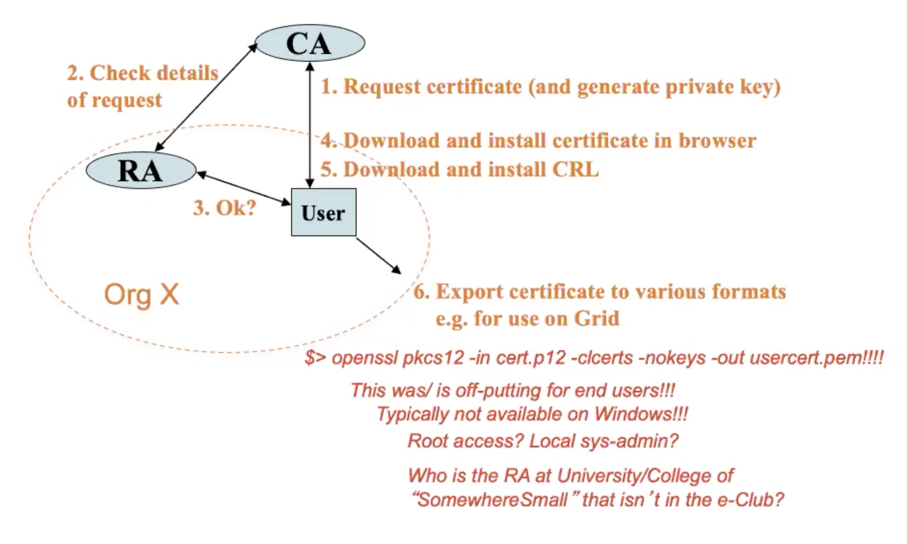
### <font color=red>Authorization</font>
* <font color=red>Authorization</font> is concerned with controlling access to resources based on policy
    * Can this user invoke this service, make use of this data?
    * Complementary to authentication
        * Know it is this user, now we can restrict/enforce what they can/cannot do
* Many different approaches for authorization
    * Group Based Access Control
    * Role Based Access Control(RBAC)
    * Identity Based Access Control(IBAC)
    * Attribute Based Access Control(ABAC)
 * Authorization and Cloulds
    * Authorization typically applies to services/data deployed on Clouds when they are running.
* How to do authorization
    * Defining what they can do and define and enforce rules
        * Each site will have different rules/regulations
    * Often realized through <font color=red>Virtual Organization(VO)</font>
        * Collection of distributed resources shared by collection of users from one or more organizations typically to work on common research goal
            * Provides conceptual framework for rules and regulations for resources to be offered/shared between VO institutions/members
            * Different domains place greater/lesser emphasis on expression and enforcement of rules and regulations
        > Example of Virtual Organization:
        >>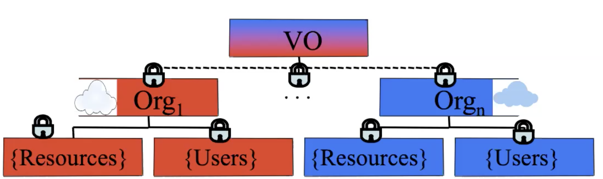
    * Many Technologies:
        * <font color=red>XACML, PERMIS, CAS, VOMS, AKENTI, VOMS, SAML, WS-*</font>
    * RBAC is a typical model
        * Basic Idea:
            * <font color=red>roles</font> applicable to specific collaboration
                * roles are often hierarchical
            * <font color=red>actions</font> allowed/not allowed for VO members
            * <font color=red>resources</font>comprising VO infrastructure
        * A policy then consists of sets of these rules
        * Policy engines consume this information to make access decisions
### Other Cloud Security Challenges
* Single sign-on
    * The Grid Model needed
    * Currently not solved for Cloud-based IaaS
    * Onus is on non-Cloud developers to define/support this
* Auditing
    * Logging, intrusion detection, auditing of security in external computer facilities
        * Well established in theory and practice and for local systems
        * Tools to support generation of diagnostic trails
* Deletion and encryption
    * Data deletion with no direct hard disk
        * Many tools and utilities do not work
    * Scale of data
* Liability
* Licensing
    * Many license models
    * Challenges with the Cloud delivery model
* Workflows
    * Many workflows tools for combing SoA services/data flows
    * Many workflows models
    * Serious challenges of:
        * Defining
        * Enforcing
        * Sharing
        * Enacting
    * Security-oriented workflows

